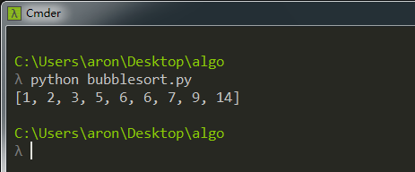
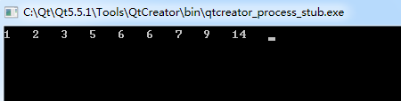

### 原理
冒泡排序（Bubble Sort）是一种简单的排序算法。它重复地走访过要排序的数列，一次比较两个元素，如果他们的顺序错误就把他们交换过来。重复地进行直到没有再需要交换，也就是说该数列已经排序完成。这个算法的名字由来是因为越小的元素会经由交换慢慢“浮”到数列的顶端。

### 步骤：
比较相邻的元素。如果第一个比第二个大，就交换他们两个。
对每一对相邻元素作同样的工作，从开始第一对到结尾的最后一对。在这一点，最后的元素应该会是最大的数。
针对所有的元素重复以上的步骤，除了最后一个。
持续每次对越来越少的元素重复上面的步骤，直到没有任何一对数字需要比较。

### 性能
时间复杂度为O(N^2)，空间复杂度为O(1)。排序是稳定的，排序比较次数与初始序列无关，但交换次数与初始序列有关。

### 优化
若初始序列就是排序好的，对于冒泡排序仍然还要比较O(N^2)次，但无交换次数。可根据这个进行优化，设置一个flag，当在一趟序列中没有发生交换，则该序列已排序好，但优化后排序的时间复杂度没有发生量级的改变。

### Python实现
```python
arr = [3, 5, 2, 6, 14, 9, 7, 1, 6]
def bubble_sort(raw_list):
    count = len(arr)
    for i in range(0, count):
        for j in range(i+1, count):
            if arr[i] > arr[j]:
                arr[i], arr[j] = arr[j], arr[i]
                #temp = arr[j]
                #arr[j] = arr[i]
                #arr[i] = temp
    return arr
```

运行结果:


### C++实现
```cpp
#include <iostream>
using namespace std;

void bubble_sort(int arr[], int len)
{
    for (int i=0; i<len; i++)
    {
        for (int j=i+1; j<len; j++)
        {
            if (arr[i] > arr[j])
            {
                int temp = arr[i];
                arr[i] = arr[j];
                arr[j] = temp;
            }
        }
    }
}

// 改进的冒泡排序
//每次从后往前冒一个最小值，且每次能确定一个数在序列中的最终位置
void bubble_sort(int arr[], int len)
{
    //比较n-1次
    for (int i = 0; i < len-1; i++)
    {         
        bool exchange = true;   // 冒泡的改进，若在一趟中没有发生逆序，则该序列已有序
        for (int j = len-1; j >i; j--)  // 每次从后边冒出一个最小值
        {    
            if (arr[j] < arr[j - 1])   // 发生逆序，则交换
            {   
                swap(arr[j], arr[j - 1]);
                exchange = false;
            }
        }
        if (exchange){
            return;
        }
    }
}

int main(int argc, char *argv[])
{
    int arr[] = {3, 5, 2, 6, 14, 9, 7, 1, 6};
    bubble_sort(arr, 9);
    for (int i=0; i<9; i++)
        cout << arr[i] <<"   ";

    return 0;
}
```

运行结果:



### 参考
* [https://segmentfault.com/a/1190000004994003](https://segmentfault.com/a/1190000004994003)