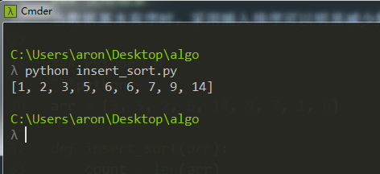
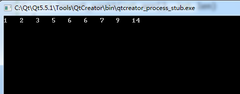

### 简介
插入排序（Insertion Sort）的算法描述是一种简单直观的排序算法。它的工作原理是通过构建有序序列，对于未排序数据，在已排序序列中从后向前扫描，找到相应位置并插入。插入排序在实现上，通常采用in-place排序（即只需用到O(1)的额外空间的排序），因而在从后向前扫描过程中，需要反复把已排序元素逐步向后挪位，为最新元素提供插入空间。

### 步骤：
从第一个元素开始，该元素可以认为已经被排序
取出下一个元素，在已经排序的元素序列中从后向前扫描
如果该元素（已排序）大于新元素，将该元素移到下一位置
重复步骤3，直到找到已排序的元素小于或者等于新元素的位置
将新元素插入到该位置中
重复步骤2

### 性能
时间复杂度为O(N^2)，空间复杂度为O(1)。算法是稳定的，比较次数和交换次数都与初始序列有关。

### 优化
直接插入排序每次往前插入时，是按顺序依次往前找，可在这里进行优化，往前找合适的插入位置时采用二分查找的方式，即折半插入。 
折半插入排序相对直接插入排序而言：平均性能更快，时间复杂度降至O(NlogN)，排序是稳定的，但排序的比较次数与初始序列无关，总是需要foor(log(i))+1次排序比较。

### 使用场景
当数据基本有序时，采用插入排序可以明显减少数据交换和数据移动次数，进而提升排序效率。

### Python实现
```python
arr = [3, 5, 2, 6, 14, 9, 7, 1, 6]

def insert_sort(arr):
    count = len(arr)
    for i in range(1, count):
        temp = arr[i]
        j = i-1
        while j >= 0:
            if arr[j] > temp:
                arr[j], arr[j+1] = temp, arr[j]
            j -= 1
    print(arr)
    return arr

insert_sort(arr)
```

运行结果:


### C++实现
```cpp
#include <iostream>
using namespace std;

// 法1
void insert_sort1(int arr[], int len)
{
    for (int i=1; i<len; i++)
    {
        if (arr[i] < arr[i-1])
        {
            int temp = arr[i];
            int j;
            for (j=i-1; j>=0 && arr[j]>temp; j--)
            {
                arr[j+1] = arr[j];
            }
            arr[j+1] = temp;
        }
    }
}

// 法2, 似乎更好理解
void insert_sort(int arr[], int len)
{
    for (int i=1; i<len; i++)
    {
        int temp = arr[i];
        int j = i-1;
        while (j>=0)
        {
            if (arr[j] > temp)
            {
                arr[j+1] = arr[j];
                arr[j] = temp;
            }
            j -= 1;
        }
    }
}

//改进的插入排序，往前插入比较时，进行二分查找
void insert_binary_sort(int arr[], int len)
{
    for (int i=1; i<len; i++)
    {
        if (arr[i] < arr[i-1])
        {
            int temp = arr[i];
            int low = 0, high = i-1, mid;
            while (low<=high)
            {
                mid = (low+high)/2;
                if (temp < arr[mid])
                {
                    high = mid - 1;
                }
                else
                {
                    low = mid + 1;
                }
            }
            for (int j = i; j>low; j--)
            {
                arr[j] = arr[j-1];
            }
            arr[low] = temp;
        }
    }
}

int main(int argc, char *argv[])
{
    int arr[] = {3, 5, 2, 6, 14, 9, 7, 1, 6};
    insert_sort(arr, 9);
    for (int i=0; i<9; i++)
        cout << arr[i] <<"   ";

    return 0;
}
```

运行结果:



### 参考
* [https://segmentfault.com/a/1190000004994003](https://segmentfault.com/a/1190000004994003)

