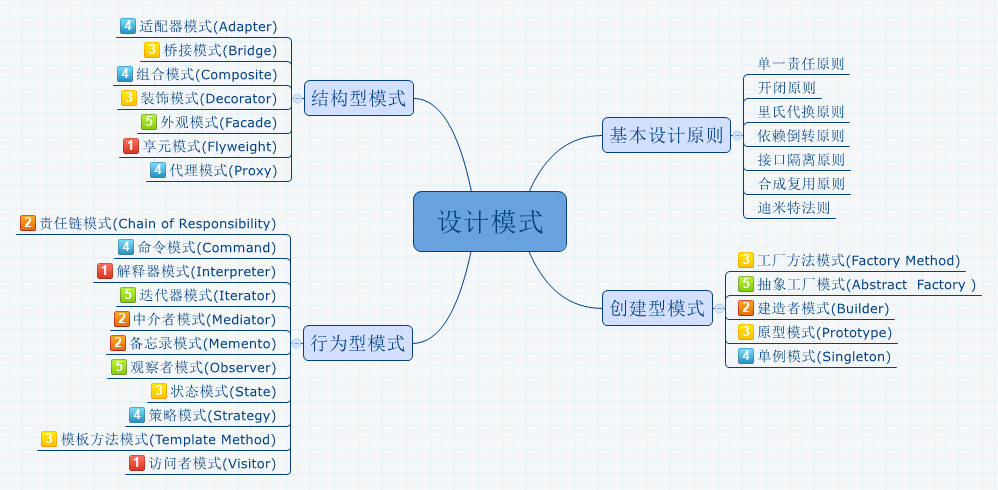

### 面向对象三个基本特征 
面向对象的三个基本特征是：封装、继承、多态

- 封装

封装是面向对象的特征之一，是对象和类概念的主要特性。封装，也就是把客观事物封装成抽象的类，并且类可以把自己的数据和方法只让可信的类或者对象操作，对不可信的进行信息隐藏。

- 继承

继承是指这样一种能力：它可以使用现有类的所有功能，并在无需重新编写原来的类的情况下对这些功能进行扩展。通过继承创建的新类称为“子类”或“派生类”，被继承的类称为“基类”、“父类”或“超类”。

要实现继承，可以通过“继承”（Inheritance）和“组合”（Composition）来实现。

- 多态性

多态性（polymorphisn）是允许将父对象设置成为和一个或更多的他的子对象相等的技术，赋值之后，父对象就可以根据当前赋值给它的子对象的特性以不同的方式运作。简单的说：允许将子类类型的指针赋值给父类类型的指针。

实现多态，有两种方式，覆盖和重载。覆盖和重载的区别在于，覆盖在运行时决定，即运行时多态,重载是在编译时决定,即编译时多态。
并且覆盖和重载的机制不同，例如在 Java 中，重载方法的签名必须不同于原先方法的，但对于覆盖签名必须相同。

### 面向对象六大原则
#### 1. 单一职责原则
单一职责原则的英文名称是 Single Responsibility Principle，简称是 SPR，简单地说就是一个类只做一件事，这个设计原则备受争议却又极其重要。
很多时候都是需要个人经验来界定。当然，最大的问题就是对职责的定义，什么是类的职责，以及怎么划分类的职责。

单一职责原则是实现高内聚、低耦合的指导方针，它是最简单但又最难运用的原则。
每一个职责都是变化的一个轴线，如果一个类有一个以上的职责，这些职责就耦合在了一起。这会导致脆弱的设计。当一个职责发生变化时，可能会影响其它的职责。另外，多个职责耦合在一起，会影响复用性。

单一职责所表达出的用意就是“单一”二字.如何划分一个类、一个函数的职责，每个人都有自己的看法，这需要根据个人经验、具体的业务逻辑而定。但是，它也有一些基本的指导原则，例如，两个完全不一样的功能就不应该放在一个类中。一个类中应该是一组相关性很高的函数、数据的封装。工程师可以不断地审视自己的代码，根据具体的业务、功能对类进行相应的拆分，我想这会是你优化代码迈出的第一步。

#### 2. 开闭原则
开闭原则的英文全称是Open Close Principle，简称OCP.一个软件实体应当对扩展开放，对修改关闭。即软件实体应尽量在不修改原有代码的情况下进行扩展。当软件需要变化时，我们应该尽量通过扩展的方式来实现变化，而不是通过修改已有的代码来实现。

为了满足开闭原则，需要对系统进行抽象化设计，抽象化是开闭原则的关键。在Java、C#等编程语言中，可以为系统定义一个相对稳定的抽象层，而将不同的实现行为移至具体的实现层中完成。在很多面向对象编程语言中都提供了接口、抽象类等机制，可以通过它们定义系统的抽象层，再通过具体类来进行扩展。如果需要修改系统的行为，无须对抽象层进行任何改动，只需要增加新的具体类来实现新的业务功能即可，实现在不修改已有代码的基础上扩展系统的功能，达到开闭原则的要求。

开闭原则指导我们，当软件需要变化时，应该尽量通过扩展的方式来实现变化，而不是通过修改已有的代码来实现。这里的“应该尽量”4个字说明OCP原则并不是说绝对不可以修改原始类的，当我们嗅到原来的代码“腐化气味”时，应该尽早地重构，以使得代码恢复到正常的“进化”轨道，而不是通过继承等方式添加新的实现，这会导致类型的膨胀以及历史遗留代码的冗余。我们的开发过程中也没有那么理想化的状况，完全地不用修改原来的代码，因此，在开发过程中需要自己结合具体情况进行考量，是通过修改旧代码还是通过继承使得软件系统更稳定、更灵活，在保证去除“代码腐化”的同时，也保证原有模块的正确性。

#### 3. 里氏代换原则
里氏替换原则英文全称是Liskov Substitution Principle，简称LSP.面向对象的语言的三大特点是继承、封装、多态，里氏替换原则就是依赖于继承、多态这两大特性。里氏替换原则简单来说就是所有引用基类、接口的地方必须能透明地使用其子类的对象。通俗点讲，只要父类能出现的地方子类就可以出现，而且替换为子类也不会产生任何报错或者异常，使用者可能根本就不需要知道是子类还是父类。但是，反过来就不行了，有子类出现的地方，父类未必就能使用。

在使用里氏代换原则时需要注意如下几个问题：

1. 子类的所有方法必须在父类中声明，或子类必须实现父类中声明的所有方法。根据里氏代换原则，为了保证系统的扩展性，在程序中通常使用父类来进行定义，如果一个方法只存在子类中，在父类中不提供相应的声明，则无法在以父类定义的对象中使用该方法。
2. 我们在运用里氏代换原则时，尽量把父类设计为抽象类或者接口，让子类继承父类或实现父接口，并实现在父类中声明的方法，运行时，子类实例替换父类实例，我们可以很方便地扩展系统的功能，同时无须修改原有子类的代码，增加新的功能可以通过增加一个新的子类来实现。里氏代换原则是开闭原则的具体实现手段之一。
3. Java语言中，在编译阶段，Java编译器会检查一个程序是否符合里氏代换原则，这是一个与实现无关的、纯语法意义上的检查，但Java编译器的检查是有局限的。

里氏替换原则的核心原理是抽象，抽象又依赖于继承这个特性，在OOP当中，继承的优缺点都相当明显。 
- 继承的优点如下：
（1）代码重用，减少创建类的成本，每个子类都拥有父类的方法和属性；
（2）子类与父类基本相似，但又与父类有所区别；
（3）提高代码的可扩展性。

- 继承的缺点如下：
（1）继承是侵入性的，只要继承就必须拥有父类的所有属性和方法；
（2）可能造成子类代码冗余、灵活性降低，因为子类必须拥有父类的属性和方法。

#### 4. 接口隔离原则
接口隔离原则英文全称是InterfaceSegregation Principles，简称ISP.使用多个专门的接口，而不使用单一的总接口，即客户端不应该依赖那些它不需要的接口。另一种定义是：类间的依赖关系应该建立在最小的接口上。接口隔离原则将非常庞大、臃肿的接口拆分成为更小的和更具体的接口，这样客户将会只需要知道他们感兴趣的方法。接口隔离原则的目的是系统解开耦合，从而容易重构、更改和重新部署。

### 参考
* 
* 
* 
