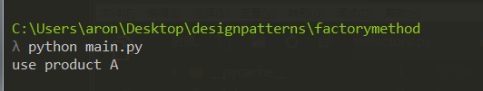
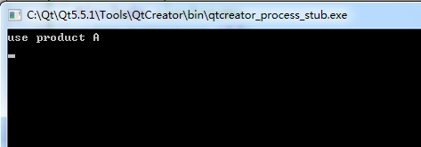

### 工厂方法模式
工厂方法模式(Factory Method Pattern)又称为工厂模式，也叫虚拟构造器(Virtual Constructor)模式或者多态工厂(Polymorphic Factory)模式，它属于类创建型模式。在工厂方法模式中，工厂父类负责定义创建产品对象的公共接口，而工厂子类则负责生成具体的产品对象，这样做的目的是将产品类的实例化操作延迟到工厂子类中完成，即通过工厂子类来确定究竟应该实例化哪一个具体产品类。

### 模式结构
工厂方法模式包含如下角色：
Product：抽象产品
ConcreteProduct：具体产品
Factory：抽象工厂
ConcreteFactory：具体工厂


### 模式分析
工厂方法模式是简单工厂模式的进一步抽象和推广。由于使用了面向对象的多态性，工厂方法模式保持了简单工厂模式的优点，而且克服了它的缺点。在工厂方法模式中，核心的工厂类不再负责所有产品的创建，而是将具体创建工作交给子类去做。这个核心类仅仅负责给出具体工厂必须实现的接口，而不负责哪一个产品类被实例化这种细节，这使得工厂方法模式可以允许系统在不修改工厂角色的情况下引进新产品。

### python 实现
文件结构
```
C:\USERS\ARON\DESKTOP\DESIGNPATTERNS\FACTORYMETHOD
    concretefactory.py
    concreteproduct.py
    factory.py
    main.py
    product.py
    __init__.py
```

```python
# factory.py
class Factory(object):
    def __init__(self):
        pass

    def factoryMethod(self):
        return None

# product.py
class Product(object):
    def __init__(self):
        pass

    def use(self):
        pass

# concretefactory.py
from factory import Factory
from concreteproduct import ConcreteProduct


class ConcreteFactory(Factory):
    def __init__(self):
        super(ConcreteFactory, self).__init__()

    def factoryMethod(self):
        return ConcreteProduct()

# concreteproduct.py
from product import Product


class ConcreteProduct(Product):
    def __init__(self):
        super(ConcreteProduct, self).__init__()

    def use(self):
        print("use product A")

# main.py
from product import Product
from concretefactory import ConcreteFactory
from concretefactory import ConcreteFactory


if __name__ == "__main__":
    fac = ConcreteFactory()
    prod = fac.factoryMethod()
    prod.use()
```

最后运行结果: 




### C++ 实现
```cpp
// factory.h
#ifndef FACTORY_H
#define FACTORY_H
#include "product.h"

class Factory
{
public:
    Factory();
    virtual ~Factory();
    virtual Product* factoryMethod();
};

#endif // FACTORY_H

// factory.cpp
#include "factory.h"
#include <stdio.h>

Factory::Factory() {}

Factory::~Factory() {}

Product* Factory::factoryMethod()
{
    return NULL;
}
```

```cpp
// product.h
#ifndef PRODUCT_H
#define PRODUCT_H

class Product
{
public:
    Product();
    virtual ~Product();
    virtual void use();
};

#endif // PRODUCT_H

// product.cpp
#include "product.h"

Product::Product() {}

Product::~Product() {}

void Product::use() {}
```

```cpp
// concretefactory.h
#ifndef CONCRETEFACTORY_H
#define CONCRETEFACTORY_H
#include "product.h"
#include "factory.h"

class ConcreteFactory : public Factory
{
public:
    ConcreteFactory();
    virtual ~ConcreteFactory();
    virtual Product* factoryMethod();
};

#endif // CONCRETEFACTORY_H

// concretefactory.cpp
#include "concretefactory.h"
#include "concreteproduct.h"

ConcreteFactory::ConcreteFactory() {}

ConcreteFactory::~ConcreteFactory() {}

Product* ConcreteFactory::factoryMethod()
{
    return new ConcreteProduct();
}
```

```cpp
// concreteproduct.h
#ifndef CONCRETEPRODUCT_H
#define CONCRETEPRODUCT_H
#include "product.h"

class ConcreteProduct : public Product
{
public:
    ConcreteProduct();
    virtual ~ConcreteProduct();
    virtual void use();
};

#endif // CONCRETEPRODUCT_H

// concreteproduct.cpp
#include "concreteproduct.h"
#include <iostream>
using namespace std;

ConcreteProduct::ConcreteProduct() {}

ConcreteProduct::~ConcreteProduct() {}

void ConcreteProduct::use()
{
    cout<<"use product A"<<endl;
}
```

```cpp
// main.cpp
#include "factory.h"
#include "concretefactory.h"
#include "product.h"
#include <iostream>
using namespace std;


int main(int argc, char *argv[])
{
    Factory* fac = new ConcreteFactory();
    Product* prod = fac->factoryMethod();
    prod->use();

    delete fac;
    delete prod;
    return 0;
}
```

运行结果:




### 工厂方法模式的优点
在工厂方法模式中，工厂方法用来创建客户所需要的产品，同时还向客户隐藏了哪种具体产品类将被实例化这一细节，用户只需要关心所需产品对应的工厂，无须关心创建细节，甚至无须知道具体产品类的类名。
基于工厂角色和产品角色的多态性设计是工厂方法模式的关键。它能够使工厂可以自主确定创建何种产品对象，而如何创建这个对象的细节则完全封装在具体工厂内部。工厂方法模式之所以又被称为多态工厂模式，是因为所有的具体工厂类都具有同一抽象父类。
使用工厂方法模式的另一个优点是在系统中加入新产品时，无须修改抽象工厂和抽象产品提供的接口，无须修改客户端，也无须修改其他的具体工厂和具体产品，而只要添加一个具体工厂和具体产品就可以了。这样，系统的可扩展性也就变得非常好，完全符合“开闭原则”。

### 工厂方法模式的缺点
在添加新产品时，需要编写新的具体产品类，而且还要提供与之对应的具体工厂类，系统中类的个数将成对增加，在一定程度上增加了系统的复杂度，有更多的类需要编译和运行，会给系统带来一些额外的开销。
由于考虑到系统的可扩展性，需要引入抽象层，在客户端代码中均使用抽象层进行定义，增加了系统的抽象性和理解难度，且在实现时可能需要用到DOM、反射等技术，增加了系统的实现难度。

### 适用环境
在以下情况下可以使用工厂方法模式：

* 一个类不知道它所需要的对象的类：在工厂方法模式中，客户端不需要知道具体产品类的类名，只需要知道所对应的工厂即可，具体的产品对象由具体工厂类创建；客户端需要知道创建具体产品的工厂类。
* 一个类通过其子类来指定创建哪个对象：在工厂方法模式中，对于抽象工厂类只需要提供一个创建产品的接口，而由其子类来确定具体要创建的对象，利用面向对象的多态性和里氏代换原则，在程序运行时，子类对象将覆盖父类对象，从而使得系统更容易扩展。
* 将创建对象的任务委托给多个工厂子类中的某一个，客户端在使用时可以无须关心是哪一个工厂子类创建产品子类，需要时再动态指定，可将具体工厂类的类名存储在配置文件或数据库中。

### 模式扩展
* 使用多个工厂方法：在抽象工厂角色中可以定义多个工厂方法，从而使具体工厂角色实现这些不同的工厂方法，这些方法可以包含不同的业务逻辑，以满足对不同的产品对象的需求。
* 产品对象的重复使用：工厂对象将已经创建过的产品保存到一个集合（如数组、List等）中，然后根据客户对产品的请求，对集合进行查询。如果有满足要求的产品对象，就直接将该产品返回客户端；如果集合中没有这样的产品对象，那么就创建一个新的满足要求的产品对象，然后将这个对象在增加到集合中，再返回给客户端。
* 多态性的丧失和模式的退化：如果工厂仅仅返回一个具体产品对象，便违背了工厂方法的用意，发生退化，此时就不再是工厂方法模式了。一般来说，工厂对象应当有一个抽象的父类型，如果工厂等级结构中只有一个具体工厂类的话，抽象工厂就可以省略，也将发生了退化。当只有一个具体工厂，在具体工厂中可以创建所有的产品对象，并且工厂方法设计为静态方法时，工厂方法模式就退化成简单工厂模式。