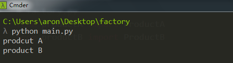
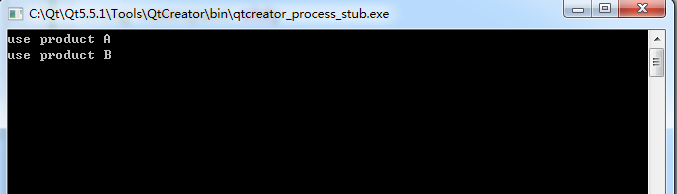

### 简单工厂模式(Simple Factory Pattern)
简单工厂模式(Simple Factory Pattern)：又称为静态工厂方法(Static Factory Method)模式，它属于类创建型模式。在简单工厂模式中，可以根据参数的不同返回不同类的实例。简单工厂模式专门定义一个类来负责创建其他类的实例，被创建的实例通常都具有共同的父类。

### Python 实现
```python
# prodcut.py
class Product(object):
    def __init__(self):
        pass

    def use(self):
        pass

# productA.py
from product import Product


class ProductA(Product):
    product_type = "A"

    def __init__(self):
        super(ProductA, self).__init__()

    def use(self):
        print("prodcut A")

# productB.py
from product import Product


class ProductB(Product):
    product_type = "B"

    def __init__(self):
        super(ProductB, self).__init__()

    def use(self):
        print("product B")

# factory.py
from productA import ProductA
from productB import ProductB


def createProduct(product_type):
    prod = None
    if product_type == "A":
        prod = ProductA()
    elif product_type == "B":
        prod = ProductB()
    return prod

# main.py
from factory import createProduct

if __name__ == "__main__":
    prodA = createProduct("A")
    prodB = createProduct("B")
    prodA.use()
    prodB.use()
```

运行结果:




### C++ 实现
```cpp
// 工厂类
//factory.h
#ifndef FACTORY_H
#define FACTORY_H
#include "product.h"
#include <string>
using namespace std;

class Factory
{
public:
    Factory();
    virtual ~Factory();

    static Product* createProduct(string proname);
};
#endif // FACTORY_H

// factory.cpp
#include "factory.h"
#include "concreateproducta.h"
#include "concreateproductb.h"

Factory::Factory(){}

Factory::~Factory(){}

Product* Factory::createProduct(string proname)
{
    if (proname == "A")
    {
        return new ConcreateProductA();
    }
    else if (proname == "B")
    {
        return new ConcreateProductB();
    }
    return NULL;
}

```

```cpp
// 产品基类
//product.h
#ifndef PRODUCT_H
#define PRODUCT_H


class Product
{
public:
    Product();
    virtual ~Product();

    virtual void Use() = 0;
};

#endif // PRODUCT_H

//product.cpp
#include "product.h"

Product::Product(){}

Product::~Product(){}

//产品A派生类
//concreateproducta.h 
#ifndef CONCREATEPRODUCTA_H
#define CONCREATEPRODUCTA_H
#include "product.h"

class ConcreateProductA: public Product
{
public:
    ConcreateProductA();
    virtual ~ConcreateProductA();

    virtual void Use();

};

#endif // CONCREATEPRODUCTA_H

//concreateproducta.cpp
#include "concreateproducta.h"
#include <iostream>
#include <string>
using namespace std;

ConcreateProductA::ConcreateProductA(){}

ConcreateProductA::~ConcreateProductA(){}

void ConcreateProductA::Use()
{
    cout << "use product A" << endl;
}

//产品B派生类
//concreateproductb.h
#ifndef CONCREATEPRODUCTB_H
#define CONCREATEPRODUCTB_H
#include "product.h"

class ConcreateProductB: public Product
{
public:
    ConcreateProductB();
    virtual ~ConcreateProductB();

    virtual void Use();
};

#endif // CONCREATEPRODUCTB_H

//concreateproductb.cpp
#include "concreateproductb.h"
#include <iostream>
#include <string>

using namespace std;

ConcreateProductB::ConcreateProductB(){}

ConcreateProductB::~ConcreateProductB(){}

void ConcreateProductB::Use()
{
    cout<< "use product B"<<endl;
}
```

```cpp
// main.cpp
#include <iostream>
#include "factory.h"
#include "product.h"

using namespace std;

int main(int argc, char *argv[])
{
    Product* prodA = Factory::createProduct("A");
    Product* prodB = Factory::createProduct("B");
    prodA->Use();
    prodB->Use();
    delete prodA;
    delete prodB;
    return 0;
}
```

运行结果:



###  模式分析
* 将对象的创建和对象本身业务处理分离可以降低系统的耦合度，使得两者修改起来都相对容易。
* 在调用工厂类的工厂方法时，由于工厂方法是静态方法，使用起来很方便，可通过类名直接调用，而且只需要传入一个简单的参数即可，在实际开发中，还可以在调用时将所传入的参数保存在XML等格式的配置文件中，修改参数时无须修改任何源代码。
* 简单工厂模式最大的问题在于工厂类的职责相对过重，增加新的产品需要修改工厂类的判断逻辑，这一点与开闭原则是相违背的。
* 简单工厂模式的要点在于：当你需要什么，只需要传入一个正确的参数，就可以获取你所需要的对象，而无须知道其创建细节。

### 简单工厂模式的优点
* 工厂类含有必要的判断逻辑，可以决定在什么时候创建哪一个产品类的实例，客户端可以免除直接创建产品对象的责任，而仅仅“消费”产品；简单工厂模式通过这种做法实现了对责任的分割，它提供了专门的工厂类用于创建对象。
* 客户端无须知道所创建的具体产品类的类名，只需要知道具体产品类所对应的参数即可，对于一些复杂的类名，通过简单工厂模式可以减少使用者的记忆量。
* 通过引入配置文件，可以在不修改任何客户端代码的情况下更换和增加新的具体产品类，在一定程度上提高了系统的灵活性。

### 简单工厂模式的缺点
* 由于工厂类集中了所有产品创建逻辑，一旦不能正常工作，整个系统都要受到影响。
* 使用简单工厂模式将会增加系统中类的个数，在一定程序上增加了系统的复杂度和理解难度。
* 系统扩展困难，一旦添加新产品就不得不修改工厂逻辑，在产品类型较多时，有可能造成工厂逻辑过于复杂，不利于系统的扩展和维护。
* 简单工厂模式由于使用了静态工厂方法，造成工厂角色无法形成基于继承的等级结构。

### 适用环境
在以下情况下可以使用简单工厂模式：

* 工厂类负责创建的对象比较少：由于创建的对象较少，不会造成工厂方法中的业务逻辑太过复杂。
* 客户端只知道传入工厂类的参数，对于如何创建对象不关心：客户端既不需要关心创建细节，甚至连类名都不需要记住，只需要知道类型所对应的参数。

### 总结
* 简单工厂模式包含三个角色：工厂角色负责实现创建所有实例的内部逻辑；抽象产品角色是所创建的所有对象的父类，负责描述所有实例所共有的公共接口；具体产品角色是创建目标，所有创建的对象都充当这个角色的某个具体类的实例。
* 简单工厂模式的要点在于：当你需要什么，只需要传入一个正确的参数，就可以获取你所需要的对象，而无须知道其创建细节。