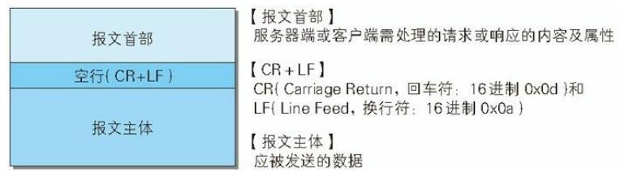
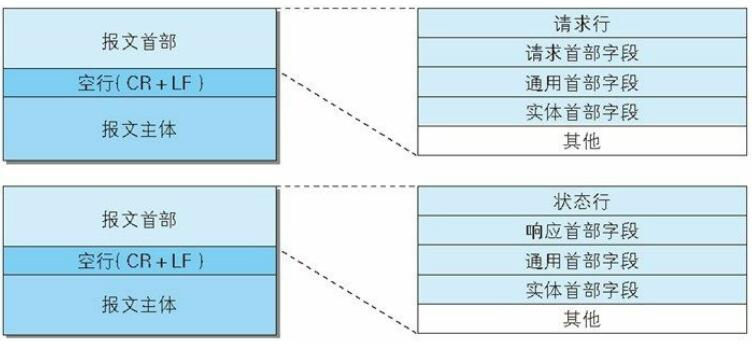

术语:
MIME:（Multipurpose Internet Mail Extensions，多用途因特网邮件扩展）

### HTTP 报文
用于 HTTP 协议交互的信息被称为 HTTP 报文.
请求端（客户端）的HTTP 报文叫做请求报文，响应端（服务器端）的叫做响应报文。HTTP 报文本身是由多行（用 CR+LF 作换行符）数据构成的字符串文本。
HTTP 报文大致可分为报文首部和报文主体两块。两者由最初出现的空行（CR+LF）来划分,通常，并不一定要有报文主体。

### 请求报文及响应报文的结构

请求行:包含用于请求的方法，请求 URI 和 HTTP 版本。
状态行:包含表明响应结果的状态码，原因短语和 HTTP 版本。
首部字段:包含表示请求和响应的各种条件和属性的各类首部。
一般有 4 种首部，分别是：通用首部、请求首部、响应首部和实体首部。
其他:可能包含 HTTP 的 RFC 里未定义的首部（Cookie 等）

### 编码提升传输速率
HTTP 在传输数据时可以按照数据原貌直接传输，但也可以在传输过程中通过编码提升传输速率。通过在传输时编码，能有效地处理大量的访问请求。但是，编码的操作需要计算机来完成，因此会消耗更多的 CPU 等资源

报文主体和实体主体的差异
报文（message）
是 HTTP 通信中的基本单位，由 8 位组字节流（octet sequence，其中 octet 为 8 个比特）组成，通过 HTTP 通信传输。
实体（entity）
作为请求或响应的有效载荷数据（补充项）被传输，其内容由实体首部和实体主体组成。

HTTP 报文的主体用于传输请求或响应的实体主体。通常，报文主体等于实体主体。只有当传输中进行编码操作时，实体主体的内容发生变化，才导致它和报文主体产生差异。

压缩传输的内容编码
内容编码指明应用在实体内容上的编码格式，并保持实体信息原样压缩。内容编码后的实体由客户端接收并负责解码。

常用的内容编码有以下几种。
- gzip（GNU zip）
- compress（UNIX 系统的标准压缩）
- deflate（zlib）
- identity（不进行编码）

分割发送的分块传输编码
在 HTTP 通信过程中，请求的编码实体资源尚未全部传输完成之前，浏览器无法显示请求页面。在传输大容量数据时，通过把数据分割成多块，能够让浏览器逐步显示页面。这种把实体主体分块的功能称为分块传输编码（Chunked Transfer Coding）。
分块传输编码会将实体主体分成多个部分（块）。每一块都会用十六进制来标记块的大小，而实体主体的最后一块会使用“0(CR+LF)”来标记。
使用分块传输编码的实体主体会由接收的客户端负责解码，恢复到编码前的实体主体。
HTTP/1.1 中存在一种称为传输编码（Transfer Coding）的机制，它可以在通信时按某种编码方式传输，但只定义作用于分块传输编码中。

在 HTTP 报文中使用多部分对象集合时，需要在首部字段里加上Content-type.
使用 boundary 字符串来划分多部分对象集合指明的各类实体.boundary 字符串指定的各个实体的起始行之前插入“--”标记.

多部分对象集合的每个部分类型中，都可以含有首部字段。另外，可
以在某个部分中嵌套使用多部分对象集合。

### 获取部分内容的范围请求
可恢复的机制:所谓恢复是指能从之前下载中断处恢复下载.
要实现可恢复功能需要指定下载的实体范围。
执行范围请求时，会用到首部字段 Range 来指定资源的 byte 范围。响应会返回状态码为 206 Partial Content 的响应报文.
对于多重范围的范围请求，响应会在首部字段 Content-Type 标明 multipart/byteranges 后返回响应报文.如果服务器端无法响应范围请求，则会返回状态码 200 OK 和完整的实体内容。

### 内容协商返回最合适的内容
当浏览器的默认语言为英语或中文，访问相同 URI 的 Web 页面时，则会显示对应的英语版或中文版的 Web 页面。这样的机制称为内容协商（Content Negotiation）。
内容协商机制是指客户端和服务器端就响应的资源内容进行交涉，然后提供给客户端最为适合的资源。内容协商会以响应资源的语言、字符集、编码方式等作为判断的基准。

包含在请求报文中的某些首部字段（如下）就是判断的基准:
- Accept
- Accept-Charset
- Accept-Encoding
- Accept-Language
- Content-Language

内容协商技术有以下 3 种类型:
1. 服务器驱动协商（Server-driven Negotiation）
由服务器端进行内容协商。以请求的首部字段为参考，在服务器端自动处理。但对用户来说，以浏览器发送的信息作为判定的依据，并不一定能筛选出最优内容。
2. 客户端驱动协商（Agent-driven Negotiation）
由客户端进行内容协商的方式。用户从浏览器显示的可选项列表中手动选择。还可以利用 JavaScript 脚本在 Web 页面上自动进行上述选择。比如按 OS 的类型或浏览器类型，自行切换成 PC 版页面或手机版页面。
3. 透明协商（Transparent Negotiation）
是服务器驱动和客户端驱动的结合体，是由服务器端和客户端各自进行内容协商的一种方法。