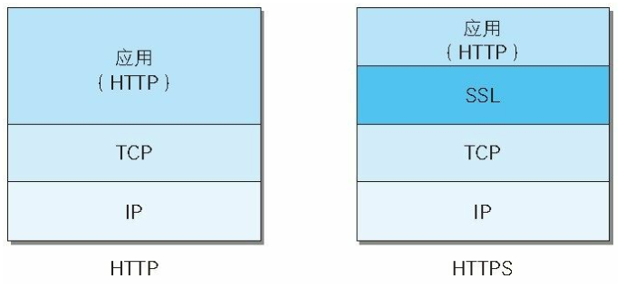

### http的不足
* 通信使用明文（不加密），内容可能会被窃听
* 不验证通信方的身份，因此有可能遭遇伪装
* 无法证明报文的完整性，所以有可能已遭篡改

### 加密处理方式
1. 通信的加密
HTTP 协议中没有加密机制，但可以通过和 SSL（Secure Socket Layer，安全套接层）或TLS（Transport Layer Security，安全层传输协议）的组合使用，加密 HTTP 的通信内容。
用 SSL 建立安全通信线路之后，就可以在这条线路上进行 HTTP通信了。与 SSL 组合使用的 HTTP 被称为 HTTPS（HTTP Secure，超文本传输安全协议）或 HTTP over SSL。
2. 内容的加密
即把HTTP 报文里所含的内容进行加密处理, 为了做到有效的内容加密，前提是要求客户端和服务器同时具备加密和解密机制。该方式不同于 SSL 或 TLS 将整个通信线路加密处理，所以内容仍有被篡改的风险。(虽然劫持者看不到内容,但可以篡改劫持信息的内容)

### 不验证通信方的身份
HTTP 协议中的请求和响应不会对通信方进行确认
任何人都可发起请求, 服务器只要接收到请求，不管对方是谁都会返回一个响应（但也仅限于发送端的 IP 地址和端口号没有被 Web 服务器设定限制访问的前提下）
查明对手的证书
SSL 不仅提供加密处理，而且还使用了一种被称为证书的手段，可用于确定方.
证书由值得信任的第三方机构颁发，用以证明服务器和客户端是实际存在的。另外，伪造证书从技术角度来说是异常困难的一件事。所以只要能够确认通信方（服务器或客户端）持有的证书，即可判断通信方的真实意图。
另外，客户端持有证书即可完成个人身份的确认，也可用于对Web 网站的认证环节。

### 证明报文完整性，可能已遭篡改
中间人攻击（Man-in-the-Middle attack，MITM）:请求或响应在传输途中，遭攻击者拦截并篡改内容的攻击.
HTTP 协议确定报文完整性的方法，但事实上并不便捷、可靠。其中常用的是 MD5 和 SHA-1 等散列值校验的方法，以及用来确认文件的数字签名方法。
提供文件下载服务的 Web 网站也会提供相应的以 PGP（Pretty Good Privacy，完美隐私）创建的数字签名及 MD5 算法生成的散列值。PGP 是用来证明创建文件的数字签名，MD5 是由单向函数生成的散列值。不论使用哪一种方法，都需要操纵客户端的用户本人亲自检查验证下载的文件是否就是原来服务器上的文件。浏览器无法自动帮用户检查。可惜的是，用这些方法也依然无法百分百保证确认结果正确。因为 PGP 和 MD5 本身被改写的话，用户是没有办法意识到的。为了有效防止这些弊端，有必要使用 HTTPS。SSL 提供认证和加密处理及摘要功能。

### HTTPS = HTTP+ 加密 + 认证 + 完整性保护
使用HTTPS 通信时，不再用 http://，而是改用 https://。另外，当浏览器访问 HTTPS 通信有效的 Web 网站时，浏览器的地址栏内会出现一个带锁的标记。对 HTTPS 的显示方式会因浏览器的不同而有所改变。
HTTPS 是身披 SSL 外壳的 HTTP,HTTPS 并非是应用层的一种新协议。只是 HTTP 通信接口部分用SSL（Secure Socket Layer）和 TLS（Transport Layer Security）协议代替而已。
通常，HTTP 直接和 TCP 通信。当使用 SSL 时，则演变成 http 先和 SSL 通信，再由 SSL 和 TCP 通信了。如下图所示

SSL 是独立于 HTTP 的协议，所以不光是 HTTP 协议，其他运行在应用层的 SMTP 和 Telnet 等协议均可配合 SSL 协议使用。可以说 SSL 是当今世界上应用最为广泛的网络安全技术。

### 相互交换密钥的公开密钥加密技术
SSL 采用一种叫做公开密钥加密（Public-key cryptography）的加密处理方式。
近代的加密方法中加密算法是公开的，而密钥却是保密的。通过这种方式得以保持加密方法的安全性。加密和解密都会用到密钥。没有密钥就无法对密码解密，反过来说，任何人只要持有密钥就能解密了。如果密钥被攻击者获得，那加密也就失去了意义。

* 对称密钥加密
加密和解密同用一个密钥的方式称为共享密钥加密（Common key crypto system）也被叫做对称密钥加密, 以共享密钥方式加密时必须将密钥也发给对方。

* 使用两把密钥的公开密钥加密
公开密钥加密方式很好地解决了共享密钥加密的困难, 公开密钥加密使用一对非对称的密钥。一把叫做私有密钥（private key），另一把叫做公开密钥（public key）。顾名思
义，私有密钥不能让其他任何人知道，而公开密钥则可以随意发布，任何人都可以获得。使用公开密钥加密方式，发送密文的一方使用对方的公开密钥进行加密处理，对方收到被加密的信息后，再使用自己的私有密钥进行解密。利用这种方式，不需要发送用来解密的私有密钥，也不必担心密钥被攻击者窃听而盗走。另外，要想根据密文和公开密钥，恢复到信息原文是异常困难的，因为解密过程就是在对离散对数进行求值，这并非轻而易举就能办到。退一步讲，如果能对一个非常大的整数做到快速地因式分解，那么密码破解还是存在希望的。但就目前的技术来看是不太现实的。

### HTTPS 采用混合加密机制
HTTPS 采用共享密钥加密和公开密钥加密两者并用的混合加密机制。
公开密钥加密与共享密钥加密相比，其处理速度要慢。所以应充分利用两者各自的优势，将多种方法组合起来用于通信。在交换密钥环节使用公开密钥加密方式，之后的建立通信交换报文阶段则使用共享密钥加密方式。

### 证明公开密钥正确性的证书
公开密钥加密方式还是存在一些问题的。那就是无法证明公开密钥本身就是货真价实的公开密钥。比如，正准备和某台服务器建立公开密钥加密方式下的通信时，如何证明收到的公开密钥就是原本预想的那台服务器发行的公开密钥。或许在公开密钥传输途中，真正的公开密钥已经被攻击者替换掉了。
为了解决上述问题，可以使用由数字证书认证机构（CA，Certificate Authority）和其相关机关颁发的公开密钥证书。数字证书认证机构处于客户端与服务器双方都可信赖的第三方机构的立场上。
首先，服务器的运营人员向数字证书认证机构提出公开密钥的申请。数字证书认证机构在判明提出申请者的身份之后，会对已申请的公开密钥做数字签名，然后分配这个已签名的公开密钥，并将该公开密钥放入公钥证书后绑定在一起。
服务器会将这份由数字证书认证机构颁发的公钥证书发送给客户端，以进行公开密钥加密方式通信。公钥证书也可叫做数字证书或直接称为证书。接到证书的客户端可使用数字证书认证机构的公开密钥，对那张证书上的数字签名进行验证，一旦验证通过，客户端便可明确两件事：一，认证服务器的公开密钥的是真实有效的数字证书认证机构。二，服务器的公开密钥是值得信赖的。
此处认证机关的公开密钥必须安全地转交给客户端。使用通信方式时，如何安全转交是一件很困难的事，因此，多数**浏览器开发商发布版本时，会事先在内部植入常用认证机关的公开密钥**。

### 可证明组织真实性的 EV SSL 证书
证书的一个作用是用来证明作为通信一方的服务器是否规范，另外一个作用是可确认对方服务器背后运营的企业是否真实存在。拥有该特性的证书就是 EV SSL 证书（Extended Validation SSL Certificate）。EV SSL 证书是基于国际标准的认证指导方针颁发的证书。其严格规定了对运营组织是否真实的确认方针，因此，通过认证的Web 网站能够获得更高的认可度。持有 EV SSL 证书的 Web 网站的浏览器地址栏处的背景色是绿色的，从视觉上就能一眼辨别出。而且在地址栏的左侧显示了 SSL证书中记录的组织名称以及颁发证书的认证机构的名称。

### 用以确认客户端的客户端证书
HTTPS 中还可以使用客户端证书,以客户端证书进行客户端认证，证明服务器正在通信的对方始终是预料之内的客户端，其作用跟服务器证书如出一辙。

### 由自认证机构颁发的证书称为自签名证书
如果使用 OpenSSL 这套开源程序，每个人都可以构建一套属于自己的认证机构，从而自己给自己颁发服务器证书。但该服务器证书在互联网上不可作为证书使用.
独立构建的认证机构叫做自认证机构，由自认证机构颁发的“无用”证书也被戏称为自签名证书。
自认证机构颁发的服务器证书之所以不起作用，是因为它无法消除伪装的可能性。自认证机构能够产生的作用顶多也就是自己对外宣称“我是○○”的这种程度。即使采用自签名证书，通过 SSL加密之后，可能偶尔还会看见通信处在安全状态的提示，可那也是有问题的。因为 就算加密通信，也不能排除正在和已经过伪装的假服务器保持通信。
值得信赖的第三方机构介入认证，才能让已植入在浏览器内的认证机构颁布的公开密钥发挥作用，并借此证明服务器的真实性。多数浏览器内预先已植入备受信赖的认证机构的证书，但也有一小部分浏览器会植入中级认证机构的证书。对于中级认证机构颁发的服务器证书，某些浏览器会以正规的证书来对待，可有的浏览器会当作自签名证书。

### HTTPS 的安全通信机制
HTTPS 通信过程
步骤 1： 客户端通过发送 Client Hello 报文开始 SSL 通信。报文中包含客户端支持的 SSL 的指定版本、加密组件（Cipher Suite）列表（所使用的加密算法及密钥长度等）。
步骤 2： 服务器可进行 SSL 通信时，会以 Server Hello 报文作为应答。和客户端一样，在报文中包含 SSL 版本以及加密组件。服务器的加密组件内容是从接收到的客户端加密组件内筛选出来的。
步骤 3： 之后服务器发送 Certificate 报文。报文中包含公开密钥证书。
步骤 4： 最后服务器发送 Server Hello Done 报文通知客户端，最初阶段的 SSL 握手协商部分结束。
步骤 5： SSL 第一次握手结束之后，客户端以 Client Key Exchange 报文作为回应。报文中包含通信加密中使用的一种被称为 Pre-master secret 的随机密码串。该报文已用步骤 3 中的公开密钥进行加密。
步骤 6： 接着客户端继续发送 Change Cipher Spec 报文。该报文会提示服务器，在此报文之后的通信会采用 Pre-master secret 密钥加密。
步骤 7： 客户端发送 Finished 报文。该报文包含连接至今全部报文的整体校验值。这次握手协商是否能够成功，要以服务器是否能够正确解密该报文作为判定标准。
步骤 8： 服务器同样发送 Change Cipher Spec 报文。
步骤 9： 服务器同样发送 Finished 报文.
步骤 10： 服务器和客户端的 Finished 报文交换完毕之后，SSL 连接就算建立完成。当然，通信会受到 SSL 的保护。从此处开始进行应用层协议的通信，即发送 HTTP 请求。
步骤 11： 应用层协议通信，即发送 HTTP 响应。
步骤 12： 最后由客户端断开连接。断开连接时，发送 close_notify 报文。上图做了一些省略，这步之后再发送 TCP FIN 报文来关闭与 TCP的通信。
在以上流程中，应用层发送数据时会附加一种叫做 MAC（Message Authentication Code）的报文摘要。MAC 能够查知报文是否遭到篡改，从而保护报文的完整性。

CBC 模式（Cipher Block Chaining）又名密码分组链接模式。在此模式下，将前
一个明文块加密处理后和下一个明文块做 XOR 运算，使之重叠，然后再对运算
结果做加密处理。对第一个明文块做加密时，要么使用前一段密文的最后一块，
要么利用外部生成的初始向量（initial vector，IV）

### SSL 和 TLS
HTTPS 使用 SSL（Secure Socket Layer） 和 TLS（Transport Layer Security）这两个协议。SSL 技术最初是由浏览器开发商网景通信公司率先倡导的，开发过 SSL3.0 之前的版本。目前主导权已转移到 IETF（Internet Engineering Task Force，Internet 工程任务组）的手中. IETF 以 SSL3.0 为基准，后又制定了 TLS1.0、TLS1.1 和 TLS1.2。TSL 是以 SSL 为原型开发的协议，有时会统一称该协议为 SSL。当前主流的版本是 SSL3.0 和 TLS1.0。      

#### SSL 速度慢
HTTPS 也存在一些问题，那就是当使用 SSL 时，它的处理速度会变慢。
SSL 的慢分两种。一种是指通信慢。另一种是指由于大量消耗CPU 及内存等资源，导致处理速度变慢。

和使用 HTTP 相比，网络负载可能会变慢 2 到 100 倍。除去和TCP 连接、发送 HTTP 请求 • 响应以外，还必须进行 SSL 通信，因此整体上处理通信量不可避免会增加。另一点是 SSL 必须进行加密处理。在服务器和客户端都需要进行加密和解密的运算处理。因此从结果上讲，比起 HTTP 会更多地消耗服务器和客户端的硬件资源，导致负载增强。针对速度变慢这一问题，并没有根本性的解决方案，我们会使用SSL 加速器这种（专用服务器）硬件来改善该问题。该硬件为SSL 通信专用硬件，相对软件来讲，能够提高数倍 SSL 的计算速度。仅在 SSL 处理时发挥 SSL 加速器的功效，以分担负载。

### 为什么不一直使用 HTTPS
1. 与纯文本通信相比，加密通信会消耗更多的CPU 及内存资源。如果每次通信都加密，会消耗相当多的资源，平摊到一台计算机上时，能够处理的请求数量必定也会随之减少。因此，如果是非敏感信息则使用 HTTP 通信，只有在包含个人信息等敏感数据时，才利用 HTTPS 加密通信。并非对所有内容都进行加密处理，而是仅在那些需要信息隐藏时才会加密，以节约资源。
2. 此外, 要进行 HTTPS 通信，证书是必不可少的。而使用的证书必须向认证机构（CA）购买。