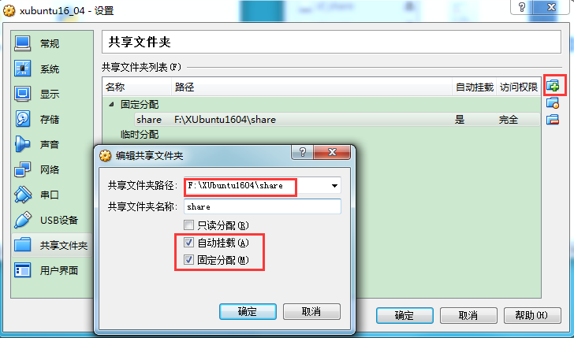

## 关于virtualbox
1. 安装增强功能
2. 设置共享文件夹
3. virtualbox快捷键

### 安装增强功能
打开终端, 挂载目录:, 执行安装, 需要root权限
```
mount  /dev/cdrom  /media/cdrom
cd  /media/cdrom0
sh  ./VBoxLinuxAdditions.run 
```

然后设置切换显示模式,注意使用快捷键切换

### 设置共享文件夹
点击虚拟机菜单栏上的"设备->分配数据空间"，固定分配一个文件夹，比如分配名为share的文件夹，
该文件夹存在于物理机上，我一般放在和虚拟机在同一目录下, 然后设置后将由你的虚拟机和物理机共享。
把数据空间挂载到vshare上，就是我在第一步中物理机里的share文件夹
然后挂载目录:
mount  -t  vboxsf share /home/debian/vshare
注意: 
vshare是linux下的一个文件夹,目录就是/home/debian/vshare
要勾选自动挂载, 如下图所示.



### VirtualBox显示切换快捷键
 
Right Ctrl + F        -- 切换到全屏模式
Right Ctrl + L        -- 切换到无缝模式
Right Ctrl + C        -- 切换到比例模式
Right Ctrl + Home     -- 显示控制菜单

## 关于debian环境搭建
### sudo command not found
debian没有内置sudo这个工具,
切换到su,
apt-get install sudo
sudo vi /etc/sudoers

```
#
# This file MUST be edited with the 'visudo' command as root.
#
# Please consider adding local content in /etc/sudoers.d/ instead of
# directly modifying this file.
#
# See the man page for details on how to write a sudoers file.
#
Defaults|   env_reset
Defaults|   mail_badpass
Defaults|   secure_path="/usr/local/sbin:/usr/local/bin:/usr/sbin:/usr/bin:/sbin:/bin"

# Host alias specification

# User alias specification

# Cmnd alias specification

# User privilege specification(在这一行, 添加一个用户)
root|   ALL=(ALL:ALL) ALL

# Members of the admin group may gain root privileges
%admin ALL=(ALL) ALL

# Allow members of group sudo to execute any command
%sudo|  ALL=(ALL:ALL) ALL

# See sudoers(5) for more information on "#include" directives:

#includedir /etc/sudoers.d
```

### 更新源列表
cd /etc/apt/
cp source.list source.list.bak


### 输入法安装
1.先安装，这四个
apt-get install fcitx，
apt-get install fcitx-ui-classic
apt-get install fcitx-ui-light
apt install ttf-wqy-*
2.百度sogo输入法linux.deb ,然后双击。。。

### 安装vim, gedit, vscode


### 更改时间和时区


### 修改主机名
查看一下当前的hostname有2种方法
1. 打开一个终端，在命令提示符中可以看到主机名，主机名通常位于“@”符号后
2. 在终端输入hostname指令
要修改hostname，需要root权限
如果是Ubuntu/Debian修改步骤和上面类似：
（1）修改/etc/hosts，将/etc/hosts内出现的h93都改成vm93。
（2）修改/etc/hostname，将该文件内容由h93修改为vm93。
（3）执行“hostname vm93”，临时修改一下。当下次重启系统，则真正生效。


### 在终端输入reboot,结果到了重新安装镜像的界面了
Virtualbox安装好debian ,在终端输入reboot,结果到了重新安装镜像的界面了。这是因为安装的磁盘iso还在光驱中。所以，reboot会从光驱驱动，重新进入安装界面。这个时候，我一般不点击reboot。而是直接点击virtualbox的poweroff键。让他关闭虚拟机。然后在关闭虚拟机后，先弹出光驱中的iso。然后再重启virtualbox中的linux OS。

###
arvin is not in the sudoers file
this incident will be reported
you have mail in /var/mail/arvin

