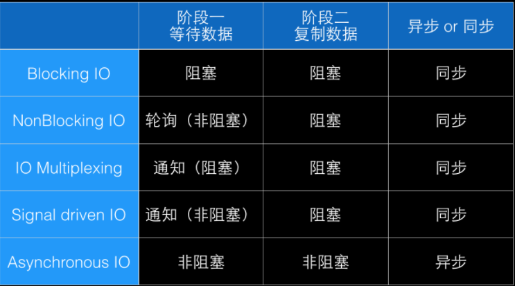
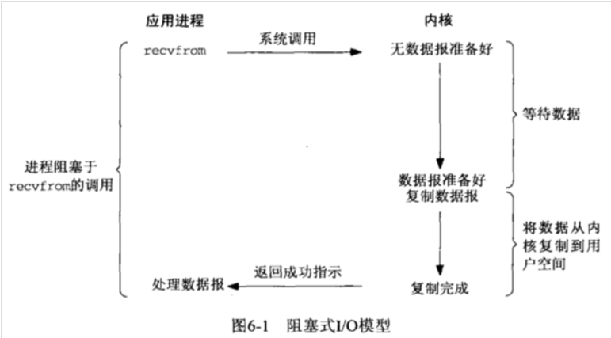
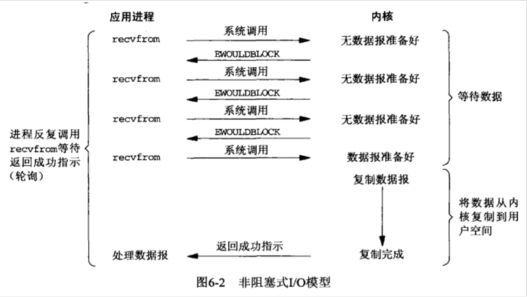
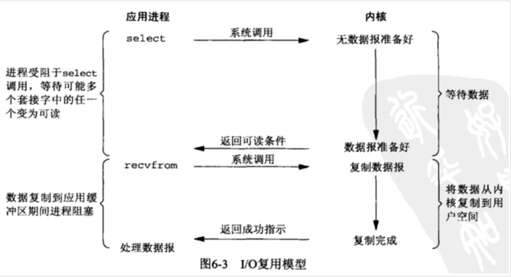
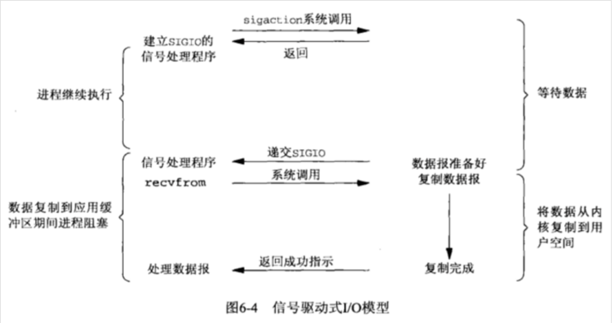
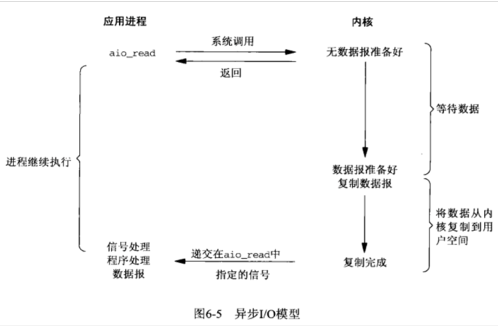

### 前言
IO有内存IO、网络IO和磁盘IO三种，通常我们说的IO指的是后两者.
Linux的内核将所有外部设备都看做一个文件来操作，对一个文件的读写操作会调用内核提供的系统命令，返回一个file descriptor（fd，文件描述符 ）。而对一个socket的读写也会有相应的描述符，称为socketfd（socket描述符），描述符就是一个数字，它指向内核中的一个结构体（文件路径，数据区等一些属性）。
### IO模型分类
在Unix(Linux)下，可用的I/O模型有五种：
* 阻塞I/O
* 非阻塞I/O
* I/O多路复用：select和poll是属于这种I/O模型。
* 信号（或事件）驱动I/O
* 异步I/O

网络IO的本质就是socket流的读取，通常一次IO读操作会涉及到两个对象和两个阶段。
两个对象分别是：
用户进程（线程）Process（Thread）
内核对象 Kernel

两个阶段：
等待流数据准备（wating for the data to be ready）;
从内核向进程复制数据（copying the data from the kernel to the process）;

对于socket流而已：

第一步通常涉及等待网络上的数据分组到达，然后被复制到内核的某个缓冲区。
第二步把数据从内核缓冲区复制到应用进程缓冲区。

对于网络数据的接收操作而言，五种I/O模型都是分为两个阶段：
1. 等待数据准备好。
2. 将准备好的数据，从内核空间考到进程空间。

对于第一步，就是等待数据到达，到达之后，数据就被复制到内核缓冲区；
对于第二步，将数据从内核缓冲区复制到进程缓冲区中。





### 阻塞I/O模型
阻塞I/O模型属于最常见的I/O模型，在这五种I/O模型中都可以看到阻塞I/O的身影。默认情况下，所有的网络socket都是阻塞的。下面，我们就演示一下具体的数据处理过程：



进程对内核发起系统调用（recvfrom），当数据到达网卡并最终被复制到进程空间（或中途发生错误，比如对进程发送一个中断信号等）后，系统调用（recvfrom）就会返回信息给进程，之后，进程再根据返回的信息来进行相应的处理。而进程在收到recvfrom返回信息之前的整个时间段内，我们称，进程被阻塞。当recvfrom返回成功信息时，进程就开始对数据进行处理。

### 非阻塞I/O模型
当I/O模型为非阻塞I/O时，那么就相当于告诉内核，当进程请求的数据没完成时，这个进程就不会进入睡眠状态，而是返回一个错误信息。



在此，对上图的流程做简单的介绍:前三次调用recvfrom，数据都未准备就绪，因此内核会立即返回一个EWOULDBLOCK的错误信息。第四次调用recvfrom时，数据已经准备就绪。然后数据被复制到进程缓冲区，并且recvfrom返回成功信息。最后，进程对数据进行处理。像这样，在非阻塞模型中一个进程反复调用recvfrom的过程，我们将它称为polling。此时，进程会不断的询问内核：是否某个操作已经准备就绪。而通常这又会浪费CPU时间片，所以，使用这种模型的很少见。

### I/O多路复用模型
在I/O多路复用模型下，我们可以使用select或poll系统调用，而此时发生的阻塞是由select或poll产生的，而不是在真正的I/O系统调用上。Linux提供select/poll（I/O复用模型会用到select或者poll函数，这两个函数也会使进程阻塞，但是和阻塞I/O所不同的是，这两个函数可以同时阻塞多个I/O操作。而且可以同时对多个读操作，多个写操作的I/O函数进行检测，直到有数据可读或可写时，才真正调用I/O操作函数），进程通过将一个或多个fd传递给select或poll系统调用，阻塞在select操作上，这样select/poll可以帮我们侦测多fd是否处于就绪状态。select/poll是顺序扫描fd是否就绪，而且支持的fd数量有限，因此它的使用受到了一些制约。Linux还提供了一个epoll系统调用，epoll使用基于事件驱动方式代替顺序扫描，因此性能更高。当有fd就绪时，立即回调函数rollback。



在此，对上图的流程做简单的介绍:在调用select，进程的一个请求就阻塞了，直到数据准备就绪。当select返回数据就绪信息（readable）时，然后，在调用recvfrom将数据复制到进程缓冲区。通过与第一张阻塞I/O模型的图的比较，我们并没有发现多路复用I/O模型有什么优点，并且事实上，还有一个小的缺点，因为使用select时需要两种不同的系统调用。但是使用select的好处是，我们可以同时等待多个I/O的完成。

### 信号驱动I/O模型
我们可以使用信号，来告诉内核当数据准备就绪的时候，使用SIGIO信号来通知我们。我们将此称为信号驱动的I/O。



在此，对上图的流程做简单的介绍:
首先，使用sigaction系统调用安装信号处理器。然后，立即从系统调用中返回，从而进程在继续执行，而不会被阻塞。当数据准备就绪的时候，就会生成SIGIO信号并发送给进程的信号处理器，然后再通过调用recvfrom来读取数据，并最终返回OK由进程对数据进行处理。

### 异步I/O模型：
一般来说，异步I/O模型的实现是从操作步骤的开始到通知整个操作完成（包括将数据从内核复制到进程缓冲区中）。它和信号驱动I/O的主要不同是：信号I/O是在I/O操作正要开始的时候通知我们的，而异步I/O是当I/O操作完成时通知我们的。



在此，对上图的流程做简单的介绍:
当调用aio_read时，会同时向内核传递描述符，缓冲区指针，缓冲区大小，文件偏移量和当整个操作完成时该如何通知我们等信息。然后，系统调用立即返回，并且进程在等待I/O完成的时候，不会发生阻塞。直到当操作完成的时候内核就会产生相应的信号，并通知给进程。


### 总结
1. 程序空间与内核空间
在Linux中，对于一次读取IO的操作，数据并不会直接拷贝到程序的程序缓冲区。它首先会被拷贝到操作系统内核的缓冲区中，然后才会从操作系统内核的缓冲区拷贝到应用程序的缓冲区。p.s: 最后一句话非常重要，重复一遍。

Waiting for the data to be ready(等待数据到达内核缓冲区)
Copying the data from the kernel to the process(从内核缓冲区拷贝数据到程序缓冲区)

2. 阻塞与非阻塞区别
调用blocking IO会一直block住对应的进程直到操作完成，而non-blocking IO在kernel还准备数据的情况下会立刻返回。
区分阻塞和非阻塞只要区分函数调用之后是否挂起返回就可以了

3. synchronous IO和asynchronous IO区别
区分异步和同步，则是函数调用之后，数据或条件满足之后如何通知函数。等待数据返回则是同步，通过回调则是异步。

4. select/poll/epoll
即使现在的各个Linux版本普遍引入了copy on write和线程，但实际上进程/线程之间的切换依然还是一笔很大的开销，这个时候我们可以考虑使用上面提到到多路IO复用，回顾一下我们上面提到的多路IO复用模型的基本原理：一个进程可以监视多个文件描述符，一旦某个文件描述符就绪（读/写准备就绪），能够信号通知程序进行相应的读写操作。下面我们就来简单的看一下多路IO复用的三种方式。
* select
```cpp
int select (int maxfdp1, fd_set *readset, fd_set *writeset, fd_set *exceptset,
            const struct timeval *timeout);
```            

如上面的方法声明所示, select监听三类描述符: readset(读), writeset(写), exceptset(异常), 我们编程的时候可以制定这三个参数监听对应的文件描述符。正如前面提到的,select调用后进程会阻塞, 当select返回后，可以通过遍历fdset，来找到就绪的描述符。
select优点在于它的跨平台，但是也有显著的缺点单个进程能够监视的文件描述符的数量存在最大限制，默认设置为1024/2048，虽然设置可以超过这一限制，但是这样也可能会造成效率的降低。而且select扫描的时候也是采用的轮循，算法复杂度为O(n)，这在fdset很多时效率会较低。

* poll
```cpp
int poll (struct pollfd *fdarray, unsigned long nfds, int timeout);
```

poll和select并没有太大的区别，但是它是基于链表实现的所以并没有最大数量限制，它将用户传入的数据拷贝到内核空间，然后查询每个fd对应的设备状态，如果设备就绪则在设备等待队列中加入一项并继续遍历，如果遍历完所有fd后没有发现就绪设备，则挂起当前进程，直到设备就绪或者主动超时，被唤醒后它又要再次遍历fd。这个过程经历了多次的遍历。算法复杂度也是O(n)。

* epoll
```cpp
int epoll_create(int size);
int epoll_ctl(int epfd, int op, int fd, struct epoll_event *event);
int epoll_wait(int epfd, struct epoll_event * events, int maxevents, int timeout);
```

select和poll都只提供了一个函数。而epoll提供了三个函数: `epoll_create`是创建一个epoll句柄, `epoll_ctl`是注册要监听的事件类型, `epoll_wait`则是等待事件的产生。与select相比，epoll几乎没有描述符限制(cat /proc/sys/fs/file-max可查看)。它采用一个文件描述符管理多个描述符，将用户的文件描述符的事件存放到kernel的一个事件表中，这样在程序空间和内核空间的只要做一次拷贝。它去掉了遍历文件描述符这一步骤，采用更加先进的回调(callback)机制，算法复杂度降到了O(1)。p.s: 虽然表面看起来epoll非常好，但是对于连接数少并且连接都十分活跃的情况下，select和poll的性能可能比epoll好，因为epoll是建立在大量的函数回调的基础之上。


##  epoll, kqueue, select, iocp的概念
epoll


## 阻塞, 非阻塞忙轮询


## 缓冲区,内核缓冲区
缓冲区的引入是为了减少频繁I/O操作而引起频繁的系统调用，当你操作一个流时，更多的是以缓冲区为单位进行操作，这是相对于用户空间而言。对于内核来说，也需要缓冲区。


## 用户态, 内核态

### 参考
* [linux中的“5种网络 IO 模型”](http://noican.blog.51cto.com/4081966/1354950)
* [https://www.ziwenxie.site/2017/01/02/unix-network-programming-asynchronous/](https://www.ziwenxie.site/2017/01/02/unix-network-programming-asynchronous/)
* [http://blog.leanote.com/post/joesay/Concurrency-Model-Part-1-IO-Concurrency](http://blog.leanote.com/post/joesay/Concurrency-Model-Part-1-IO-Concurrency)