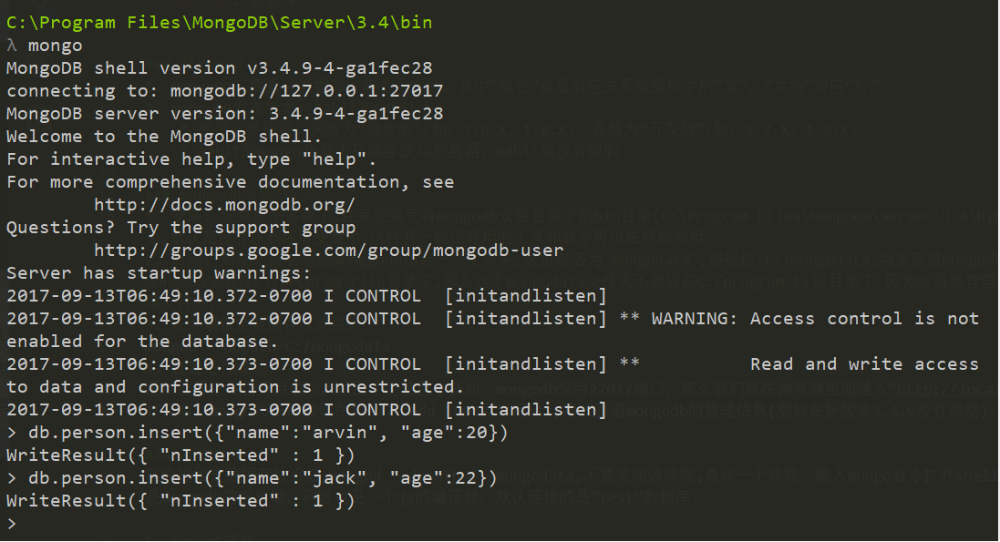
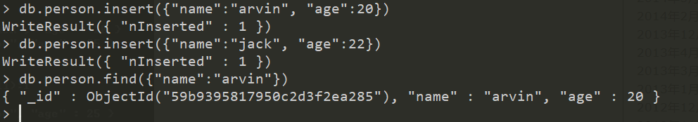
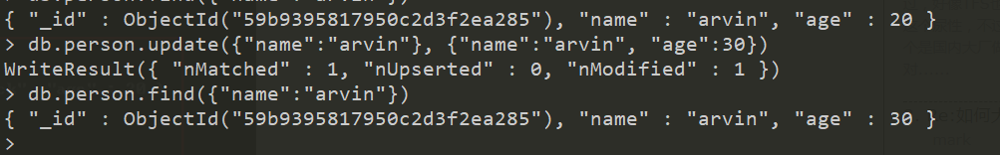
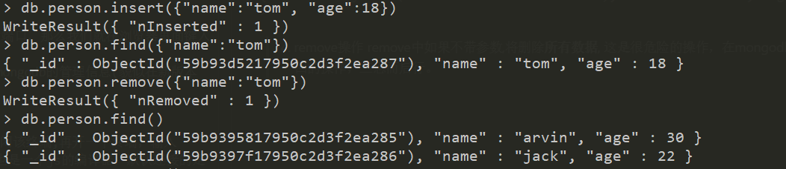
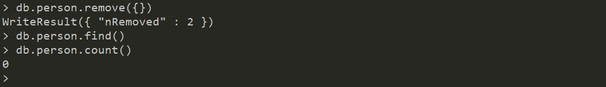

### 基础知识
1. mongoDB三要素: 数据库，集合，文档，其中“集合”就是对应关系数据库中的“表”，“文档”对应“行”。
2. mongoDB发布版本: 32bit和64bit
    * 根据业界规则，偶数为“稳定版”(如：1.6.X，1.8.X)，奇数为“开发版”(如：1.7.X，1.9.X)
    * 32bit的mongodb最大只能存放2G的数据，64bit就没有限制

### mongoDB安装与启动
1. 安装: 安装就不多说了,注意安装完将mongodb安装目录下的bin目录(C:\Program Files\MongoDB\Server\3.4\bin)放到环境变量中去,默认是没有放到环境变量中.这样有一些很好用的工具和命令可以在终端使用.
2. 启动: 启动之前必须给monggodb指定一个文件夹,这里取名为”mongodata",路径位:C:\mongodata,用来存放mongodb的数据。如果你将mongodb安装在C:/program File目录下,那么这个mongodata文件夹不要放在C:/program File目录下.因为这需要管理员权限才能添加和删除文件夹.
3. 在终端指定数据存放地点:
mongod --dbpath=C:/mongodata
4. 查看是否成功:
最后要看下是否开启成功，从图中的信息中获知，mongodb采用27017端口，那么我们就在浏览器里面键入“http://localhost:27017/”，
打开后，mongodb告诉我们在27017上Add 1000可以用http模式查看mongodb的管理信息(貌似在新版本3.4.9没有成功)。

### 基本操作
在终端指定数据存放点后,mongod --dbpath=C:/mongodata,不要关闭该终端,再开一个终端，输入mongo命令打开shell，其实这个shell就是mongodb的客户端，同时也是一个js的编译器，默认连接的是“test”数据库。

1. insert操作

2. find 操作

这里要注意两点：
“_id"： 这个字段是数据库默认给我们加的GUID，目的就是保证数据的唯一性。
严格的按照Bson的形式书写文档，不过也没关系，错误提示还是很强大的。

3. update操作

update方法的第一个参数为“查找的条件”，第二个参数为“更新的值”。

4.  remove操作

删除指定数据

删除所有数据

