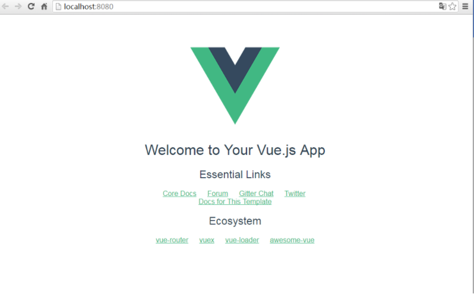

### node简介
简单的说 Node.js 就是运行在服务端的 JavaScript。
Node.js 是一个基于 Chrome V8 引擎的 JavaScript 运行环境。 
Node.js 使用了一个事件驱动、非阻塞式 I/O 的模型，使其轻量又高效。 
Node.js 的包管理器 npm，是全球最大的开源库生态系统。

### node安装
windows下的NodeJS安装是比较方便的（v0.6.0版本之后，支持windows native），
只需要登陆官网 [node官网](http://nodejs.org/)，便可以看到首页的“INSTALL”按钮，直接点击就会自动下载安装了。

安装完成后可以使用cmd（win+r然后输入cmd进入）测试下是否安装成功。
方法：在cmd下输入node -v，出现版本提示就是完成了NodeJS的安装。

npm的安装。由于新版的NodeJS已经集成了npm，所以之前npm也一并安装好了。
同样可以使用cmd命令行输入"npm -v"来测试是否成功安装。出现版本提示便是已经安装好了。

### vue简介
Vue.js是一套构建用户界面的渐进式框架。与其他重量级框架不同的是，Vue 采用自底向上增量开发的设计。
Vue 的核心库只关注视图层，并且非常容易学习，非常容易与其它库或已有项目整合。
另一方面，Vue 完全有能力驱动采用单文件组件和Vue生态系统支持的库开发的复杂单页应用。
Vue.js 的目标是通过尽可能简单的 API 实现响应的数据绑定和组合的视图组件。
Vue.js是一个MVVM模式的框架.

### 安装cnpm
由于有些npm有些资源被屏蔽或者是国外资源的原因，经常会导致用npm安装依赖包的时候失败或者速度非常慢，所有需要npm的国内镜像-cnpm.
在命令行中输入:`npm install -g cnpm --registry=http://registry.npm.taobao.org`,回车然后等待安装,
完成之后，就可以用cnpm代替npm来安装依赖包了。如果想进一步了解cnpm的，查看淘宝npm镜像官网。

### vue安装
在命令行输入:`cnpm install -g vue-cli`,回车,等待安装

### 用vue-cli构建项目
要创建项目，首先我们要选定目录，然后再命令行中把目录转到选定的目录.
下面创建一个vueflask项目,在命令行输入命令:`vue init webpack vueflask`,回车.
这个命令是初始化一个项目，其中webpack是构建工具，也就是整个项目是基于webpack的。其中vueflask是整个项目文件夹的名称，这个文件夹会自动生成在你指定的目录中.
运行初始化命令的时候回让用户输入几个基本的选项，如项目名称，描述，作者等信息，如果不想填直接回车默认就好.
整个项目的目录结构，我们主要在src目录中做修改。这个项目现在还只是一个结构框架，整个项目需要的依赖资源都还没有安装

### 安装项目所需的依赖
要安装依赖包，首先cd到项目文件夹(vueflask文件夹)，然后运行命令`cnpm install` ，等待安装。
安装完成之后，会在我们的项目目录vueflask文件夹中多出一个node_modules文件夹，这里边就是我们项目需要的依赖包资源。
安装完依赖包之后，就可以运行整个项目了。

### 运行vue项目
在项目目录中，运行命令`npm run dev`或`cnpm run dev` ，会用热加载的方式运行我们的应用，热加载可以在修改完代码后不用手动刷新浏览器就能实时看到修改后的效果。
关于`npm run dev`命令，其中的“run”对应的是package.json文件中，scripts字段中的dev，也就是`node build/dev-server.js`命令的一个快捷方式。
 项目运行成功后，浏览器会自动打开localhost:8080（如果浏览器没有自动打开，可以手动输入）。运行成功后，会看到如下所示的界面。
 
 

 ### 参考
 * [http://www.cnblogs.com/qdrw/articles/6380091.html](http://www.cnblogs.com/qdrw/articles/6380091.html)