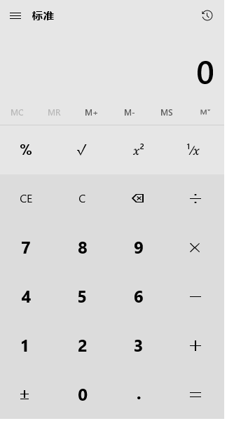

### PyAutoGUI——让所有GUI都自动化
本教程译自大神Al Sweigart的PyAutoGUI项目，Python自动化工具，更适合处理GUI任务，网页任务推荐：
* Selenium+Firefox记录（Chromedriver和Phantomjs也很给力，Phantomjs虽然是无头浏览器，但有时定位不准），然后用Python写单元测试
* request处理get/post请求写一堆代码自动化处理，都在后台运行，不用运行浏览器，非常适合处理表单

### 简介
PyAutoGUI是一个纯Python的GUI自动化工具，其目的是可以用程序自动控制鼠标和键盘操作，多平台支持（Windows，OS X，Linux）。可以用pip安装，Github上有[源代码](https://github.com/asweigart/pyautogui)。

PyAutoGUI可以模拟鼠标的移动、点击、拖拽，键盘按键输入、按住操作，以及鼠标+键盘的热键同时按住等操作，可以说手能动的都可以。

让鼠标移到屏幕中央
```python
import pyautogui
screenWidth, screenHeight = pyautogui.size()
pyautogui.moveTo(screenWidth / 2, screenHeight / 2)
```

一些例子:
```python
import pyautogui
screenWidth, screenHeight = pyautogui.size()
currentMouseX, currentMouseY = pyautogui.position()
pyautogui.moveTo(100, 150)
pyautogui.click()
#  鼠标向下移动10像素
pyautogui.moveRel(None, 10)
pyautogui.doubleClick()
#  用缓动/渐变函数让鼠标2秒后移动到(500,500)位置
#  use tweening/easing function to move mouse over 2 seconds.
pyautogui.moveTo(1800, 500, duration=2, tween=pyautogui.easeInOutQuad)
#  在每次输入之间暂停0.25秒
pyautogui.typewrite('Hello world!', interval=0.25)
pyautogui.press('esc')
pyautogui.keyDown('shift')
pyautogui.press(['left', 'left', 'left', 'left', 'left', 'left'])
pyautogui.keyUp('shift')
pyautogui.hotkey('ctrl', 'c')
```

```python
distance = 200
while distance > 0:
    pyautogui.dragRel(distance, 0, duration=0.5) # 向右
    distance -= 5
    pyautogui.dragRel(0, distance, duration=0.5) # 向下
    pyautogui.draIn gRel(-distance, 0, duration=0.5) # 向左
    distance -= 5
    pyautogui.dragRel(0, -distance, duration=0.5) # 向上
```

### 保护措施
为了能够及时中断，PyAutoGUI提供了一个保护措施。当pyautogui.FAILSAFE = True时，如果把鼠标光标在屏幕左上角，PyAutoGUI函数就会产生pyautogui.FailSafeException异常。如果失控了，需要中断PyAutoGUI函数，就把鼠标光标在屏幕左上角。要禁用这个特性，就把FAILSAFE设置成False：
```python
import pyautogui
pyautogui.FAILSAFE = False
```

通过把pyautogui.PAUSE设置成float或int时间（秒），可以为所有的PyAutoGUI函数增加延迟。默认延迟时间是0.1秒。在函数循环执行的时候，这样做可以让PyAutoGUI运行的慢一点，非常有用。例如：
```python
import pyautogui
pyautogui.PAUSE = 2.5
pyautogui.moveTo(100,100); pyautogui.click()
```

所有的PyAutoGUI函数在延迟完成前都处于阻塞状态（block）。（未来计划增加一个可选的非阻塞模式来调用函数。）建议PAUSE和FAILSAFE一起使用。

### Cheat Sheet
#### 常用函数
```python
import pyautogui
#  当前鼠标的坐标
pyautogui.position() # (123, 372)
#  当前屏幕的分辨率（宽度和高度）
pyautogui.size()  # (1920, 1080)
#  (x,y)是否在屏幕上
x, y = 122, 244
pyautogui.onScreen(x, y)  # True
```

#### 保护措施
```python
# PyAutoGUI函数增加延迟为2.5秒：
pyautogui.PAUSE = 2.5
# 当pyautogui.FAILSAFE = True时，如果把鼠标光标在屏幕左上角，PyAutoGUI函数就会产生pyautogui.FailSafeException异常。
pyautogui.FAILSAFE = True
```

#### 鼠标函数
坐标系的原点是左上角。X轴（水平）坐标向右增大，Y轴（竖直）坐标向下增大。
```python
num_seconds = 1.2
#  用num_seconds秒的时间把光标移动到(x, y)位置
pyautogui.moveTo(x, y, duration=num_seconds)
#  用num_seconds秒的时间把光标的X轴（水平）坐标移动xOffset，
#  Y轴（竖直）坐标向下移动yOffset。
xOffset, yOffset = 50, 100
pyautogui.moveRel(xOffset, yOffset, duration=num_seconds)
```

click()函数就是让鼠标点击，默认是单击左键，参数可以设置,其中，button属性可以设置成left，middle和right。
```python
pyautogui.click(x=moveToX, y=moveToY, clicks=num_of_clicks, interval=secs_between_clicks, button='left')
```

所有的点击都可以用这个函数，不过下面的函数可读性更好：
```python
pyautogui.rightClick(x=moveToX, y=moveToY)
pyautogui.middleClick(x=moveToX, y=moveToY)
pyautogui.doubleClick(x=moveToX, y=moveToY)
pyautogui.tripleClick(x=moveToX, y=moveToY)
```

scroll函数控制鼠标滚轮的滚动，`amount_to_scroll`参数表示滚动的格数。正数则页面向上滚动，负数则向下滚动：
```python
pyautogui.scroll(clicks=amount_to_scroll, x=moveToX, y=moveToY)
```

每个按键按下和松开两个事件可以分开处理：
```python
pyautogui.mouseDown(x=moveToX, y=moveToY, button='left')
pyautogui.mouseUp(x=moveToX, y=moveToY, button='left')
```

### 键盘函数
键盘上可以按的键都可以调用：
```python
#  每次键入的时间间隔
secs_between_keys = 0.1
pyautogui.typewrite('Hello world!\n', interval=secs_between_keys)
```

多个键也可以：
```python
pyautogui.typewrite(['a', 'b', 'c', 'left', 'backspace', 'enter', 'f1'], interval=secs_between_keys)
```

按键名称列表：`pyautogui.KEYBOARD_KEYS[:10]`
['\t', '\n', '\r', ' ', '!', '"', '#', '$', '%', '&']

键盘的一些热键像Ctrl-S或Ctrl-Shift-1都可以用hotkey()函数来实现：
```python
pyautogui.hotkey('ctrl', 'a') # 全选
pyautogui.hotkey('ctrl', 'c') # 复制
pyautogui.hotkey('ctrl', 'v') # 粘贴
```

每个按键的按下和松开也可以单独调用：
```python
pyautogui.keyDown(key_name)
pyautogui.keyUp(key_name)
```

### 消息弹窗函数
如果你需要消息弹窗，通过单击OK暂停程序，或者向用户显示一些信息，消息弹窗函数就会有类似JavaScript的功能：
```python
pyautogui.alert('这个消息弹窗是文字+OK按钮')
pyautogui.confirm('这个消息弹窗是文字+OK+Cancel按钮')
pyautogui.prompt('这个消息弹窗是让用户输入字符串，单击OK')
# 在prompt()函数中，如果用户什么都不输入，就会返回None。
```

### 截屏函数
PyAutoGUI用Pillow/PIL库实现图片相关的识别和操作。
在Linux里面，你必须执行`sudo apt-get install scrot`来使用截屏特性。
```python
#  返回一个Pillow/PIL的Image对象
pyautogui.screenshot()
pyautogui.screenshot('foo.png')
```

如果你有一个图片文件想在上面做点击操作，你可以用locateOnScreen()函数来定位。
```python
#  返回(最左x坐标，最顶y坐标，宽度，高度)
pyautogui.locateOnScreen('pyautogui/looks.png')
# (0, 1040, 48, 40)
```

locateAllOnScreen()函数会寻找所有相似图片，返回一个生成器：
```python
for i in pyautogui.locateAllOnScreen('pyautogui/looks.png'):
    print(i)
# (0, 1040, 48, 40)
list(pyautogui.locateAllOnScreen('pyautogui/looks.png'))
# (0, 1040, 48, 40)
```

locateCenterOnScreen()函数会返回图片在屏幕上的中心XY轴坐标值：
```python
pyautogui.locateCenterOnScreen('pyautogui/looks.png')
# (24, 1060)
```

如果没找到图片会返回None。定位比较慢，一般得用1~2秒.

### 常用函数
position()：返回整数元组(x, y)，分别表示鼠标光标所在位置的XY轴坐标
size()：返回显示器的尺寸整数元组(x, y)。未来将加入多屏支持

### 鼠标控制函数
#### 屏幕与鼠标位置
屏幕位置使用X和Y轴的笛卡尔坐标系。原点(0,0)在左上角，分别向右、向下增大。
如果屏幕像素是 1920×1080，那么右下角的坐标是(1919, 1079), 左上角是从(0, 0)开始的。
分辨率大小可以通过size()函数返回整数元组。光标的位置用position()返回。例如：
```python
pyautogui.size()
# (1920, 1080)
pyautogui.position()
# (272, 688)
```

下面是Python 3版本的光标位置记录程序：
```python
# ! python 3
import pyautogui
print('Press Ctrl-C to quit')
try:
    while True:
        x, y = pyautogui.position()
        positionStr = 'X: {} Y: {}'.format(*[str(x).rjust(4) for x in [x, y]])
        print(positionStr, end='')
        print('\b' * len(positionStr), end='', flush=True)
except KeyboardInterrupt:
    print('\n')
```

要检查XY坐标是否在屏幕上，需要用onScreen()函数来检验，如果在屏幕上返回True：
```python
import pyautogui
pyautogui.onScreen(0, 0) # True
pyautogui.onScreen(0, -1) # False
pyautogui.onScreen(0, 2080) # False
pyautogui.onScreen(1920, 1080) # False
pyautogui.onScreen(1919, 1079) # True
```

####  鼠标行为
moveTo()函数会把鼠标光标移动到指定的XY轴坐标处。如果传入None值，则表示使用当前光标的对象轴坐标值。
```python
pyautogui.moveTo(100, 200)     # 光标移动到(100, 200)位置
pyautogui.moveTo(None, 500)   # 光标移动到(100, 500)位置
pyautogui.moveTo(600, None)   # 光标移动到(600, 500)位置
#一般鼠标光标都是瞬间移动到指定的位置，如果你想让鼠标移动的慢点，可以设置持续时间：
pyautogui.moveTo(100, 200, duration=2)     # 用2秒把光标移动到(100, 200)位置
```

默认的持续时间pyautogui.MINIMUM_DURATION是0.1秒，如果你设置的时间比默认值还短，那么就会瞬间执行。

如果你想让光标以当前位置为原点，进行相对移动，就用pyautogui.moveRel()函数。例如：
```python
pyautogui.moveTo(100, 200) #把光标移动到(100, 200)位置
pyautogui.moveRel(0, 50)   #向下移动50
pyautogui.moveRel(30, 0, 2)   #向右移动30
pyautogui.moveRel(30, None)   #向右移动30
```

#### 鼠标拖拽
PyAutoGUI的dragTo()和dragRel()函数与moveTo()和moveRel()函数类似。另外，他们有一个button参数可以设置成left，middle和right三个键。例如：
```python
#  按住鼠标左键，把鼠标拖拽到(100, 200)位置
pyautogui.dragTo(100, 200, button='left')
#  按住鼠标左键，用2秒钟把鼠标拖拽到(300, 400)位置
pyautogui.dragTo(300, 400, 2, button='left')
#  按住鼠标右键，用2秒钟把鼠标拖拽到(30,0)位置
pyautogui.dragTo(30, 0, 2, button='right')
```

#### 缓动/渐变（Tween / Easing）函数
缓动/渐变函数的作用是让光标的移动更炫。如果你不需要用到的话，你可以忽略这些。

缓动/渐变函数可以改变光标移动过程的速度和方向。通常鼠标是匀速直线运动，这就是线性缓动/渐变函数。PyAutoGUI有30种缓动/渐变函数，可以通过`pyautogui.ease*?`查看。其中，pyautogui.easeInQuad()函数可以用于moveTo()，moveRel()，dragTo()和dragRel()函数，光标移动呈现先慢后快的效果，整个过程的时间还是和原来一样。而pyautogui.easeOutQuad函数的效果相反：光标开始移动很快，然后慢慢减速。pyautogui.easeOutElastic是弹簧效果，首先越过终点，然后再反弹回来。例如：
```python
#  开始很慢，不断加速
pyautogui.moveTo(100, 100, 2, pyautogui.easeInQuad)
#  开始很快，不断减速
pyautogui.moveTo(100, 100, 2, pyautogui.easeOutQuad)
#  开始和结束都快，中间比较慢
pyautogui.moveTo(100, 100, 2, pyautogui.easeInOutQuad)
#  一步一徘徊前进
pyautogui.moveTo(100, 100, 2, pyautogui.easeInBounce)
#  徘徊幅度更大，甚至超过起点和终点
pyautogui.moveTo(100, 100, 2, pyautogui.easeInElastic)
```

这些效果函数是模仿Al Sweigart的PyTweening模块，可以直接使用，不需要额外安装。
如果你想创建自己的效果，也可以定义一个函数，其参数是(0.0,1.0)，表示起点和终点，返回值是介于[0.0,1.0]之间的数。

#### 鼠标单击
click()函数模拟单击鼠标左键一次的行为。例如：`pyautogui.click()`
如果单击之前要先移动，可以把目标的XY坐标值传入函数：
```python
#  先移动到(100, 200)再单击
pyautogui.click(x=100, y=200, duration=2)
# 可以通过button参数设置left，middle和right三个键。例如：
pyautogui.click(button='right')
```

要做多次单击可以设置clicks参数，还有interval参数可以设置每次单击之间的时间间隔。例如：
```python
#  双击左键
pyautogui.click(clicks=2)
#  两次单击之间停留0.25秒
pyautogui.click(clicks=2, interval=0.25)
#  三击右键
pyautogui.click(button='right', clicks=2, interval=0.25)
```

为了操作方便，PyAutoGUI提供了doubleClick()，tripleClick()和rightClick()来实现双击、三击和右击操作。

#### 鼠标按下和松开函数
mouseDown()和mouseUp()函数可以实现鼠标按下和鼠标松开的操作。两者参数相同，有x，y和button。例如：
```python
#  鼠标左键按下再松开
pyautogui.mouseDown(); pyautogui.mouseUp() 
#  按下鼠标右键
pyautogui.mouseDown(button='right') 
#  移动到(100, 200)位置，然后松开鼠标右键
pyautogui.mouseUp(button='right', x=100, y=200) 
```

#### 滚轮滚动函数
鼠标滚轮滚动可以用scroll()函数和clicks次数参数来模拟。scroll()函数是vscroll()的一个包装（wrapper），执行竖直滚动。
不同平台上的clicks次数不太一样。还有x和y参数可以在滚动之前定位到(x, y)位置。例如：
```python
#  向上滚动10格
pyautogui.scroll(10)
#  向下滚动10格
pyautogui.scroll(-10)
#  移动到(100, 100)位置再向上滚动10格
pyautogui.scroll(10, x=100, y=100)
# 在OS X和Linux平台上，PyAutoGUI还可以用hscroll()实现水平滚动。例如：
#  向右滚动10格
pyautogui.hscroll(10)
#  向左滚动10格
pyautogui.hscroll(-10)
```

### 键盘控制函数
#### typewrite()输入函数
键盘控制的主要函数就是typewrite()。这个函数可以实现字符输入。typewrite()函数只能用于单个字符键，不能按SHITF和F1这些功能键。要在两次输入间增加时间间隔，可以用interval参数。例如：
```python
#  输入Hello world!
pyautogui.typewrite('Hello world!')
#  每次输入间隔0.25秒，输入Hello world!
pyautogui.typewrite('Hello world!', interval=0.25)
```

#### press()，keyDown()和keyUp()函数
要按那些功能键，可以用press()函数把`pyautogui.KEYBOARD_KEYS`里面按键对应的字符串输入进去。例如：

```python
#  ENTER键
pyautogui.press('enter')
#  F1键
pyautogui.press('f1')
#  左方向键
pyautogui.press('left')
```

press()函数其实是keyDown()和keyUp()函数的包装，模拟的按下然后松开两个动作。这两个函数可以单独调用。例如，按下shift键的同时按3次左方向键：
```python
#  按下`shift`键
pyautogui.keyDown('shift')
pyautogui.press('left')
pyautogui.press('left')
pyautogui.press('left')
#  松开`shift`键
pyautogui.keyUp('shift')
```

和typewrite()函数一样，可以用数组把一组键传入press()。例如：
`pyautogui.press(['left', 'left', 'left'])`

#### hotkey()函数
为了更高效的输入热键，PyAutoGUI提供了hotkey()函数来绑定若干按键：
`pyautogui.hotkey('ctrl', 'shift', 'ese')`
等价于：
```python
pyautogui.keyDown('ctrl')
pyautogui.keyDown('shift')
pyautogui.keyDown('esc')
pyautogui.keyUp('esc')
pyautogui.keyUp('shift')
pyautogui.keyUp('ctrl')
```

#### KEYBOARD_KEYS
下面就是press()，keyDown()，keyUp()和hotkey()函数可以输入的按键名称：
`print(pyautogui.KEYBOARD_KEYS)`
```
['\t', '\n', '\r', ' ', '!', '"', '#', '$', '%', '&', "'", '(', ')', '*', '+', ',', '-', '.', '/', '0', '1', '2', '3', '4', '5', '6', '7', '8', '9', ':', ';', '<', '=', '>', '?', '@', '[', '\\', ']', '^', '_', '`', 'a', 'b', 'c', 'd', 'e', 'f', 'g', 'h', 'i', 'j', 'k', 'l', 'm', 'n', 'o', 'p', 'q', 'r', 's', 't', 'u', 'v', 'w', 'x', 'y', 'z', '{', '|', '}', '~', 'accept', 'add', 'alt', 'altleft', 'altright', 'apps', 'backspace', 'browserback', 'browserfavorites', 'browserforward', 'browserhome', 'browserrefresh', 'browsersearch', 'browserstop', 'capslock', 'clear', 'convert', 'ctrl', 'ctrlleft', 'ctrlright', 'decimal', 'del', 'delete', 'divide', 'down', 'end', 'enter', 'esc', 'escape', 'execute', 'f1', 'f10', 'f11', 'f12', 'f13', 'f14', 'f15', 'f16', 'f17', 'f18', 'f19', 'f2', 'f20', 'f21', 'f22', 'f23', 'f24', 'f3', 'f4', 'f5', 'f6', 'f7', 'f8', 'f9', 'final', 'fn', 'hanguel', 'hangul', 'hanja', 'help', 'home', 'insert', 'junja', 'kana', 'kanji', 'launchapp1', 'launchapp2', 'launchmail', 'launchmediaselect', 'left', 'modechange', 'multiply', 'nexttrack', 'nonconvert', 'num0', 'num1', 'num2', 'num3', 'num4', 'num5', 'num6', 'num7', 'num8', 'num9', 'numlock', 'pagedown', 'pageup', 'pause', 'pgdn', 'pgup', 'playpause', 'prevtrack', 'print', 'printscreen', 'prntscrn', 'prtsc', 'prtscr', 'return', 'right', 'scrolllock', 'select', 'separator', 'shift', 'shiftleft', 'shiftright', 'sleep', 'stop', 'subtract', 'tab', 'up', 'volumedown', 'volumemute', 'volumeup', 'win', 'winleft', 'winright', 'yen', 'command', 'option', 'optionleft', 'optionright']
```

### 消息弹窗函数
PyAutoGUI通过Tkinter实现了4种纯Python的消息弹窗函数，和JavaScript类似。

####  alert()函数
```python
pyautogui.alert(text='', title='', button='OK')
# 'OK'
```

显示一个简单的带文字和OK按钮的消息弹窗。用户点击后返回button的文字。

#### confirm() 函数
```python
#  OK和Cancel按钮的消息弹窗
pyautogui.confirm(text='', title='', buttons=['OK', 'Cancel'])
#  10个按键0-9的消息弹窗
pyautogui.confirm(text='', title='', buttons=range(10))
```

显示一个简单的带文字、OK和Cancel按钮的消息弹窗，用户点击后返回被点击button的文字，支持自定义数字、文字的列表。

####  prompt() 函数
`pyautogui.prompt(text='', title='' , default='')`
可以输入的消息弹窗，带OK和Cancel按钮。用户点击OK按钮返回输入的文字，点击Cancel按钮返回None。

#### password() 函数
`pyautogui.password(text='', title='', default='', mask='*')`
样式同prompt()，用于输入密码，消息用*表示。带OK和Cancel按钮。用户点击OK按钮返回输入的文字，点击Cancel按钮返回None。

### 截屏函数
PyAutoGUI可以截屏并保存为图片文件，然后定位这些截屏在屏幕上的位置。与sikuli类似，把屏幕上的按键截取下来，然后定位，就可以执行点击等操作了。

截屏功能需要安装Pillow模块。OS X用screencapture命令，是系统自带的。Linux用户用scrot命令，可以通过`sudo apt-get install scrot`安装。

####  Ubuntu注意事项
由于Ubuntu上安装Pillow时缺少PNG和JPEG依赖，所以安装比较复杂，具体可以看Ubuntu论坛。不过用miniconda可以解决这些问题，如果Ubuntu或Mint上安装了miniconda，可以直接`conda install pillow`来安装。

#### screenshot()函数
screenshot()函数会返回Image对象（参考Pillow或PIL模块文档），也可以设置文件名：
```python
import pyautogui
im1 = pyautogui.screenshot()
im2 = pyautogui.screenshot('my_screenshot.png')
# 在一个 1920×10801920×1080 的屏幕上，screenshot()函数要消耗100微秒——不快也不慢。

#如果你不需要截取整个屏幕，还有一个可选的region参数。你可以把截取区域的左上角XY坐标值和宽度、高度传入截取。
im = pyautogui.screenshot(region=(0, 0, 300 ,400))
```

#### 定位函数
可以定位截图在屏幕上的坐标位置。比如，你需要在计算器里输入：



如果你不知道按钮的位置，就不能用moveTo()定位和click()点击。而且每次计算器的位置可能会变化，这时即使有来坐标也不好用了。但是如果你有要点击按钮的截图，比如数字7：

你可以调用pyautogui.locateOnScreen('calc7key.png')函数来获得7的屏幕坐标。返回的是一个元组(top, left, width, height)。这个元组可以用pyautogui.center()函数来获取截图屏幕的中心坐标。如果截图没找到，pyautogui.locateOnScreen()函数返回None：
```python
import pyautogui
button7location = pyautogui.locateOnScreen('pyautogui/calc7key.png')
button7location
# (1226, 546, 29, 28)
button7x, button7y = pyautogui.center(button7location)
button7x, button7y
# (1240, 560)
pyautogui.click(button7x, button7y) 
```

locateCenterOnScreen()等价于上面的前两布操作，直接获得截屏屏幕中心坐标：
```python
import pyautogui
x, y = pyautogui.locateCenterOnScreen('pyautogui/calc7key.png')
pyautogui.click(x, y)
```

在 1920×10801920×1080 的屏幕上，定位函数需要1~2秒时间。对视频游戏（LOL、DOTA）来说就太慢了，但是上班干活还是绰绰有余。

还是几个定位函数。都是从左上角原点开始向右向下搜索截图位置：

* locateOnScreen(image, grayscale=False)：返回找到的第一个截图Image对象在屏幕上的坐标(left, top, width, height)，如果没找到返回None
* locateCenterOnScreen(image, grayscale=False)：返回找到的第一个截图Image对象在屏幕上的中心坐标(x, y)，如果没找到返回None
* locateAllOnScreen(image, grayscale=False)：返回找到的所有相同截图Image对象在屏幕上的坐标(left, top, width, height)的生成器
* locate(needleImage, haystackImage, grayscale=False)：返回找到的第一个截图Image对象在haystackImage里面的坐标(left, top, width, height)，如果没找到返回None
* locateAll(needleImage, haystackImage, grayscale=False)：返回找到的所有相同截图Image对象在haystackImage里面的坐标(left, top, width, height)的生成器

两个locateAll*函数都可以用for循环和list()输出：
```python
for pos in pyautogui.locateAllOnScreen('pyautogui/calc7key.png'):
    print(pos)
# (1227, 546, 29, 28)
list(pyautogui.locateAllOnScreen('pyautogui/calc7key.png'))
# [(1227, 546, 29, 28)]
```

#### 灰度值匹配
可以把grayscale参数设置为True来加速定位（大约提升30%），默认为False。这种去色（desaturate）方法可以加速定位，但是也可能导致假阳性（false-positive）匹配：
```python
import pyautogui
button7location = pyautogui.locateOnScreen('pyautogui/calc7key.png', grayscale=True)
button7location
# (1227, 546, 29, 28)
```

#### 像素匹配
要获取截屏某个位置的RGB像素值，可以用Image对象的getpixel()方法：
```python
import pyautogui
im = pyautogui.screenshot()
im.getpixel((100, 200))
# (255, 255, 255)
# 也可以用PyAutoGUI的pixel()函数，是之前调用的包装：
pyautogui.pixel(100, 200)
# (255, 255, 255)
```

如果你只是要检验一下指定位置的像素值，可以用pixelMatchesColor()函数，把X、Y和RGB元组值穿入即可：
```python
pyautogui.pixelMatchesColor(100, 200, (255, 255, 255))
# True
pyautogui.pixelMatchesColor(100, 200, (255, 255, 245))
# False

# tolerance参数可以指定红、绿、蓝3种颜色误差范围：
pyautogui.pixelMatchesColor(100, 200, (255, 255, 245), tolerance=10)
# True
pyautogui.pixelMatchesColor(100, 200, (248, 250, 245), tolerance=10)
# True
pyautogui.pixelMatchesColor(100, 200, (205, 255, 245), tolerance=10)
# False
```


### 参考
* [https://muxuezi.github.io/posts/doc-pyautogui.html](https://muxuezi.github.io/posts/doc-pyautogui.html)