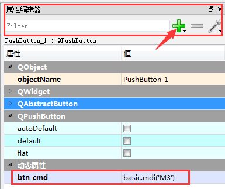
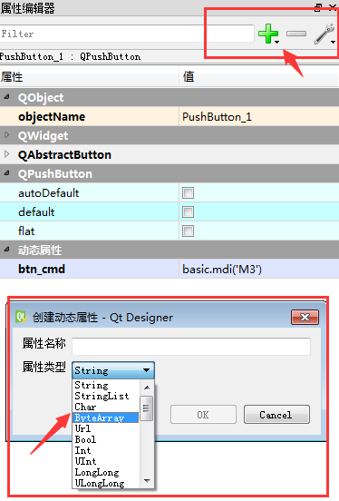

### 在ui文件中添加动态属性
如下图所示:在属性编辑器中点击"+"按钮, 添加的属性有很多类型,一般选择string或者ByteArray, 最好选择ByteArray,如果选择string还会涉及到需要翻译的问题.



然后设置你的动态属性名称:



### 在你的代码中访问ui中设置的动态属性
如何遍历ui对象中的所有按钮对象
如何在循环中给btn连接信号槽
```python
def initUI(self):
    self.ui = uic.loadUi(os.path.join(
        os.path.dirname(__file__), "res/ctrlpanel.ui"), self)
    self.setFixedSize(self.ctrlpanelWidth, self.ctrlpanelHeight)
    for attr in dir(self.ui):
        # getattr 根据属性名称获取属性的值或对象
        obj = getattr(self.ui, attr)
        if isinstance(obj, QtWidgets.QPushButton) or isinstance(obj, QtWidgets.QToolButton):
            # 注意:这里有一个闭包的问题,这里用functools.partial解决了
            obj.clicked.connect(functools.partial(self.on_clicked, obj))
```

代码中访问ui设置的动态属性
一般思维定势使用'.'来访问对象的属性,但是ui中的动态属性无法通过'.'访问,
而是使用`property()`函数来访问动态属性.如`btn.property("btn_cmd")`

### 关于QToolButton和QPushButton
如果你想在按钮上添加图片,并且让文字显示在图标下面,那么请使用QToolButton,
不要使用QPushButton, QPushButton添加图标后,其文字是默认显示在图标右边,而不是下面.
```python
button = QToolButton()
button.setToolButtonStyle(QtCore.Qt.ToolButtonTextUnderIcon)
button.setIcon(myIcon)
button.setText("Sample text")
```