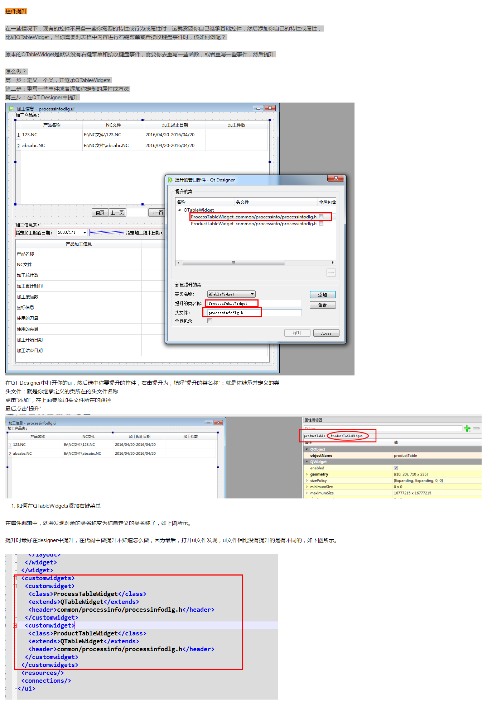

### PyQt控件提升(promotion)
常用控件有标准的属性和方法, 但在一些情况下，现有的控件不具备一些你需要的特性或行为或属性时，这就需要你自己继承基础控件，然后添加你自己的特性或属性，
比如QTableWidget，当你需要对表格中内容进行右键菜单或者接收键盘事件时.原本的QTableWidget是默认没有右键菜单和接收键盘事件，需要你去重写一些函数，或者重写一些事件，然后提升.


第一步：定义一个类，并继承QTableWidgets
第二步：重写一些事件或者添加你定制的属性或方法
第三步：在QT Designer中提升


在QT Designer中打开你的ui，然后选中你要提升的控件，右击提升为，填好“提升的类名称”：就是你继承并定义的类
头文件：就是你继承定义的类所在的头文件名称
点击“添加”，在上面要添加头文件所在的路径
最后点击“提升”



如何在QTableWidgets添加右键菜单
在属性编辑中，就会发现对象的类名称变为你自定义的类名称了，如上图所示。
提升时最好在designer中提升，在代码中做提升不知道怎么做，因为最后，打开ui文件发现，ui文件相比没有提升的是有不同的，如下图所示。


### 自定义PyQt控件(插件法)
自定义控件一般是在原有控件的基础上定制你专有的属性和方法,然后封装成一个控件,可是让你在designer中拖拽这个你封装的控件.
最后将# myplugins.py放在`C:\Program Files\Python36\Lib\site-packages\pyqt5-tools\plugins\designer`目录下.
方法:
```python
# myplugins.py
from PyQt5 import QtCore
from PyQt5 import QtWidgets
from PyQt5 import QtDesigner

def py_property(typeName):
    """定义 Qt 属性"""
    values = {}
    getter = values.get
    def setter(self, value):
        values[self] = value
    def resetter(self):
        del values[self]
    return QtCore.pyqtProperty(typeName, getter, setter, resetter)

class PyPushButton(QtWidgets.QPushButton):

    def __init__(self, parent):
        super(PyPushButton, self).__init__(parent)

    signal_pressed = QtCore.pyqtSignal(str)
    signal_released = QtCore.pyqtSignal(str)

    py_text = py_property("QString")
    py_clicked = py_property("QString")
    py_pressed = py_property("QString")
    py_released = py_property("QString")
    py_checked = py_property("QString")
    py_enabled = py_property("QString")
    py_tag = py_property("QString")


class PyButtonPlugin(QtDesigner.QPyDesignerCustomWidgetPlugin):

    def __init__(self):
        super(PyButtonPlugin, self).__init__()

    def createWidget(self, parent):
        return PyPushButton(parent)

    def name(self):
        return "PyPushButton"

    def group(self):
        return "MyPlugins"

    def includeFile(self):
        return "myplugins/widgets/pushbutton.h"

    def isContainer(self):
        return False

    def domXml(self):
        return """
<ui language="c++">
    <widget class="PyPushButton" name="PyPushButton">
        <property name="geometry">
            <rect>
                <width>100</width>
                <height>30</height>
            </rect>
        </property>
        <property name="text">
            <string>pushbutton</string>
        </property>
        <property name="py_text">
            <string notr="true"></string>
        </property>
    </widget>
    <customwidgets>
        <customwidget>
            <propertyspecifications>
                <stringpropertyspecification
                    name="py_text" type="multiline" />
                <stringpropertyspecification
                    name="py_clicked" type="multiline" />
                <stringpropertyspecification
                    name="py_pressed" type="multiline" />
                <stringpropertyspecification
                    name="py_released" type="multiline" />
                <stringpropertyspecification
                    name="py_enabled" type="multiline" />
                <stringpropertyspecification
                    name="py_checked" type="multiline" />
				<stringpropertyspecification
                    name="py_tag" type="multiline" />
            </propertyspecifications>
        </customwidget>
    </customwidgets>
</ui>
"""

# myplugins/widgets/pushbutton.py
import logging
from PyQt5 import QtCore
from PyQt5 import QtWidgets

_logger = logging.getLogger(__name__)


class PyPushButton(QtWidgets.QPushButton):

    py_checked = basic.property("QString")
    py_clicked = basic.property("QString")
    py_enabled = basic.property("QString")
    py_pressed = basic.property("QString")
    py_released = basic.property("QString")
    py_shortcut = basic.property("QString")
    py_tag = basic.property("QString")
    py_text = basic.property("QString")

    signal_pressed = QtCore.pyqtSignal(str)
    signal_released = QtCore.pyqtSignal(str)

    def __init__(self, parent=None):
        super(PyPushButton, self).__init__(parent)
        self._shortcutval = False
        self.bPress = False
        self.clicked.connect(self.onClicked)
        self.pressed.connect(self.onPushed)
        self.released.connect(self.onUnPushed)
        basic.signal_UpdateUi.connect(self._update)

    def onClicked(self):
        self.bPress = True
        if self.py_clicked is not None:
            _logger.debug("""点击:"{}"按钮""".format(self.text()))
            basic._exec(self.py_clicked)

    def onPushed(self):
        self.bPress = True
        if self.py_pressed is not None:
            _logger.debug("""按下:"{}"按钮""".format(self.text()))
            basic._exec(self.py_pressed)
        self.signal_pressed.emit(self.objectName())

    def onUnPushed(self):
        self.bPress = False
        if self.py_released is not None:
            _logger.debug("""松开:"{}"按钮""".format(self.text()))
            basic._exec(self.py_released)
        self.signal_released.emit(self.objectName())

    def _update(self):
        if self.py_checked:
            self.setCheckable(True)
            self.setChecked(bool(basic._eval(self.py_checked)))

        if self.py_enabled:
            self.setEnabled(bool(basic._eval(self.py_enabled)))

        if self.py_shortcut:
            shortcutval = bool(basic._eval(self.py_shortcut))
            if not self._shortcutval and shortcutval:
                self.signal_pressed.emit(self.objectName())
            elif self._shortcutval and not shortcutval:
                self.signal_released.emit(self.objectName())
            self._shortcutval = shortcutval

        if self.py_tag:
            if not hasattr(self, "py_tag_label"):
                self.py_tag_vbox = QtWidgets.QVBoxLayout()
                self.py_tag_vbox.setContentsMargins(0, 0, 0, 0)
                self.setLayout(self.py_tag_vbox)
                self.py_tag_label = QtWidgets.QLabel()
                self.py_tag_vbox.addWidget(self.py_tag_label, 1)
            self.py_tag_label.setText(self.py_tag)

        if self.py_text:
            self.setText(str(basic._eval(self.py_text)))

    # 补丁: setText 会清除快捷键, 屏蔽此行为
    def setText(self, text):
        shortcut = self.shortcut()
        super(PyPushButton, self).setText(text)
        self.setShortcut(shortcut)

    def setEnabled(self, b):
        if not b:
            if self.bPress:
                self.bPress = False
                self.signal_released.emit(self.objectName())
        super(PyPushButton, self).setEnabled(b)
```