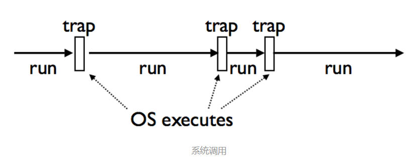

### Coroutine概念
Coroutine，又称作协程。即协同运行的例程，它是比是线程（thread）更细量级的用户态线程.特点是允许用户的主动调用和主动退出，挂起当前的例程然后返回值或去执行其他任务，接着返回原来停下的点继续执行。

一般函数都是线性执行的，不可能说执行到一半返回，等会儿又跑到原来的地方继续执行。但python（or其他动态语言）可以做到，答案是用yield语句。

其实是操作系统（OS）为我们做的工作，因为它具有getcontext和swapcontext这些特性，通过系统调用，我们可以把上下文和状态保存起来，切换到其他的上下文，这些特性为coroutine的实现提供了底层的基础。操作系统的Interrupts和Traps机制则为这种实现提供了可能性，因此它看起来可能是下面这样的:



### 理解生成器（generator）
python有yield这个关键字，它能把一个函数变成一个generator，与return不同，yield在函数中返回值时会保存函数的状态，使下一次调用函数时会从上一次的状态继续执行，即从yield的下一条语句开始执行，节省存储空间，提高运行效率。
```python
def fib(max):
    n, a, b = 0, 0, 1
    while n  max:
        yield b
        a, b = b, a + b
        n = n + 1
```

注意: yield 对应的值在函数被调用时不会立刻返回，而是调用next方法时（本质上 for 循环也是调用 next 方法）才返回.

### 生产者-消费者协程

```python
#-*- coding:utf-8
def consumer():
    status = True
    while True:
        n = yield status
        print("我拿到了{}!".format(n))
        if n == 3:
            status = False

def producer(consumer):
    n = 5
    while n > 0:
        # yield给主程序返回消费者的状态
        yield consumer.send(n)
        n -= 1

if __name__ == '__main__':
    c = consumer()
    c.send(None)
    p = producer(c)
    for status in p:
        if status == False:
            print("我只要3,4,5就行啦")
            break
    print("程序结束")


我拿到了5!
我拿到了4!
我拿到了3!
我只要3,4,5就行啦
程序结束
```
分析:
从主程序中开始看，第一句`c = consumer()`，因为consumer函数中存在yield语句，python会把它当成一个generator（生成器，注意：生成器和协程的概念区别很大,千万别混淆了两者），因此在运行这条语句后，python并不会像执行函数一样，而是返回了一个generator object。

第二条语句`c.send(None)`，这条语句的作用是将consumer（即变量c，它是一个generator）中的语句推进到第一个yield语句出现的位置，在例子中，consumer中的`status = True`和`while True:`都已经被执行了，程序停留在`n = yield status`的位置（注意：此时这条语句还没有被执行），上面说的send(None)语句十分重要，如果漏写这一句，那么程序直接报错。

下面第三句`p = producer(c)`，这里像上面一样定义了producer的生成器，注意:这里我们传入了消费者的生成器，来让producer跟consumer通信。

第四句`for status in p:`，这条语句会循环地运行producer和获取它yield回来的状态。

现在我们要让生产者发送1,2,3,4,5给消费者，消费者接受数字，返回状态给生产者，而我们的消费者只需要3,4,5就行了，当数字等于3时，会返回一个错误的状态。最终我们需要由主程序来监控生产者－消费者的过程状态，调度结束程序。

现在程序流进入了producer里面，我们直接看yield consumer.send(n)，生产者调用了消费者的send()方法，把n发送给consumer（即c），在consumer中的n = yield status，n拿到的是消费者发送的数字，同时，consumer用yield的方式把状态（status）返回给消费者，注意：这时producer（即消费者）的consumer.send()调用返回的就是consumer中yield的status！消费者马上将status返回给调度它的主程序，主程序获取状态，判断是否错误，若错误，则终止循环，结束程序。上面看起来有点绕，其实这里面generator.send(n)的作用是：把n发送generator(生成器)中yield的赋值语句中，同时返回generator中yield的变量（结果）。

于是程序便一直运作，直至consumer中获取的n的值变为3！此时consumer把status变为False，最后返回到主程序，主程序中断循环，程序结束。（观察输出结果，是否如你所想？）

### Coroutine与Generator区别
最重要的区别：
* generator总是生成值，一般是迭代的序列
* coroutine关注的是消耗值，是数据(data)的消费者
* coroutine不会与迭代操作关联，而generator会
* coroutine强调协同控制程序流，generator强调保存状态和产生数据

相似的是，它们都是不用return来实现重复调用的函数/对象，都用到了yield(中断/恢复)的方式来实现。

### asyncio与gevent
asyncio是python 3.4中新增的模块，它提供了一种机制，使得你可以用协程（coroutines）、IO复用（multiplexing I/O）在单线程环境中编写并发模型。

asyncio模块主要包括了：

* 具有特定系统实现的事件循环（event loop）;
* 数据通讯和协议抽象（类似Twisted中的部分);
* TCP，UDP,SSL，子进程管道，延迟调用和其他;
* Future类;
* yield from的支持;
* 同步的支持;
* 提供向线程池转移作业的接口;

下面来看下asyncio的一个例子：
```python
import asyncio

async def compute(x, y):
    print("Compute %s + %s ..." % (x, y))
    await asyncio.sleep(1.0)
    return x + y

async def print_sum(x, y):
    result = await compute(x, y)
    print("%s + %s = %s" % (x, y, result))

loop = asyncio.get_event_loop()
loop.run_until_complete(print_sum(1, 2))
loop.close()
```

当事件循环开始运行时，它会在Task中寻找coroutine来执行调度，因为事件循环注册了`print_sum()`，因此`print_sum()`被调用，执行`result = await compute(x, y)`这条语句（等同于`result = yield from compute(x, y)`），因为`compute()`自身就是一个coroutine，因此`print_sum()`这个协程就会暂时被挂起，`compute()`被加入到事件循环中，程序流执行`compute()`中的print语句，打印”Compute %s + %s …”，然后执行了`await asyncio.sleep(1.0)`，因为`asyncio.sleep()`也是一个coroutine，接着`compute()`就会被挂起，等待计时器读秒，在这1秒的过程中，事件循环会在队列中查询可以被调度的coroutine，而因为此前`print_sum()`与`compute()`都被挂起了，因此事件循环会停下来等待协程的调度，当计时器读秒结束后，程序流便会返回到`compute()`中执行return语句，结果会返回到`print_sum()`中的result中，最后打印result，事件队列中没有可以调度的任务了，此时`loop.close()`把事件队列关闭，程序结束。


Gevent是一个基于libv的封装了greenlet的网络库，主要用于协程以及并发的处理。

gevent的基本原理：

当一个greenlet遇到IO操作时，比如访问网络，就自动切换到其他的greenlet，等到IO操作完成，再在适当的时候切换回来继续执行。由于IO操作非常耗时，经常使程序处于等待状态，有了gevent为我们自动切换协程，就保证总有greenlet在运行，而不是等待IO。

### 参考
* [理解python coroutine](http://www.jianshu.com/p/afa86801c038)
