### 上下文（application context 和 request context）
上下文是一个难理解的概念，在知乎的一个问题下面有个很通俗易懂的回答：
> 每一段程序都有很多外部变量。只有像Add这种简单的函数才是没有外部变量的。一旦你的一段程序有了外部变量，这段程序就不完整，不能独立运行。你为了使他们运行，就要给所有的外部变量一个一个写一些值进去。这些值的集合就叫上下文。 – vzch

flask中的上下文分两种，application context和request context，即应用上下文和请求上下文。这两者并不是全局与局部的关系，它们都处于一个请求的局部中。每个请求的g都是独立的，并且在整个请求内都是可访问修改的。


从一个 Flask App 读入配置并启动开始，就进入了 App Context，在其中我们可以访问配置文件、打开资源文件、通过路由规则反向构造 URL。
当一个请求进入开始被处理时，就进入了 Request Context，在其中我们可以访问请求携带的信息，比如 HTTP Method、表单域等。

### 上下文对象的作用域
每个传给flask对象的请求，都是在不同的线程中处理，而且同一时刻每个线程只处理一个请求。所以对于每个请求来说，它们完全不用担心自己上下文中的数据被别的请求所修改。

然后就可以解释这个特性：从flask模块中引入的g、session、request、current_app是怎么做到同一个对象能在所有请求中使用并且不会冲突。

这两个上下文，一个保存请求本身的信息，一个保存处理过程中所用到的全局变量，从逻辑上也更为清晰。


 Web 应用中每个线程（或 Greenlet）同时只处理一个请求，所以 App Context 对象和 Request Context 对象也是请求间隔离的。

### 请求上下文
Flask中所有的请求处理都在“请求上下文”中进行，在它设计之初便就有这个概念。
* “请求上下文”是一个上下文对象，实现了`__enter__`和`__exit__`方法。可以使用with语句构造一个上下文环境。
* 进入上下文环境时，`_request_ctx_stack`这个栈中会推入一个`_RequestContext`对象。这个栈结构就是LocalStack栈。
* 推入栈中的`_RequestContext`对象有一些属性，包含了请求的的所有相关信息。例如app、request、session、g、flashes。还有一个url_adapter，这个对象可以进行URL匹配。
* 在with语句构造的上下文环境中可以进行请求处理。当退出上下文环境时，`_request_ctx_stack`这个栈会销毁刚才存储的上下文对象
以上的运行逻辑使得请求的处理始终在一个上下文环境中，这保证了请求处理过程不被干扰，而且请求上下文对象保存在LocalStack栈中，也很好地实现了线程/协程的隔离。

以下是一个简单的例子：

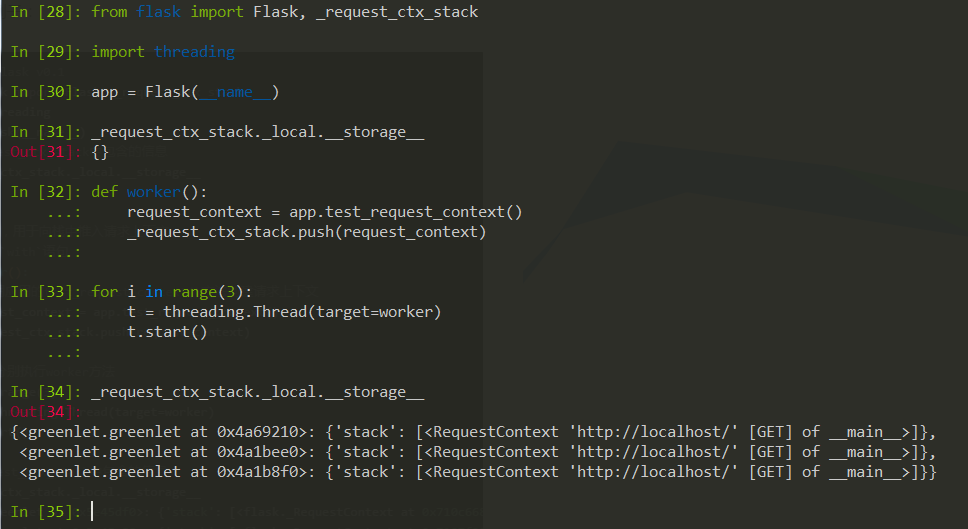

上面的结果显示：`_request_ctx_stack`中为每一个线程创建了一个“键-值”对，每一“键-值”对中包含一个请求上下文对象。如果使用with语句，在离开上下文环境时栈中销毁存储的上下文对象信息。

请求上下文——0.9版本
在0.9版本中，Flask引入了“应用上下文”的概念，且对“请求上下文”的实现有一定的改变。主要有一下改变:
* 请求上下文实现了push、pop方法，这使得对于请求上下文的操作更加的灵活；
* 伴随着请求上下文对象的生成并存储在栈结构中，Flask还会生成一个“应用上下文”对象，而且“应用上下文”对象也会存储在另一个栈结构中去。这是两个版本最大的不同。

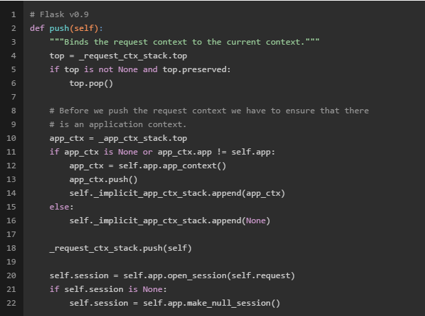

我们注意到，0.9版本的“请求上下文”的pop方法中，当要将一个“请求上下文”推入`_request_ctx_stack`栈中的时候，会先检查另一个栈`_app_ctx_stack`的栈顶是否存在“应用上下文”对象或者栈顶的“应用上下文”对象的应用是否是当前应用。如果不存在或者不是当前对象，Flask会自动先生成一个“应用上下文”对象，并将其推入`_app_ctx_stack`中。

注意到当要离开以上“请求上下文”环境的时候，Flask会先将“请求上下文”对象从`_request_ctx_stack`栈中销毁，之后会根据实际的情况确定销毁“应用上下文”对象。看下面代码:

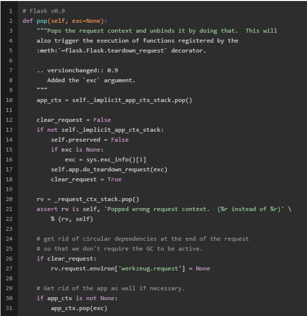


### 应用上下文
“应用上下文”存在的一个主要功能就是确定请求所在的应用。

疑问：既然“请求上下文”中也包含app等和当前应用相关的信息，那么只要调用`_request_ctx_stack.top.app`或者魔法`current_app`就可以确定请求所在的应用了，那为什么还需要“应用上下文”对象呢？
答案: 对于单应用单请求来说，使用“请求上下文”确实就可以了。
然而，Flask的设计理念之一就是多应用的支持。当在一个应用的请求上下文环境中，需要嵌套处理另一个应用的相关操作时，“请求上下文”显然就不能很好地解决问题了。

如何让请求找到“正确”的应用呢？
我们可能会想到，可以再增加一个请求上下文环境，并将其推入`_request_ctx_stack`栈中。由于两个上下文环境的运行是独立的，不会相互干扰，所以通过调用`_request_ctx_stack.top.app`或者魔法`current_app`也可以获得当前上下文环境正在处理那个应用。这种办法在一定程度上可行，但是如果对于第二个应用的处理不涉及到相关请求，那也就无从谈起“请求上下文”。

为了应对这个问题，Flask中将应用相关的信息单独拿出来，形成一个“应用上下文”对象。这个对象可以和“请求上下文”一起使用，也可以单独拿出来使用。
不过有一点需要**注意的是**：在创建“请求上下文”时**一定要创建**一个“应用上下文”对象。有了“应用上下文”对象，便可以很容易地确定当前处理哪个应用，这就是魔法`current_app`。在0.1版本中，`current_app`是对`_request_ctx_stack.top.app`的引用，而在0.9版本中`current_app`是对`_app_ctx_stack.top.app`的引用。
下面以一个多应用的例子进行说明：

```python
# example - Flask v0.9
>>> from flask import Flask, _request_ctx_stack, _app_ctx_stack
# 创建两个Flask应用
>>> app = Flask(__name__)
>>> app2 = Flask(__name__)
# 先查看两个栈中的内容
>>> _request_ctx_stack._local.__storage__
{}
>>> _app_ctx_stack._local.__storage__
{}
# 构建一个app的请求上下文环境，在这个环境中运行app2的相关操作
>>> with app.test_request_context():
        print "Enter app's Request Context:"
        print _request_ctx_stack._local.__storage__
        print _app_ctx_stack._local.__storage__
        print
        with app2.app_context():
            print "Enter app2's App Context:"
            print _request_ctx_stack._local.__storage__
            print _app_ctx_stack._local.__storage__
            print
            # do something
        print "Exit app2's App Context:"
        print _request_ctx_stack._local.__storage__
        print _app_ctx_stack._local.__storage__
        print
# Result
Enter app's Request Context:
{<greenlet.greenlet object at 0x000000000727A178>: {'stack': [<RequestContext 'http://localhost/' [GET] of __main__>]}}
{<greenlet.greenlet object at 0x000000000727A178>: {'stack': [<flask.ctx.AppContext object at 0x0000000005DD0DD8>]}}
Enter app2's App Context:
{<greenlet.greenlet object at 0x000000000727A178>: {'stack': [<RequestContext 'http://localhost/' [GET] of __main__>]}}
{<greenlet.greenlet object at 0x000000000727A178>: {'stack': [<flask.ctx.AppContext object at 0x0000000005DD0DD8>, <flask.ctx.AppContext object at 0x0000000007313198>]}}
Exit app2's App Context
{<greenlet.greenlet object at 0x000000000727A178>: {'stack': [<RequestContext 'http://localhost/' [GET] of __main__>]}}
{<greenlet.greenlet object at 0x000000000727A178>: {'stack': [<flask.ctx.AppContext object at 0x0000000005DD0DD8>]}}
```

在以上的例子中：

我们首先创建了两个Flask应用app和app2；

接着我们构建了一个app的请求上下文环境。当进入这个环境中时，这时查看两个栈的内容，发现两个栈中已经有了当前请求的请求上下文对象和应用上下文对象。并且栈顶的元素都是app的请求上下文和应用上下文；

之后，我们再在这个环境中嵌套app2的应用上下文。当进入app2的应用上下文环境时，两个上下文环境便隔离开来，此时再查看两个栈的内容，发现`_app_ctx_stack`中推入了app2的应用上下文对象，并且栈顶指向它。这时在app2的应用上下文环境中，`current_app`便会一直指向app2；

当离开app2的应用上下文环境，`_app_ctx_stack`栈便会销毁app2的应用上下文对象。这时查看两个栈的内容，发现两个栈中只有app的请求的请求上下文对象和应用上下文对象。

最后，离开app的请求上下文环境后，两个栈便会销毁app的请求的请求上下文对象和应用上下文对象，栈为空。

### 与上下文对象有关的“全局变量”
Flask中使用的一些“全局变量”，包括`current_app`、`request`、`session`、`g`等都来自于上下文对象。
其中`current_app`一直指向`_app_ctx_stack`栈顶的“应用上下文”对象，是对当前应用的引用。
而request、session、g等一直指向`_request_ctx_stack`栈顶的“请求上下文”对象，分别引用请求上下文的request、session和g。不过，从 Flask 0.10 起，对象 g 存储在应用上下文中而不再是请求上下文中。

### 两种上下文分析
当 `app = Flask(__name__)` 构造出一个 Flask App 时，App Context 并不会被自动推入 Stack 中。所以此时 Local Stack 的栈顶是空的，current\_app 也是 unbound 状态。

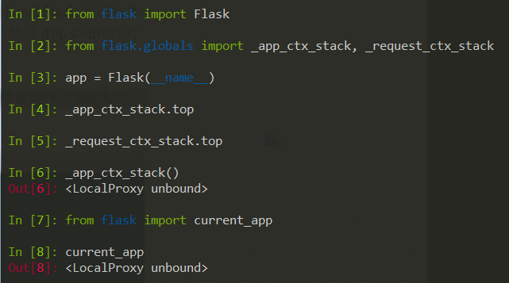

这也是一些 Flask 用户可能被坑的地方, 比如编写一个离线脚本时，如果直接在一个 Flask-SQLAlchemy 写成的 Model 上调用 `User.query.get(user_id)`，就会遇到 RuntimeError。因为此时 App Context 还没被推入栈中，而 Flask-SQLAlchemy 需要数据库连接信息时就会去取 `current_app.config`，current\_app 指向的却是 `_app_ctx_stack` 为空的栈顶。

解决的办法是运行脚本正文之前，先将 App 的 App Context 推入栈中，栈顶不为空后 current\_app 这个 Local Proxy 对象就自然能将“取 config 属性” 的动作转发到当前 App 上了：

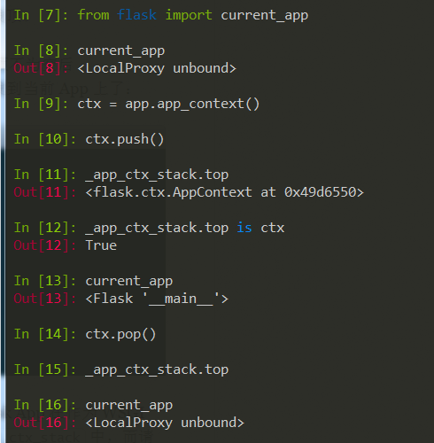

那么为什么在应用运行时不需要手动 `app_context().push()` 呢？
因为 Flask App 在作为 WSGI Application 运行时，会在每个请求进入的时候将请求上下文推入 `_request_ctx_stack` 中，而请求上下文一定是 App 上下文之中，所以推入部分的逻辑有这样一条：如果发现 `_app_ctx_stack` 为空，则隐式地推入一个 App 上下文。

所以，请求中是不需要手动推上下文入栈的，但是离线脚本需要手动推入 App Context。如果没有什么特殊困难，我更建议用 Flask-Script 来写离线任务。

### 两个疑问
1. 为什么 App Context 要独立出来：既然在 Web 应用运行时里，App Context 和 Request Context 都是 Thread Local 的，那么为什么还要独立二者？

2. 为什么要放在“栈”里：在 Web 应用运行时中，一个线程同时只处理一个请求，那么 `_req_ctx_stack` 和 `_app_ctx_stack` 肯定都是只有一个栈顶元素的。那么为什么还要用“栈”这种结构？

答案:这两个做法给予我们多个 Flask App 共存和非 Web Runtime 中灵活控制 Context 的可能性。

我们知道对一个 Flask App 调用 app.run() 之后，进程就进入阻塞模式并开始监听请求。此时是不可能再让另一个 Flask App 在主线程运行起来的。
那么还有哪些场景需要多个 Flask App 共存呢？
前面提到了，一个 Flask App 实例就是一个 WSGI Application，那么 WSGI Middleware 是允许使用组合模式的.比如:

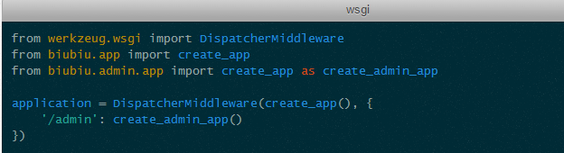

这个例子就利用 Werkzeug 内置的 Middleware 将两个 Flask App 组合成一个一个 WSGI Application。这种情况下两个 App 都同时在运行，只是根据 URL 的不同而将请求分发到不同的 App 上处理。

需要注意的是，这种用法和 Flask 的 Blueprint 是有区别的。Blueprint 虽然和这种用法很类似，但前者自己没有 App Context，只是同一个 Flask App 内部整理资源的一种方式，所以多个 Blueprint 可能共享了同一个 Flask App；后者面向的是所有 WSGI Application，而不仅仅是 Flask App，即使是把一个 Django App 和一个 Flask App 用这种用法整合起来也是可行的。

如果仅仅在 Web Runtime 中，多个 Flask App 同时工作倒不是问题。毕竟每个请求被处理的时候是身处不同的 Thread Local 中的。但是 Flask App 不一定仅仅在 Web Runtime 中被使用 —— 有两个典型的场景是在非 Web 环境需要访问上下文代码的，一个是离线脚本（前面提到过），另一个是测试。这两个场景即所谓的“Running code outside of a request”。

### 在非 Web 环境运行 Flask 关联的代码
离线脚本或者测试这类非 Web 环境和和 Web 环境不同 —— 前者一般只在主线程运行。

设想，一个离线脚本需要操作两个 Flask App 关联的上下文，应该怎么办呢？这时候栈结构的 App Context 优势就发挥出来了。

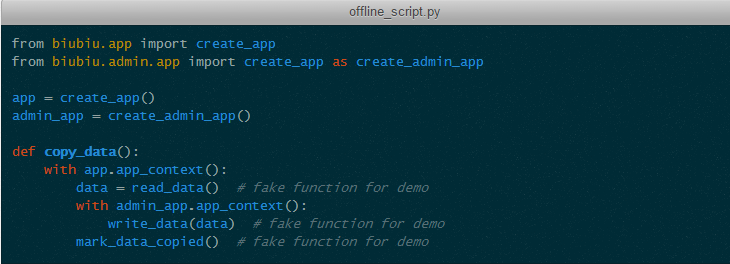

无论有多少个 App，只要主动去 Push 它的 App Context，Context Stack 中就会累积起来。这样，栈顶永远是当前操作的 App Context。当一个 App Context 结束的时候，相应的栈顶元素也随之出栈。如果在执行过程中抛出了异常，对应的 App Context 中注册的 teardown 函数被传入带有异常信息的参数。

这么一来就解释了两个疑问, 在这种单线程运行环境中，只有栈结构才能保存多个 Context 并在其中定位出哪个才是“当前”。而离线脚本只需要 App 关联的上下文，**不需要构造出请求**，所以 App Context 也应该和 Request Context 分离。这也就解释了为什么需要两个上下文了.

另一个手动推入 Context 的场景是测试。测试中我们可能会需要构造一个请求，并验证相关的状态是否符合预期。例如：

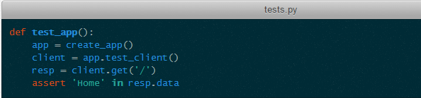

这里调用 client.get 时，Request Context 就被推入了。其特点和 App Context 非常类似，这里不再赘述。

### 为何建议使用 App Factory 模式

从官方文档来看，Flask 有 Singleton(单例) 和 App Factory 两种用法。
前一种用法和其他的一些 Web 框架（如 Bottle、Sinatra）的门面广告很相似，因为代码精简，所以显得非常的“帅”：

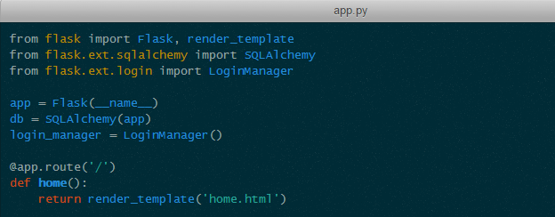

但是这种“帅”是有代价的。一个最麻烦的问题就是编写测试的时候：

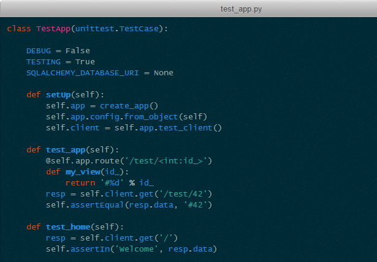

在上面的例子中，我为了测试给 App 新挂载了一个 View 函数。这是很常见的一个测试需求。但是如果 Flask App 实例是单例的，这种做法就会“弄脏”下一个测试的运行。更加麻烦的是，上述例子中如果 test\_home 在 test\_app 之前运行了，Flask 的开发者防御机制会认为这是一个“已经开始处理 Web 请求了，又挂载了视图”的失误，从而抛出 RuntimeError。

所以除非是应用简单到不需要 Web 层测试，否则还是尽量使用 App Factory 模式比较好。况且配合 Blueprint 的情况下，App Factory 还能帮助我们良好地组织应用结构：

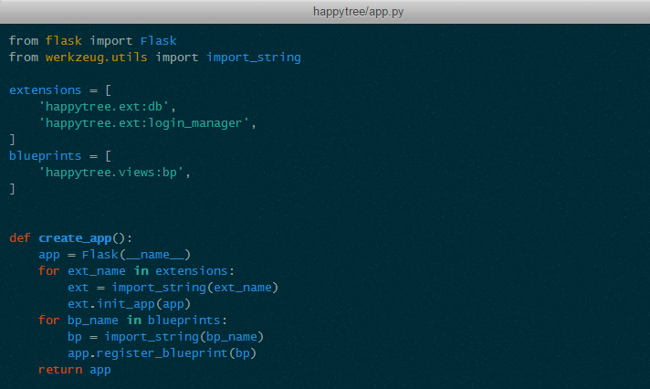

这样就能彻底摆脱 app.py 和 View 模块“互相 Import”的纠结了。


### 参考
* [http://blog.csdn.net/barrysj/article/details/51519254](http://blog.csdn.net/barrysj/article/details/51519254)
* [https://blog.tonyseek.com/post/the-context-mechanism-of-flask/](https://blog.tonyseek.com/post/the-context-mechanism-of-flask/)
* [http://fanchunke.me/Flask/Flask%E4%B8%AD%E7%9A%84%E8%AF%B7%E6%B1%82%E4%B8%8A%E4%B8%8B%E6%96%87%E5%92%8C%E5%BA%94%E7%94%A8%E4%B8%8A%E4%B8%8B%E6%96%87/](http://fanchunke.me/Flask/Flask%E4%B8%AD%E7%9A%84%E8%AF%B7%E6%B1%82%E4%B8%8A%E4%B8%8B%E6%96%87%E5%92%8C%E5%BA%94%E7%94%A8%E4%B8%8A%E4%B8%8B%E6%96%87/)
