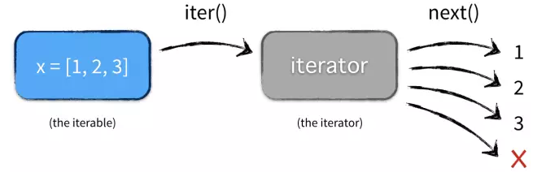

### 容器(container)
容器是一种把多个元素组织在一起的数据结构，容器中的元素可以逐个地迭代获取，可以用 in, not in关键字判断元素是否包含在容器中。
在Python中，常见的容器对象有：
list, deque, ....
set, frozensets, ....
dict, defaultdict, OrderedDict, Counter, ....
tuple, namedtuple, …
str

尽管绝大多数容器都提供了某种方式来获取其中的每一个元素，但这并不是容器本身提供的能力，而是可迭代对象赋予了容器这种能力，
当然并不是所有的容器都是可迭代的，比如：Bloom filter，虽然Bloom filter可以用来检测某个元素是否包含在容器中，
但是并不能从容器中获取其中的每一个值，因为Bloom filter压根就没把元素存储在容器中，而是通过一个散列函数映射成一个值保存在数组中。

### 可迭代对象(iterable)

很多容器都是可迭代对象，此外还有更多的对象同样也是可迭代对象，比如处于打开状态的files，sockets等等。但凡是可以返回一个迭代器的对象都可称之为可迭代对象.
```python
>>> x = [1, 2, 3]
>>> y = iter(x)
>>> z = iter(x)
>>> next(y)
1
>>> next(y)
2
>>> next(z)
1
>>> type(x)
<class 'list'>
>>> type(y)
<class 'list_iterator'>
```
这里 x 是一个可迭代对象，可迭代对象和容器一样是一种通俗的叫法，并不是指某种具体的数据类型，list是可迭代对象，dict是可迭代对象，set也是可迭代对象。 
y 和 z 是两个独立的迭代器，迭代器内部持有一个状态，该状态用于记录当前迭代所在的位置，以方便下次迭代的时候获取正确的元素。
迭代器有一种具体的迭代器类型，比如 list\_iterator， set\_iterator。
可迭代对象实现了 \_\_iter\_\_和 \_\_next\_\_方法（python2中是 next方法，python3是 __next__方法），这两个方法对应内置函数 iter()和 next()。 
\_\_iter\_\_方法返回可迭代对象本身，这使得他既是一个可迭代对象同时也是一个迭代器。
当运行下面代码:
```python
x = [1, 2, 3]
for elem in x:
    ...
```
实际执行情况是:



### 迭代器(iterator)
迭代器就是用于迭代操作（for 循环）的对象，它像列表一样可以迭代获取其中的每一个元素，
它是一个带状态的对象，它能在你调用 next()方法的时候返回容器中的下一个值，
任何实现了 \_\_next\_\_ 方法（python2 是 next）方法的对象都是迭代器
以斐波那契数列为例来实现一个迭代器：
```python
class Fib(object):
    def __init__(self, n):
        self.prev = 0
        self.cur = 1
        self.n = n

    def __iter__(self):
        return self

    def __next__(self):
        if self.n > 0:
            value = self.cur
            self.cur = self.cur + self.prev
            self.prev = value
            self.n -= 1
            return value
        else:
            raise StopIteration()
        # 兼容python2
        def __next__(self):
            return self.next()

f = Fib(10)
print([i for i in f])
#[1, 1, 2, 3, 5, 8, 13, 21, 34, 55]
```
Fib既是一个可迭代对象（因为它实现了 \_\_iter\_\_方法），又是一个迭代器（因为实现了 \_\_next\_\_方法）。
实例变量 prev和 cur维护迭代器内部的状态。每次调用 next()方法的时候做两件事：
1. 为下一次调用 next()方法修改状态
2. 为当前这次调用生成返回结果
迭代器就像一个懒加载的工厂，等到有人需要的时候才给它生成值返回，没调用的时候就处于休眠状态等待下一次调用。

### 生成器
普通函数用 return 返回一个值，然而在 Python 中还有一种函数，用关键字 yield 来返回值，这种函数叫生成器函数，
函数被调用时会返回一个生成器对象，生成器本质上还是一个迭代器，也是用在迭代操作中，因此它有和迭代器一样的特性，唯一的区别在于实现方式上不一样.
生成器其实是一种特殊的迭代器，不过这种迭代器更加优雅。它不需要再像上面的类一样写 \_\_iter\_\_()和 \_\_next\_\_()方法了，只需要一个 yiled关键字。 
生成器一定是迭代器（反之不成立），因此任何生成器也是以一种懒加载的模式生成值。
最简单的生成器函数：
```python
>>> def func(n):
	yield n*2

>>> func
<function func at 0x02397B70>
>>> g = func(5)
>>> g
<generator object func at 0x023961E8>
```
func 就是一个生成器函数，调用该函数时返回对象就是生成器 g ，这个生成器对象的行为和迭代器是非常相似的，可以用在 for 循环等场景中。
注意 yield 对应的值在函数被调用时不会立刻返回，而是调用next方法时（本质上 for 循环也是调用 next 方法）才返回.
```python
>>> g = func(5)
>>> next(g)
10

>>> g = func(5)
>>> for i in g:
...     print(i)
...
10
```
用生成器实现斐波那契数列:
```python
def fib(n):
    prev, curr = 0, 1
    while n > 0:
        n -= 1
        yield curr
        prev, curr = curr, curr + prev

print([i for i in fib(10)])
#[1, 1, 2, 3, 5, 8, 13, 21, 34, 55]
```
fib就是一个普通的python函数，它特殊的地方在于函数体中没有return关键字，函数的返回值是一个生成器对象。
当执行 f=fib()返回的是一个生成器对象，此时函数体中的代码并不会执行，只有显示或隐示地调用next的时候才会真正执行里面的代码。

生成器在Python中是一个非常强大的编程结构，可以用更少地中间变量写流式代码，
此外，相比其它容器对象它更能节省内存和CPU，当然它可以用更少的代码来实现相似的功能。现在就可以动手重构你的代码了，但凡看到类似：
```python
def something():
    result = []
    for ... in ...:
        result.append(x)
    return result

def iter_something():
    for ... in ...:
        yield x
```

### 生成器表达式(generator expression)
生成器表达式是列表推倒式的生成器版本，看起来像列表推导式，但是它返回的是一个生成器对象而不是列表对象。
```python
>>> a = (x*x for x in range(10))
>>> a
<generator object <genexpr> at 0x401f08>
>>> sum(a)
285
```

### 生成器的执行顺序
在调用\_\_next\_\_()或者进入for循环之后，函数执行到yield就返回一个值，然后函数暂停。在下次调用\_\_next\_\_()之后，生成器开始执行yield之后的语句。

### 生成器对象的成员函数

生成器对象有几个比较重要的成员函数：
\_\_next\_\_()和\_\_iter\_\_()：有这两个函数，生成器就具有了可迭代性
send()：这个函数很有用，可以用来给生成器函数传递一个新的值
close()：关闭这个生成器，关闭之后生成器就不可再调用
throw（）：给生成器传入一个异常

### send函数的用法
```python
#send函数的用法
from random import randint

def Gen(n):
    i=0 
    while (i<n):
        i=i+1
        #yeild语句，在重新开始执行的时候可以获得一个值，这个值就是由send函数输入的
        res = yield randint(0, 100)
        if res=='stop':
            print ('forced stop')
            break

if __name__=='__main__':
    #初始化一个生成器对象
    c=Gen(10)
    print (c.__next__())
    print (c.__next__())
    #传入‘start’字符串，
    print (c.send('start'))
    #传入‘stop’字符串，生成器跳出while循环
    print (c.send('stop'))
    #继续迭代生成器将报错
    print (c.__next__())

执行结果：
95
77
49
forced stop
Traceback (most recent call last):
  File "sample3.py", line 17, in <module>
    print (c.send('stop'))
StopIteration
```
从执行结果来看，
调用前两个next和第三个send函数，生成器都会yield出结果。
第四次调用send函数之后，也开始了迭代，不过由于退出了while循环，没有再一次回到yield，所以最终的结果里面只有三个数字
最后一次调用next函数，出现报错，因为生成器已经关闭。

### close函数的用法
```python
#close函数的用法
from random import randint

def Gen(n):
    i=0 
    while (i<n):
        i=i+1
        yield randint(0,100)

if __name__=='__main__':
    c=Gen(10)
    print (c.__next__())
    print (c.__next__())
    #close生成器之后，再调用next将报错
    c.close()
    print (c.__next__())

执行结果：
81
65
Traceback (most recent call last):
  File "sample4.py", line 15, in <module>
    print (c.__next__())
StopIteration
```
close函数的用法就是关闭生成器对象，其实调用send或者next函数都会‘open’这个生成器，期间生成器都会记录执行的中间结果，直到生成器被关闭为止

### throw函数的用法

```python
from random import randint

def Gen(n):
    i=0 
    while (i<n):
        i=i+1
        try:
            res = yield randint(0,100)
        except IOError:
            print ('get the IO Error')

if __name__=='__main__':
    c=Gen(10)
    print (c.__next__())
    #给生成器扔进去一个异常    
    c.throw(IOError)
    print (c.__next__())
```
执行结果：
39
get the IO Error
19

可以看到生成器内部成功的捕获并处理了这个异常，并且没有阻断生成器后面的执行流程

### 参考
* [https://mp.weixin.qq.com/s/baavCsOtKH0uuUGI-GPecw](https://mp.weixin.qq.com/s/baavCsOtKH0uuUGI-GPecw)
* [http://www.jianshu.com/p/1c7c6ee38392](http://www.jianshu.com/p/1c7c6ee38392)