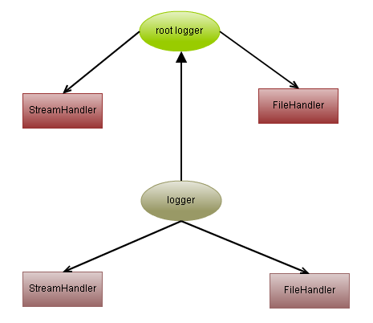

### python日志等级
- FATAL - 导致程序退出的严重系统级错误，不可恢复，当错误发生时，系统管理员需要立即介入，谨慎使用。
- ERROR - 运行时异常以及预期之外的错误，也需要立即处理，但紧急程度低于FATAL,当错误发生时，影响了程序的正确执行。需要注意的是这两种级别属于服务自己的错误，需要管理员介入，用户输入出错不属于此分类。
- WARN - 预期之外的运行时状况，表示系统可能出现问题。对于那些目前还不是错误，然而不及时处理也会变成错误的情况，也可以记为WARN，如磁盘过低。
- INFO - 有意义的事件信息，记录程序正常的运行状态，比如收到请求，成功执行。通过查看INFO,可以快速定位WARN，ERROR, FATAL。INFO不宜过多，通常情况下不超过TRACE的10%。
- DEBUG - 与程序运行时的流程相关的详细信息以及当前变量状态。
- TRACE - 更详细的跟踪信息。DEBUG和TRACE这两种规范由项目组自己定义,通过该种日志，可以查看某一个操作每一步的执行过程，可以准确定位是何种操作，何种参数，何种顺序导致了某种错误的发生

### 日志存放
日志最好放到单独的日志目录，例如 /var/logs/ 下，按照应用分成不同的目录，或者是文件。日志不要放在应用目录下，那样不利于自动化部署和应用升级，备份等。

### 日志切分
日志可以按照每天，每周或者是文件的大小，切分之后压缩。一方面容易按时间回溯，另一方面可以减少磁盘空间，对于很久之前的日志，可以传输到远程服务器，或者是删除。

### 一些好的习惯
- root级别的设置: 日志格式, 有利于标准化
- class 中设置logger self.logger = logging.getLogger(type(self).__name__), 以类名作为日志实例的名字
- 模块，文件中设置 logger logger = logging.getLogger(__name__), 以模块的名字作为日志实例的名字
- 使用JSON YAML等格式来配置logging，感觉比使用代码或者 ini格式看起来更方面
- 错误日志是比较特殊的日志，因为它需要更多的信息，例如错误产生的上下文，还有错误堆栈等信息。可以通过 python logging context pypi 关键词google一些信息，或者自己设计一个 logging handler 来实现。
- 不要用__file__作为日志实例的名字, 否则日志会直接__file__文件的最后面添加日志.

### 记录 Exception 的trace 信息
```python
try:
    open('/path/to/does/not/exist', 'rb')
except (SystemExit, KeyboardInterrupt):
    raise
except Exception, e:
    logger.error('Failed to open file', exc_info=True)
```

### 日志设定
在软件开发过程中,需要将日志信息输出到控制台,写入到日志文件中.但是如何做呢?
在你的应用程序创建一个模块,如logger.py

```python
# logger.py

import logging  
# 创建一个logger  
logger = logging.getLogger(__file__)  
logger.setLevel(logging.DEBUG)  
# 创建一个handler，用于写入日志文件  
fh = logging.FileHandler('mylog.log')  
fh.setLevel(logging.DEBUG)  
# 再创建一个handler，用于输出到控制台  
ch = logging.StreamHandler()  
ch.setLevel(logging.DEBUG)  
# 定义handler的输出格式  
formatter = logging.Formatter('%(asctime)s - %(name)s - %(levelname)s - %(message)s')  
fh.setFormatter(formatter)  
ch.setFormatter(formatter)  
# 给logger添加handler  
logger.addHandler(fh)  
logger.addHandler(ch)  
# 记录一条日志  
logger.info('this is first log.')  
```
### 在模块级别获取日志实例的隐患
加入你的日志配置是写在一个配置文件件,如ini,json或者yaml文件中,
当你在模块中以模块名字实例了一个日志实例,此时日志的配置还没有加载的话,你的日志实例是没有配置的,
你会发现没有日志被记录到日志文件中,控制台打印的日志没有格式.
好的做法是在需要打印日志的时候创建日志实例.
```python
import logging

def foo():
    logger = logging.getLogger(__name__)
    logger.info('Hi, foo')

class Bar(object):
    def __init__(self, logger=None):
        self.logger = logger or logging.getLogger(__name__)

    def bar(self):
        self.logger.info('Hi, bar')
```

python2.7出来了一个新参数`disable_existing_loggers`,解决了上面的问题,
```python
import logging
import logging.config

logger = logging.getLogger(__name__)

# load config from file
# logging.config.fileConfig('logging.ini', disable_existing_loggers=False)
# or, for dictConfig
logging.config.dictConfig({
    'version': 1,
    'disable_existing_loggers': False,  # this fixes the problem
    'formatters': {
        'standard': {
            'format': '%(asctime)s [%(levelname)s] %(name)s: %(message)s'
        },
    },
    'handlers': {
        'default': {
            'level':'INFO',
            'class':'logging.StreamHandler',
        },
    },
    'loggers': {
        '': {
            'handlers': ['default'],
            'level': 'INFO',
            'propagate': True
        }
    }
})

logger.info('It works!')
```

### 使用json或yaml配置日志
你可以从一个字典里加载日志配置,这也意味着你可以从json或yaml加载日志配置,尽管你可以从ini文件加载日志配置,但毕竟读写不方便,下面演示用json和yaml写日志配置
logging.json
```json
{
    "version": 1,
    "disable_existing_loggers": false,
    "formatters": {
        "simple": {
            "format": "%(asctime)s - %(name)s - %(levelname)s - %(message)s"
        }
    },

    "handlers": {
        "console": {
            "class": "logging.StreamHandler",
            "level": "DEBUG",
            "formatter": "simple",
            "stream": "ext://sys.stdout"
        },

        "info_file_handler": {
            "class": "logging.handlers.RotatingFileHandler",
            "level": "INFO",
            "formatter": "simple",
            "filename": "info.log",
            "maxBytes": 10485760,
            "backupCount": 20,
            "encoding": "utf8"
        },

        "error_file_handler": {
            "class": "logging.handlers.RotatingFileHandler",
            "level": "ERROR",
            "formatter": "simple",
            "filename": "errors.log",
            "maxBytes": 10485760,
            "backupCount": 20,
            "encoding": "utf8"
        }
    },

    "loggers": {
        "my_module": {
            "level": "ERROR",
            "handlers": ["console"],
            "propagate": "no"
        }
    },

    "root": {
        "level": "INFO",
        "handlers": ["console", "info_file_handler", "error_file_handler"]
    }
}
```

logging.yaml
```yaml
---
version: 1
disable_existing_loggers: False
formatters:
    simple:
        format: "%(asctime)s - %(name)s - %(levelname)s - %(message)s"

handlers:
    console:
        class: logging.StreamHandler
        level: DEBUG
        formatter: simple
        stream: ext://sys.stdout

    info_file_handler:
        class: logging.handlers.RotatingFileHandler
        level: INFO
        formatter: simple
        filename: info.log
        maxBytes: 10485760 # 10MB
        backupCount: 20
        encoding: utf8

    error_file_handler:
        class: logging.handlers.RotatingFileHandler
        level: ERROR
        formatter: simple
        filename: errors.log
        maxBytes: 10485760 # 10MB
        backupCount: 20
        encoding: utf8

loggers:
    my_module:
        level: ERROR
        handlers: [console]
        propagate: no

root:
    level: INFO
    handlers: [console, info_file_handler, error_file_handler]
...
```

### 如何读取json和yaml配置
```python
import os
import json
import logging.config

def setup_logging(
    default_path='logging.json',
    default_level=logging.INFO,
    env_key='LOG_CFG'
):
    """Setup logging configuration

    """
    path = default_path
    value = os.getenv(env_key, None)
    if value:
        path = value
    if os.path.exists(path):
        with open(path, 'rt') as f:
            config = json.load(f)
        logging.config.dictConfig(config)
    else:
        logging.basicConfig(level=default_level)
```

json是一个标准库,不需要安装,yaml需要安装,但yaml文件更易读

```python
import os
import logging.config

import yaml

def setup_logging(
    default_path='logging.yaml',
    default_level=logging.INFO,
    env_key='LOG_CFG'
):
    """Setup logging configuration

    """
    path = default_path
    value = os.getenv(env_key, None)
    if value:
        path = value
    if os.path.exists(path):
        with open(path, 'rt') as f:
            config = yaml.safe_load(f.read())
        logging.config.dictConfig(config)
    else:
        logging.basicConfig(level=default_level)
```

### logging模块的API
`logging.getLogger([name])`
返回一个logger实例，如果没有指定name，返回root logger。
只要name相同，返回的logger实例都是同一个而且只有一个，即name和logger实例是一一对应的。
这意味着，无需把logger实例在各个模块中传递。只要知道name，就能得到同一个logger实例.

`Logger.setLevel(lvl)`
设置logger的level， level有以下几个级别：NOTSET < DEBUG < INFO < WARNING < ERROR < CRITICAL

`Logger.addHandler(hdlr)`
logger可以雇佣handler来帮它处理日志， handler主要有以下几种：
StreamHandler: 输出到控制台;
FileHandler:输出到文件handler还可以设置自己的level以及输出格式。

`logging.basicConfig([**kwargs])`
这个函数用来配置root logger,为root logger创建一个StreamHandler,设置默认的格式。
这些函数:logging.debug()、logging.info()、logging.warning()、logging.error()、logging.critical() 如果调用的时候发现root logger没有任何handler，会自动调用basicConfig添加一个handler,如果root logger已有handler,这个函数不做任何事情,使用basicConfig来配置root logger的输出格式和level：

### 关于root logger以及logger的父子关系
关于root logger, 实际上logger实例之间还有父子关系, root logger就是处于最顶层的logger, 它是所有logger的祖先。如下图:



root logger是默认的logger
如果不创建logger实例, 直接调用logging.debug()、logging.info()logging.warning()、logging.error()、logging.critical()这些函数，
那么使用的logger就是 root logger,它可以自动创建，也是单实例的。

如何得到root logger
通过logging.getLogger()或者logging.getLogger("")来得到root logger实例。

默认的levelroot 
logger默认的level是logging.WARNING

如何表示父子关系
logger的name的命名方式可以表示logger之间的父子关系. 比如：
```python
parent_logger = logging.getLogger('foo')
child_logger = logging.getLogger('foo.bar')
```

什么是effective level
logger有一个概念，叫effective level。 如果一个logger没有显示地设置level，那么它就用父亲的level。如果父亲也没有显示地设置level， 就用父亲的父亲的level，以此推,直到到达root logger，root logger一定设置过level。默认为logging.WARNING
child loggers得到消息后，会把消息分发给它的handler处理，也会传递给所有祖先logger处理，

```python
import logging  
# 设置root logger  
r = logging.getLogger()  
ch = logging.StreamHandler()  
ch.setLevel(logging.DEBUG)  
formatter = logging.Formatter('%(asctime)s - %(levelname)s - %(message)s')  
ch.setFormatter(formatter)  
r.addHandler(ch)  
   
# 创建一个logger作为父亲  
p = logging.getLogger('foo')  
p.setLevel(logging.DEBUG)  
ch = logging.StreamHandler()  
ch.setLevel(logging.DEBUG)  
formatter = logging.Formatter('%(asctime)s - %(message)s')  
ch.setFormatter(formatter)  
p.addHandler(ch)  
   
# 创建一个孩子logger  
c = logging.getLogger('foo.bar')  
c.debug('foo') 
```

```
2017-05-07 16:04:29,893 - foo  
2011-05-07 16:04:29,893 - DEBUG - foo 
```
可见， 子logger没有任何handler，所以对消息不做处理。但是它把消息转发给了它的父亲以及root logger。最后输出两条日志。


### 一些问题
当你的应用程序用到了日志模块,并同时输出日志到控制台和文件中,打包发布并安装你的应用程序后,运行你的程序后有日志输出,当关闭应用程序会弹出一个弹框,让你去日志文件检查错误信息,并且会自动生成一个和应用程序同名的日志文件.这个弹框及和应用程序同名日志文件是怎么产生的呢?
原因是:控制台窗口的句柄导致的,不要将日志文件输出到控制台窗口即可.


### logging模块的一些局限
logging模块是单进程的,当在多进程中涉及到日志切分就会出现日志错乱的现象和日志重复的现象.在tornado中就有所体现.
像tornado这种推荐进行多进程部署的框架，在类似的日志切分上会发生错误，
原因是: 单个的日志文件作为进程间的共享资源，当其中一个进程进行日志切分的时候，实际上是将原来的日志文件改名，
然后新建一个日志文件，文件操作描述符fd发生了改变，其它的进程不知道这个操作，再次写入日志的时候因为找不到新的文件描述符发生异常。

每次TimedRotatingHandler做切分操作时，所做的步骤如下：

1. 如现在的文件为mownfish.log, 切分后的文件名设定为mownfish.log.2013-11-24
2. 判断是否存在和切分后重命名的文件mownfish.log.2013-11-24一样名称的文件，如果存在就删除
3. 将当前的日志文件mownfish.log重命名为mownfish.log.2013-11-24
4. 以“w”模式打开一个新文件mownfish.log,并写入新的日志。

当一个进程做好日志切分后,名称为mownfish.log文件的描述符已经变了,而其他进程在写入日志的是否发现日志的文件描述符不一致从而发生异常.

### 多个模块使用logging
每个 logger 都有个名字，以 ‘.’ 来划分继承关系。名字为空的就是 root_logger.
首先在主模块定义了logger'mainModule'，并对它进行了配置，就可以在解释器进程里面的其他地方通过getLogger('mainModule')得到的对象都是一样的，不需要重新配置，可以直接使用。定义的该logger的子logger，都可以共享父logger的定义和配置，所谓的父子logger是通过命名来识别，任意以'mainModule'开头的logger都是它的子logger，例如'mainModule.sub'。

实际开发一个application，首先可以通过logging配置文件编写好这个application所对应的配置，可以生成一个根logger，如'PythonAPP'，然后在主函数中通过fileConfig加载logging配置，接着在application的其他地方、不同的模块中，可以使用根logger的子logger，如'PythonAPP.Core'，'PythonAPP.Web'来进行log，而不需要反复的定义和配置各个模块的logger。

### logging 是线程安全的么？
logging是线程安全的, handler 内部使用了 threading.RLock() 来保证同一时间只有一个线程能够输出。
但是，在使用 logging.FileHandler 时，多进程同时写一个日志文件是不支持的。


### Tornado的日志以及日志重复问题


### 多进程日志
使用的TimedRotatingFileHandler并不是进程安全的，日志的准确性无法保证，所以改用线程安全的ConcurrentLogHandler。
- ConcurrentLogHandler需要安装, pip install ConcurrentLogHandler
- ConcurrentLogHandler不能将日志根据时间分片

filename: 日志文件地址，相对地址或绝对地址均可
mode: 默认为"a"
maxBytes: 文件长度，超过最大长度自动分片，最初日志都会写入filename里面，到达设置的最大长度之后进行分片，分片后文件名为filename.1 filename.2，以此类推
backupCount: 最大日志文件保留数量，默认为0即不会删除日志文件
encoding: 日志文件编码格式，默认为gbk

```python
def init_log():
    logfile = "/data1/restful_log/restful_api_thread.log"
    filesize = 800*1024*1024
    log = getLogger()
    rotate_handler = ConcurrentRotatingFileHandler(logfile, "a", filesize, encoding="utf-8")
    datefmt_str = '%Y-%m-%d %H:%M:%S'
    format_str = '%(asctime)s\t%(levelname)s\t%(message)s '
    formatter = Formatter(format_str, datefmt_str)
    rotate_handler.setFormatter(formatter)
    log.addHandler(rotate_handler)
    log.setLevel(WARN)
    return log
```    

### 参考
* [使用python的logging模块](http://kenby.iteye.com/blog/1162698)
