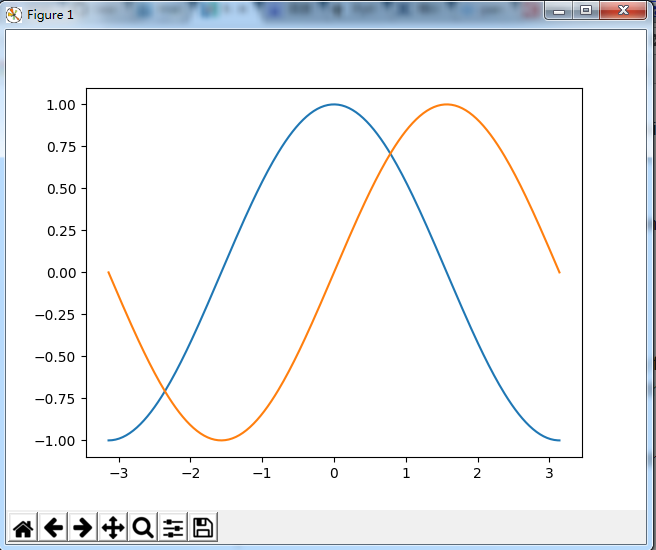

### Matplotlib简介
Matplotlib 可能是 Python 2D-绘图领域使用最广泛的包了。它能让使用者轻松地将数据图形化，并提供多样化的输出格式。这里将会探索 matplotlib 的常见用法。

### IPython和pylab
IPython 是 Python 的一个增强shell。它在下列方面有所增强： named inputs and outputs、shell commands、debug. 在命令行终端给 IPython 加上参数 -pylab （0.12 以后的版本是 --pylab）之后，就可以像 Matlab/Mathematica 那样以交互的方式绘图。

pylab 是 matplotlib 面向对象绘图库的一个接口。它的语法和 Matlab 十分相近。也就是说，它主要的绘图命令和 Matlab 对应的命令有相似的参数。

### 简单绘制
这里将先尝试用默认配置在同一张图上绘制正弦和余弦函数图像，然后逐步添加各项功能来美化。
第一步: 获取正弦函数和余弦函数的值,并绘制正弦和余弦曲线

```python
import numpy as np
import matplotlib.pyplot as plt

X = np.linspace(-np.pi, np.pi, 256, endpoint=True)
C, S = np.cos(X), np.sin(X)

plt.plot(X, C)
plt.plot(X, S)

plt.show()
```

X是一个numpy数组,并从[-π, π]中等间距取256个值, 即坐标系的X轴上的取值
C是余弦曲线上对应于X轴各个取值的余弦值,即坐标系上y轴的取值
S是正弦曲线上对应于X轴各个取值的正弦值,即坐标系上y轴的取值
运行结果:


Matplotlib有一系列默认设置允许定制各种属性,你可以控制mayplotlib几乎所有的属性,如:
图像尺寸, dpi(分辨率), 线宽, 颜色, 样式, 坐标轴, 坐标轴和网格属性, 文本, 字体等属性. 不过，matplotlib 的默认配置在大多数情况下已经做得足够好，你可能只在很少的情况下才会想更改这些默认配置。

在下面的脚本中，我们已经实例化了(并注释了)影响曲线外观的设置。这些设置已被明确设置为默认值，但现在您可以交互地设置这些值来探索其影响(请参阅下面的线条属性和线条样式).
```python
import numpy as np
import matplotlib.pyplot as plt

# 创建一个大小为8x6 inch的新图形，每英寸使用80点
plt.figure(figsize=(8,6), dpi=80)

# 从1x1的网格创建一个新的子图
plt.subplot(111)

X = np.linspace(-np.pi, np.pi, 256,endpoint=True)
C,S = np.cos(X), np.sin(X)

# Plot cosine using blue color with a continuous line of width 1 (pixels)
plt.plot(X, C, color="blue", linewidth=1.0, linestyle="-")

# Plot sine using green color with a continuous line of width 1 (pixels)
plt.plot(X, S, color="green", linewidth=1.0, linestyle="-")

# Set x 上下限
plt.xlim(-4.0,4.0)

# Set x 刻度
plt.xticks(np.linspace(-4,4,9,endpoint=True))

# Set y limits
plt.ylim(-1.0,1.0)

# Set y ticks
plt.yticks(np.linspace(-1,1,5,endpoint=True))

# Save figure using 72 dots per inch
# savefig("../figures/exercice_2.png",dpi=72)

# Show result on screen
plt.show()
```


### 参考
* [Matplotlib教程](http://www.labri.fr/perso/nrougier/teaching/matplotlib/)