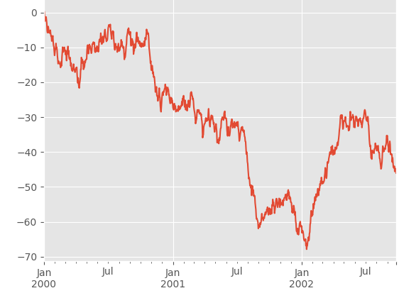
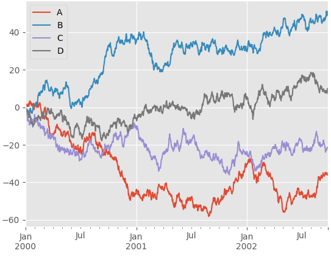

这是一个简短的为新手入门的pandas教程,更高级的用法请查看[ccokbook](http://pandas.pydata.org/pandas-docs/stable/cookbook.html#cookbook)
这里安装numpy, mayplotlit 和 pandas省略.首先导入如下包
```python
In [1]: import pandas as pd

In [2]: import numpy as np

In [3]: import matplotlib.pyplot as plt
```

### 对象创建
传递一个list来创建一个 Series 对象, pandas会自动创建索引
```python
In [4]: s = pd.Series([1,3,5,np.nan, 6, 8])

In [5]: s
Out[5]:
0    1.0
1    3.0
2    5.0
3    NaN
4    6.0
5    8.0
dtype: float64
```

传递一个numpy的array创建一个DataFrame对象, 同时以datetime为索引和带label的列
DataFrame 是有多个列的数据表，每个列拥有一个 label，当然，DataFrame 也有索引
```python
# 创建datetime索引
In [6]: dates = pd.date_range('20170608', periods=6)

In [7]: dates
Out[7]:
DatetimeIndex(['2017-06-08', '2017-06-09', '2017-06-10', '2017-06-11',
               '2017-06-12', '2017-06-13'],
              dtype='datetime64[ns]', freq='D')

In [8]: df = pd.DataFrame(np.random.randn(6,4), index=dates, columns=list('ABCD'))

In [9]: df
Out[9]:
                   A         B         C         D
2017-06-08 -0.561773  0.881191 -2.697783 -0.034672
2017-06-09 -0.053409  0.814811  0.294231 -1.753744
2017-06-10 -1.699722  0.971518 -2.592852  1.088473
2017-06-11 -2.411028  0.312229 -1.879164  1.388484
2017-06-12 -0.173929 -0.572149  2.044024 -0.101223
2017-06-13 -0.906777 -0.207889 -0.776134  2.327599
```

传递一个dict来创建一个DataFrame, 每个 dict 的 value 会被转化成一个 Series,
可以认为，DataFrame 是由多个 Series 组成的
```python
In [10]: df2 = pd.DataFrame({
    ...: 'A': 1.,
    ...: 'B': pd.Timestamp('20170608'),
    ...: 'C': pd.Series(1, index=list(range(4)), dtype='float32'),
    ...: 'D': np.array([3]*4, dtype='int32'),
    ...: 'E': pd.Categorical(['test', 'train', 'test', 'train']),
    ...: 'F': 'foo'})

In [11]: df2
Out[11]:
     A          B    C  D      E    F
0  1.0 2017-06-08  1.0  3   test  foo
1  1.0 2017-06-08  1.0  3  train  foo
2  1.0 2017-06-08  1.0  3   test  foo
3  1.0 2017-06-08  1.0  3  train  foo
```

每列数据的格式用 dtypes 查看
```python
In [12]: df2.dtypes
Out[12]:
A           float64
B    datetime64[ns]
C           float32
D             int32
E          category
F            object
dtype: object
```

### 数据查看

查看指定列的数据
```python
In [15]: df2.A
Out[15]:
0    1.0
1    1.0
2    1.0
3    1.0
Name: A, dtype: float64
```

用 head 和 tail 查看顶端和底端的几列, `head()`和`tail()`函数默认值都是5
```python
In [16]: df.head()                                 
Out[16]:                                           
                   A         B         C         D 
2017-06-08 -0.561773  0.881191 -2.697783 -0.034672 
2017-06-09 -0.053409  0.814811  0.294231 -1.753744 
2017-06-10 -1.699722  0.971518 -2.592852  1.088473 
2017-06-11 -2.411028  0.312229 -1.879164  1.388484 
2017-06-12 -0.173929 -0.572149  2.044024 -0.101223 
                                                   
In [17]: df.tail(3)                                
Out[17]:                                           
                   A         B         C         D 
2017-06-11 -2.411028  0.312229 -1.879164  1.388484 
2017-06-12 -0.173929 -0.572149  2.044024 -0.101223 
2017-06-13 -0.906777 -0.207889 -0.776134  2.327599 
                                                   
In [18]: df.head(2)                                
Out[18]:                                           
                   A         B         C         D 
2017-06-08 -0.561773  0.881191 -2.697783 -0.034672 
2017-06-09 -0.053409  0.814811  0.294231 -1.753744 
                                                   
In [19]: df.tail()                                 
Out[19]:                                           
                   A         B         C         D 
2017-06-09 -0.053409  0.814811  0.294231 -1.753744 
2017-06-10 -1.699722  0.971518 -2.592852  1.088473 
2017-06-11 -2.411028  0.312229 -1.879164  1.388484 
2017-06-12 -0.173929 -0.572149  2.044024 -0.101223 
2017-06-13 -0.906777 -0.207889 -0.776134  2.327599 
```

单独查看 index 和 columns 和 数据, DataFrame 内部用 numpy 格式存储数据
```python
In [20]: df.index
Out[20]:
DatetimeIndex(['2017-06-08', '2017-06-09', '2017-06-10', '2017-06-11',
               '2017-06-12', '2017-06-13'],
              dtype='datetime64[ns]', freq='D')

In [21]: df.columns
Out[21]: Index(['A', 'B', 'C', 'D'], dtype='object')

In [22]: df.values
Out[22]:
array([[-0.56177253,  0.88119144, -2.6977834 , -0.03467225],
       [-0.05340873,  0.81481114,  0.29423114, -1.75374372],
       [-1.69972161,  0.97151768, -2.59285248,  1.08847275],
       [-2.41102846,  0.3122287 , -1.87916396,  1.38848363],
       [-0.17392908, -0.57214913,  2.04402398, -0.10122313],
       [-0.90677665, -0.20788934, -0.77613381,  2.32759919]])
```

describe() 显示数据的概要。
```python
In [23]: df.describe()
Out[23]:
              A         B         C         D
count  6.000000  6.000000  6.000000  6.000000
mean  -0.967773  0.366618 -0.934613  0.485819
std    0.922339  0.639667  1.852466  1.428378
min   -2.411028 -0.572149 -2.697783 -1.753744
25%   -1.501485 -0.077860 -2.414430 -0.084585
50%   -0.734275  0.563520 -1.327649  0.526900
75%   -0.270890  0.864596  0.026640  1.313481
max   -0.053409  0.971518  2.044024  2.327599
```

和 numpy 一样，可以方便的得到转置,就是行列转换 
```python
In [24]: df.T
Out[24]:
   2017-06-08  2017-06-09  2017-06-10  2017-06-11  2017-06-12  2017-06-13
A   -0.561773   -0.053409   -1.699722   -2.411028   -0.173929   -0.906777
B    0.881191    0.814811    0.971518    0.312229   -0.572149   -0.207889
C   -2.697783    0.294231   -2.592852   -1.879164    2.044024   -0.776134
D   -0.034672   -1.753744    1.088473    1.388484   -0.101223    2.327599
```

对 axis 按照 index 排序（axis=1 是指根据列名来排序, axis=0 是根据行名来排序）
```python
In [26]: df.sort_index(axis=1, ascending=False)
Out[26]:
                   D         C         B         A
2017-06-08 -0.034672 -2.697783  0.881191 -0.561773
2017-06-09 -1.753744  0.294231  0.814811 -0.053409
2017-06-10  1.088473 -2.592852  0.971518 -1.699722
2017-06-11  1.388484 -1.879164  0.312229 -2.411028
2017-06-12 -0.101223  2.044024 -0.572149 -0.173929
2017-06-13  2.327599 -0.776134 -0.207889 -0.906777
```

按值排序
```python
In [30]: df.sort_values(by='B')
Out[30]:
                   A         B         C         D
2017-06-12 -0.173929 -0.572149  2.044024 -0.101223
2017-06-13 -0.906777 -0.207889 -0.776134  2.327599
2017-06-11 -2.411028  0.312229 -1.879164  1.388484
2017-06-09 -0.053409  0.814811  0.294231 -1.753744
2017-06-08 -0.561773  0.881191 -2.697783 -0.034672
2017-06-10 -1.699722  0.971518 -2.592852  1.088473
```

### 选择
**注意:** 以下这些对交互式环境很友好，但是作为 production code 请用优化过的 `.at, .iat, .loc, .iloc, .ix`等.

获取行/列
从 DataFrame 选择一个列，就得到了 Series
```python
In [31]: df['A']
Out[31]:
2017-06-08   -0.561773
2017-06-09   -0.053409
2017-06-10   -1.699722
2017-06-11   -2.411028
2017-06-12   -0.173929
2017-06-13   -0.906777
Freq: D, Name: A, dtype: float64
```

使用[] 对行切片
```python
In [35]: df[0:3]
Out[35]:
                   A         B         C         D
2017-06-08 -0.561773  0.881191 -2.697783 -0.034672
2017-06-09 -0.053409  0.814811  0.294231 -1.753744
2017-06-10 -1.699722  0.971518 -2.592852  1.088473
```

通过标签选择
通过时间戳的下标（dates[0] = Timestamp('20130101')）来访问
```python
In [36]: df.loc[dates[1]]
Out[36]:
A   -0.053409
B    0.814811
C    0.294231
D   -1.753744
Name: 2017-06-09 00:00:00, dtype: float64
```

选择多个标签
```python
In [38]: df.loc[:,['A', 'B']]
Out[38]:
                   A         B
2017-06-08 -0.561773  0.881191
2017-06-09 -0.053409  0.814811
2017-06-10 -1.699722  0.971518
2017-06-11 -2.411028  0.312229
2017-06-12 -0.173929 -0.572149
2017-06-13 -0.906777 -0.207889
```

注意那个冒号，用法和 MATLAB 或 NumPy 是一样的！所以也可以这样
```python
In [39]: df.loc[dates[0]:dates[2], ['A', 'B']]
Out[39]:
                   A         B
2017-06-08 -0.561773  0.881191
2017-06-09 -0.053409  0.814811
2017-06-10 -1.699722  0.971518
```

依旧和 MATLAB 一样，当有一个维度是标量（而不是范围或序列）的时候，选择出的矩阵维度会减少
```python
In [40]: df.loc[dates[0], ['A', 'B']]
Out[40]:
A   -0.561773
B    0.881191
Name: 2017-06-08 00:00:00, dtype: float64
```

如果对所有的维度都写了标量，不就是选出一个元素吗？
```python
In [41]: df.loc[dates[0], 'A']
Out[41]: -0.56177252662051747
```

这种情况通常用 at ，速度更快
```python
In [42]: df.at[dates[0], 'A']
Out[42]: -0.56177252662051747
```

通过位置选择,即整数下标选择, 和 MATLAB 完全一样
这个就和数组类似啦，直接看例子。选出第4行：
```python
In [43]: df.iloc[3]
Out[43]:
A   -2.411028
B    0.312229
C   -1.879164
D    1.388484
Name: 2017-06-11 00:00:00, dtype: float64
```

选出3~4行，0~1列：
```python
In [45]: df.iloc[3:5, 0:2]
Out[45]:
                   A         B
2017-06-11 -2.411028  0.312229
2017-06-12 -0.173929 -0.572149
```

也能用 list 选择, 挑出指定行和列
```python
In [46]: df.iloc[[1, 2, 4], [0, 3]]
Out[46]:
                   A         D
2017-06-09 -0.053409 -1.753744
2017-06-10 -1.699722  1.088473
2017-06-12 -0.173929 -0.101223
```

也可以用slice
```python
In [47]: df.iloc[1:3, 1:3]
Out[47]:
                   B         C
2017-06-09  0.814811  0.294231
2017-06-10  0.971518 -2.592852
```

选择单个元素
```python
In [48]: df.iloc[0,0]
Out[48]: -0.56177252662051747

In [49]: df.iat[0,0]
Out[49]: -0.56177252662051747
```

### 布尔值索引
根据单列的值来选择数据
```python
In [7]: df[df.A > 0]
Out[7]:
                   A         B         C        D
2017-06-13  0.909448 -0.302722 -2.198783 -0.47542
```

从DataFrame中选择符合条件的值, 其中不符合条件的用NaN填充
```python
In [8]: df[df > 0]
Out[8]:
                   A         B         C         D
2017-06-08       NaN       NaN       NaN       NaN
2017-06-09       NaN  1.297100       NaN  0.231742
2017-06-10       NaN  2.380203       NaN       NaN
2017-06-11       NaN  2.262221  1.135382  1.166144
2017-06-12       NaN       NaN       NaN       NaN
2017-06-13  0.909448       NaN       NaN       NaN
```

isin() 函数：是否在集合中, 用来过滤数据
```python
In [9]: df2 = df.copy()

In [10]: df2['E'] = ['one', 'two', 'three', 'four', 'three', 'one']

In [11]: df2
Out[11]:
                   A         B         C         D      E
2017-06-08 -0.993188 -0.098497 -0.898984 -0.060261    one
2017-06-09 -0.262396  1.297100 -0.161798  0.231742    two
2017-06-10 -1.792578  2.380203 -0.116943 -1.486425  three
2017-06-11 -2.126554  2.262221  1.135382  1.166144   four
2017-06-12 -0.421283 -1.725798 -0.588929 -0.191101  three
2017-06-13  0.909448 -0.302722 -2.198783 -0.475420    one

In [12]: df2[df2['E'].isin(['two', 'four'])]
Out[12]:
                   A         B         C         D     E
2017-06-09 -0.262396  1.297100 -0.161798  0.231742   two
2017-06-11 -2.126554  2.262221  1.135382  1.166144  four
```

### 设置 setting
为 DataFrame 增加新的列，按 index 对应
```python
In [13]: s1 = pd.Series([1,2,3,4,5,6], index=pd.date_range('20170608', periods=6))

In [14]: s1
Out[14]:
2017-06-08    1
2017-06-09    2
2017-06-10    3
2017-06-11    4
2017-06-12    5
2017-06-13    6
Freq: D, dtype: int64

In [15]: df['F'] = s1

In [16]: df
Out[16]:
                   A         B         C         D  F
2017-06-08 -0.993188 -0.098497 -0.898984 -0.060261  1
2017-06-09 -0.262396  1.297100 -0.161798  0.231742  2
2017-06-10 -1.792578  2.380203 -0.116943 -1.486425  3
2017-06-11 -2.126554  2.262221  1.135382  1.166144  4
2017-06-12 -0.421283 -1.725798 -0.588929 -0.191101  5
2017-06-13  0.909448 -0.302722 -2.198783 -0.475420  6
```

通过label, 下标和numpy数组设置值
```python
# 通过label设置值
In [17]: df.at[dates[0], 'A'] = 0
# 通过下标设置值
In [19]: df.iat[0,1] = 0
# 用 numpy 数组设置值
In [21]: df.loc[:, 'D'] = np.array([5] * len(df))
In [23]: df

Out[23]:
                   A         B         C  D  F
2017-06-08  0.000000  0.000000 -0.898984  5  1
2017-06-09 -0.262396  1.297100 -0.161798  5  2
2017-06-10 -1.792578  2.380203 -0.116943  5  3
2017-06-11 -2.126554  2.262221  1.135382  5  4
2017-06-12 -0.421283 -1.725798 -0.588929  5  5
2017-06-13  0.909448 -0.302722 -2.198783  5  6
```

通过布尔值设置值
```python
In [28]: df[df>0] = -df

In [29]: df
Out[29]:
                   A         B         C  D  F
2017-06-08  0.000000  0.000000 -0.898984 -5 -1
2017-06-09 -0.262396 -1.297100 -0.161798 -5 -2
2017-06-10 -1.792578 -2.380203 -0.116943 -5 -3
2017-06-11 -2.126554 -2.262221 -1.135382 -5 -4
2017-06-12 -0.421283 -1.725798 -0.588929 -5 -5
2017-06-13 -0.909448 -0.302722 -2.198783 -5 -6
```

### 缺失值
pandas 用 np.nan 表示缺失值。通常它不会被计算。
Reindexing 允许你改变/增加/删除 指定轴的index, 并返回数据的拷贝
```python
In [30]: df1 = df.reindex(index=dates[0:4], columns=list(df.columns) + ['E'])

In [31]: df1.loc[dates[0]:dates[1], 'E'] = 1

In [32]: df1
Out[32]:
                   A         B         C  D  F    E
2017-06-08  0.000000  0.000000 -0.898984 -5 -1  1.0
2017-06-09 -0.262396 -1.297100 -0.161798 -5 -2  1.0
2017-06-10 -1.792578 -2.380203 -0.116943 -5 -3  NaN
2017-06-11 -2.126554 -2.262221 -1.135382 -5 -4  NaN
```

丢弃有NaN的行
```python
In [33]: df1.dropna()  # 或者 df1.dropna(how='any')
Out[33]:
                   A       B         C  D  F    E
2017-06-08  0.000000  0.0000 -0.898984 -5 -1  1.0
2017-06-09 -0.262396 -1.2971 -0.161798 -5 -2  1.0
```

填充缺失值
```python
In [35]: df1.fillna(value=5)
Out[35]:
                   A         B         C  D  F    E
2017-06-08  0.000000  0.000000 -0.898984 -5 -1  1.0
2017-06-09 -0.262396 -1.297100 -0.161798 -5 -2  1.0
2017-06-10 -1.792578 -2.380203 -0.116943 -5 -3  5.0
2017-06-11 -2.126554 -2.262221 -1.135382 -5 -4  5.0
```

获取布尔值的 mask：哪些值是 NaN, 则为true,否则为false
```python
In [36]: pd.isnull(df1)
Out[36]:
                A      B      C      D      F      E
2017-06-08  False  False  False  False  False  False
2017-06-09  False  False  False  False  False  False
2017-06-10  False  False  False  False  False   True
2017-06-11  False  False  False  False  False   True

In [37]: df1
Out[37]:
                   A         B         C  D  F    E
2017-06-08  0.000000  0.000000 -0.898984 -5 -1  1.0
2017-06-09 -0.262396 -1.297100 -0.161798 -5 -2  1.0
2017-06-10 -1.792578 -2.380203 -0.116943 -5 -3  NaN
2017-06-11 -2.126554 -2.262221 -1.135382 -5 -4  NaN
```

**注意:** 这里的df1数据其实没有改变, 返回的是运算后的数据拷贝

### 操作
说明: 操作都会把NaN(缺失值)排除在外

#### 统计
平均值
```python
# 对每一列做平均值
In [38]: df.mean() # df.mean(0)
Out[38]:
A   -0.918710
B   -1.328007
C   -0.850137
D   -5.000000
F   -3.500000
dtype: float64

# 对每一行做平均值
In [40]: df.mean(1)
Out[40]:
2017-06-08   -1.379797
2017-06-09   -1.744259
2017-06-10   -2.457945
2017-06-11   -2.904831
2017-06-12   -2.547202
2017-06-13   -2.882190
Freq: D, dtype: float64
```

操作具有不同维度的对象需要对齐。pandas会沿着指定的维度自动广播
```python
In [42]: s = pd.Series([1, 3, 5, np.nan, 6, 8], index=dates).shift(2)

In [43]: s
Out[43]:
2017-06-08    NaN
2017-06-09    NaN
2017-06-10    1.0
2017-06-11    3.0
2017-06-12    5.0
2017-06-13    NaN
Freq: D, dtype: float64

In [45]: df.sub(s, axis='index')
Out[45]:
                   A         B         C     D     F
2017-06-08       NaN       NaN       NaN   NaN   NaN
2017-06-09       NaN       NaN       NaN   NaN   NaN
2017-06-10 -2.792578 -3.380203 -1.116943  -6.0  -4.0
2017-06-11 -5.126554 -5.262221 -4.135382  -8.0  -7.0
2017-06-12 -5.421283 -6.725798 -5.588929 -10.0 -10.0
2017-06-13       NaN       NaN       NaN   NaN   NaN

In [46]: df
Out[46]:
                   A         B         C  D  F
2017-06-08  0.000000  0.000000 -0.898984 -5 -1
2017-06-09 -0.262396 -1.297100 -0.161798 -5 -2
2017-06-10 -1.792578 -2.380203 -0.116943 -5 -3
2017-06-11 -2.126554 -2.262221 -1.135382 -5 -4
2017-06-12 -0.421283 -1.725798 -0.588929 -5 -5
2017-06-13 -0.909448 -0.302722 -2.198783 -5 -6
```

### Apply
对数据（行或列） Apply 函数
```python
In [47]: df.apply(np.cumsum)
Out[47]:
                   A         B         C   D   F
2017-06-08  0.000000  0.000000 -0.898984  -5  -1
2017-06-09 -0.262396 -1.297100 -1.060782 -10  -3
2017-06-10 -2.054974 -3.677303 -1.177726 -15  -6
2017-06-11 -4.181527 -5.939523 -2.313108 -20 -10
2017-06-12 -4.602811 -7.665321 -2.902037 -25 -15
2017-06-13 -5.512259 -7.968043 -5.100820 -30 -21

In [48]: df.apply(lambda x: x.max() -x.min())
Out[48]:
A    2.126554
B    2.380203
C    2.081839
D    0.000000
F    5.000000
dtype: float64
```

### 直方图
```python
In [49]: s = pd.Series(np.random.randint(0, 7, size=10))

In [50]: s
Out[50]:
0    0
1    4
2    6
3    2
4    6
5    6
6    0
7    0
8    3
9    1
dtype: int32

In [52]: s.value_counts()     
Out[52]:                      
6    3                        
0    3                        
4    1                        
3    1                        
2    1                        
1    1                        
dtype: int64                  
```

### 字符串方法

```python
In [53]: s = pd.Series(['A', 'B', 'C', 'Aaba', 'Baca', np.nan, 'CABA', 'dog', 'cat'])

In [54]: s.str.lower()
Out[54]:
0       a
1       b
2       c
3    aaba
4    baca
5     NaN
6    caba
7     dog
8     cat
dtype: object
```

### Merge

#### concat
简单地按行拼接
```python
In [55]: df = pd.DataFrame(np.random.randn(10, 4))

In [56]: df
Out[56]:
          0         1         2         3
0  1.279835  0.488299  0.122145  1.066159
1 -0.566047 -0.625790 -0.941786 -0.209994
2  0.364785  1.185549 -0.381762  1.752895
3 -0.568627 -0.235160 -1.602423  0.603979
4  0.698751 -1.656823 -0.306150  2.019342
5 -0.423725  1.321606  0.894416 -0.249282
6 -0.125866 -2.315650  0.376551  1.050506
7 -0.189071 -0.933617 -0.051930 -0.375252
8  0.478909 -2.041329  1.217890 -1.020701
9 -1.287622 -0.173968  0.387218 -0.004477

# 拆分成piece
In [57]: pieces = [df[:3], df[3:7], df[7:]]

In [58]: pieces
Out[58]:
[          0         1         2         3
 0  1.279835  0.488299  0.122145  1.066159
 1 -0.566047 -0.625790 -0.941786 -0.209994
 2  0.364785  1.185549 -0.381762  1.752895,
           0         1         2         3
 3 -0.568627 -0.235160 -1.602423  0.603979
 4  0.698751 -1.656823 -0.306150  2.019342
 5 -0.423725  1.321606  0.894416 -0.249282
 6 -0.125866 -2.315650  0.376551  1.050506,
           0         1         2         3
 7 -0.189071 -0.933617 -0.051930 -0.375252
 8  0.478909 -2.041329  1.217890 -1.020701
 9 -1.287622 -0.173968  0.387218 -0.004477]

In [59]: pd.concat(pieces)
Out[59]:
          0         1         2         3
0  1.279835  0.488299  0.122145  1.066159
1 -0.566047 -0.625790 -0.941786 -0.209994
2  0.364785  1.185549 -0.381762  1.752895
3 -0.568627 -0.235160 -1.602423  0.603979
4  0.698751 -1.656823 -0.306150  2.019342
5 -0.423725  1.321606  0.894416 -0.249282
6 -0.125866 -2.315650  0.376551  1.050506
7 -0.189071 -0.933617 -0.051930 -0.375252
8  0.478909 -2.041329  1.217890 -1.020701
9 -1.287622 -0.173968  0.387218 -0.004477
```

#### join
和 SQL 的 join 是一个意思
```python
In [60]: left = pd.DataFrame({'key': ['foo', 'foo'], 'lval': [1, 2]})

In [61]: right = pd.DataFrame({'key': ['foo', 'foo'], 'rval': [4, 5]})

In [62]: left
Out[62]:
   key  lval
0  foo     1
1  foo     2

In [63]: right
Out[63]:
   key  rval
0  foo     4
1  foo     5

In [64]: pd.merge(left, right, on='key')
Out[64]:
   key  lval  rval
0  foo     1     4
1  foo     1     5
2  foo     2     4
3  foo     2     5
```

#### Append
向 DataFrame 增加新的**数据行**
```python
In [65]: df = pd.DataFrame(np.random.randn(8, 4), columns=['A','B','C','D'])

In [66]: df
Out[66]:
          A         B         C         D
0 -0.303120  0.419378  0.111816 -0.160104
1  0.924466  2.385372 -1.575671 -1.789283
2  1.106048 -0.087699  1.714677 -0.058831
3  0.765727  0.101523 -1.204472  0.011180
4 -2.084695 -0.517287 -0.497699  0.153516
5 -0.252460  0.044590 -0.481047  0.617817
6 -0.121789 -1.663595 -0.464836 -0.858457
7 -0.246298  0.687569 -2.081519 -1.529134

In [67]: s = df.iloc[3]

In [68]: df.append(s, ignore_index=True)
Out[68]:
          A         B         C         D
0 -0.303120  0.419378  0.111816 -0.160104
1  0.924466  2.385372 -1.575671 -1.789283
2  1.106048 -0.087699  1.714677 -0.058831
3  0.765727  0.101523 -1.204472  0.011180
4 -2.084695 -0.517287 -0.497699  0.153516
5 -0.252460  0.044590 -0.481047  0.617817
6 -0.121789 -1.663595 -0.464836 -0.858457
7 -0.246298  0.687569 -2.081519 -1.529134
8  0.765727  0.101523 -1.204472  0.011180
```

#### Grouping
和 SQL 中的 GROUP BY 类似，包括以下这几步：
* 根据某些规则，把数据分组
* 对每组应用一个函数
* 合并结果到一个数据结构中

```python
In [69]: df = pd.DataFrame({
    ...: 'A' : ['foo', 'bar', 'foo', 'bar','foo', 'bar', 'foo', 'foo'],
    ...: 'B' : ['one', 'one', 'two', 'three','two', 'two', 'one', 'three'],
    ...: 'C' : np.random.randn(8),
    ...: 'D' : np.random.randn(8)})

In [70]: df
Out[70]:
     A      B         C         D
0  foo    one -1.203566 -1.199038
1  bar    one  2.368016 -1.059656
2  foo    two -0.704544 -1.047794
3  bar  three -0.511092  1.121859
4  foo    two -0.723414 -1.225536
5  bar    two -0.363631  0.111177
6  foo    one  0.271759  0.500798
7  foo  three -0.248960  2.035166

# 做 Group 操作并对每组求和
In [71]: df.groupby('A').sum()
Out[71]:
            C         D
A
bar  1.493293  0.173380
foo -2.608725 -0.936404

# 可以对两列进行 Group by 并求和
In [72]: df.groupby(['A', 'B']).sum()
Out[72]:
                  C         D
A   B
bar one    2.368016 -1.059656
    three -0.511092  1.121859
    two   -0.363631  0.111177
foo one   -0.931807 -0.698240
    three -0.248960  2.035166
    two   -1.427958 -2.273330
```

### Reshape
#### Stack 叠层
准备数据
```python
In [73]: tuples = list(zip(*[['bar', 'bar', 'baz', 'baz',
    ...: 'foo', 'foo', 'qux', 'qux'],
    ...: ['one', 'two', 'one', 'two',
    ...: 'one', 'two', 'one', 'two']]))

In [75]: index = pd.MultiIndex.from_tuples(tuples, names=['first', 'second'])

In [76]: df = pd.DataFrame(np.random.randn(8, 2), index=index, columns=['A','B'])

In [77]: df2 = df[:4]

In [78]: df2
Out[78]:
                     A         B
first second
bar   one     0.181096 -0.610853
      two    -1.326709  0.269153
baz   one    -0.455180 -0.070055
      two    -0.953993 -0.235160
```      

stack() 把 DataFrame 的所有列“压缩”到 index 里去
```python
In [79]: stacked = df2.stack()

In [80]: stacked
Out[80]:
first  second
bar    one     A    0.181096
               B   -0.610853
       two     A   -1.326709
               B    0.269153
baz    one     A   -0.455180
               B   -0.070055
       two     A   -0.953993
               B   -0.235160
dtype: float64
```

反之，只要是 MultiIndex 都可以用 unstack() 恢复出列，默认把最后一个 index 解开
```python
In [81]: stacked.unstack()
Out[81]:
                     A         B
first second
bar   one     0.181096 -0.610853
      two    -1.326709  0.269153
baz   one    -0.455180 -0.070055
      two    -0.953993 -0.235160

In [82]: stacked.unstack(1)
Out[82]:
second        one       two
first
bar   A  0.181096 -1.326709
      B -0.610853  0.269153
baz   A -0.455180 -0.953993
      B -0.070055 -0.235160

In [83]: stacked.unstack(0)
Out[83]:
first          bar       baz
second
one    A  0.181096 -0.455180
       B -0.610853 -0.070055
two    A -1.326709 -0.953993
       B  0.269153 -0.235160
```

### Pivot Table 旋转
准备数据
```python
In [84]: df = pd.DataFrame({'A' : ['one', 'one', 'two', 'three'] * 3,
    ...:  'B' : ['A', 'B', 'C'] * 4,
    ...: 'C' : ['foo', 'foo', 'foo', 'bar', 'bar', 'bar'] * 2,
    ...: 'D' : np.random.randn(12),
    ...: 'E' : np.random.randn(12)})

In [85]: df
Out[85]:
        A  B    C         D         E
0     one  A  foo -0.379428 -0.050681
1     one  B  foo  1.650807  0.024530
2     two  C  foo  0.349554  1.202692
3   three  A  bar -1.516381 -0.163382
4     one  B  bar  0.360722 -0.241622
5     one  C  bar -0.276398  0.581192
6     two  A  foo  0.304563 -0.663271
7   three  B  foo  1.328499  0.485223
8     one  C  foo  1.665213 -0.577843
9     one  A  bar -0.229248 -0.335329
10    two  B  bar -0.133112  1.119350
11  three  C  bar -0.383992  0.787800
```

pivot 是把原来的数据(values)作为新表的行(index)、列(columns)
```python
In [86]: pd.pivot_table(df, values='D', index=['A', 'B'], columns=['C'])
Out[86]:
C             bar       foo
A     B
one   A -0.229248 -0.379428
      B  0.360722  1.650807
      C -0.276398  1.665213
three A -1.516381       NaN
      B       NaN  1.328499
      C -0.383992       NaN
two   A       NaN  0.304563
      B -0.133112       NaN
      C       NaN  0.349554
```

### 时间序列
pandas 的时间序列功能在金融应用中很有用。

resample功能
```python
In [88]: rng = pd.date_range('9/6/2017', periods=100, freq='S')

In [89]: ts = pd.Series(np.random.randint(0, 500, len(rng)), index=rng)

In [90]: ts.resample('5Min').sum()
Out[90]:
2017-09-06    26085
Freq: 5T, dtype: int32
```

时区表示
```python
In [94]: rng = pd.date_range('9/6/2017 00:00', periods=5, freq='D')

In [95]: ts = pd.Series(np.random.randn(len(rng)), rng)

In [96]: ts
Out[96]:
2017-09-06   -0.715837
2017-09-07    1.021448
2017-09-08    1.186508
2017-09-09    0.606852
2017-09-10    0.566530
Freq: D, dtype: float64

In [97]: ts_utc = ts.tz_localize('UTC')

In [98]: ts_utc
Out[98]:
2017-09-06 00:00:00+00:00   -0.715837
2017-09-07 00:00:00+00:00    1.021448
2017-09-08 00:00:00+00:00    1.186508
2017-09-09 00:00:00+00:00    0.606852
2017-09-10 00:00:00+00:00    0.566530
Freq: D, dtype: float64
```

时区转换
```python
In [100]: ts_utc.tz_convert('US/Eastern')
Out[100]:
2017-09-05 20:00:00-04:00   -0.715837
2017-09-06 20:00:00-04:00    1.021448
2017-09-07 20:00:00-04:00    1.186508
2017-09-08 20:00:00-04:00    0.606852
2017-09-09 20:00:00-04:00    0.566530
Freq: D, dtype: float64
```

在时间跨度表示之间进行转换
```python
In [101]: rng = pd.date_range('9/6/2017', periods=5, freq='M')

In [102]: ts = pd.Series(np.random.randn(len(rng)), index=rng)

In [103]: ts
Out[103]:
2017-09-30   -0.337867
2017-10-31    0.546883
2017-11-30    0.063004
2017-12-31    0.419636
2018-01-31    2.562404
Freq: M, dtype: float64

In [104]: ps = ts.to_period()

In [105]: ps
Out[105]:
2017-09   -0.337867
2017-10    0.546883
2017-11    0.063004
2017-12    0.419636
2018-01    2.562404
Freq: M, dtype: float64

In [106]: ps.to_timestamp()
Out[106]:
2017-09-01   -0.337867
2017-10-01    0.546883
2017-11-01    0.063004
2017-12-01    0.419636
2018-01-01    2.562404
Freq: MS, dtype: float64

In [107]: prng = pd.period_range('1990Q1', '2000Q4', freq='Q-NOV')

In [108]: ts = pd.Series(np.random.randn(len(prng)), prng)

In [109]: ts.index = (prng.asfreq('M', 'e') + 1).asfreq('H', 's') + 9

In [110]: ts.head()
Out[110]:
1990-03-01 09:00   -0.315663
1990-06-01 09:00    2.092510
1990-09-01 09:00    0.337302
1990-12-01 09:00    0.037893
1991-03-01 09:00    0.463572
Freq: H, dtype: float64
```

### 类别

```python
In [111]: df = pd.DataFrame({"id":[1,2,3,4,5,6], "raw_grade":['a', 'b', 'b', 'a', 'a', 'e']})

In [112]: df
Out[112]:
   id raw_grade
0   1         a
1   2         b
2   3         b
3   4         a
4   5         a
5   6         e

In [113]: df['grade'] = df['raw_grade'].astype('category')

In [114]: df['grade']
Out[114]:
0    a
1    b
2    b
3    a
4    a
5    e
Name: grade, dtype: category
Categories (3, object): [a, b, e]
```

类别可以 inplace 地赋值：（只是改一下对应的字符串嘛，类别是用 Index 对象存储的）
`In [115]: df['grade'].cat.categories = ["very good", "good", "very bad"]`
修改类别时，如果有新的类别，会自动加进去
```python
In [117]: df['grade'] = df['grade'].cat.set_categories(["very bad", "bad", "medium", "good", "very good"])

In [118]: df['grade']
Out[118]:
0    very good
1         good
2         good
3    very good
4    very good
5     very bad
Name: grade, dtype: category
Categories (5, object): [very bad, bad, medium, good, very good]
```

根据类别排序
```python
In [119]: df.sort_values(by='grade')
Out[119]:
   id raw_grade      grade
5   6         e   very bad
1   2         b       good
2   3         b       good
0   1         a  very good
3   4         a  very good
4   5         a  very good
```

做 group by 的时候，空的类别也会被呈现出来
```python
In [120]: df.groupby('grade').size()
Out[120]:
grade
very bad     1
bad          0
medium       0
good         2
very good    3
dtype: int64
```

### 绘图
```python
In [121]: ts = pd.Series(np.random.randn(1000), index=pd.date_range('1/1/2000', periods=1000))

In [122]: ts = ts.cumsum()

In [123]: ts.plot()
Out[123]: <matplotlib.axes._subplots.AxesSubplot at 0x6a0be10>
```



对于DtaFrame,可以直接plot
```python
In [124]: df = pd.DataFrame(np.random.randn(1000, 4), index=ts.index, columns=['A', 'B', 'C', 'D'])

In [125]: df = df.cumsum()

In [126]: plt.figure(); df.plot(); plt.legend(loc='best')
Out[126]: <matplotlib.legend.Legend at 0x6c3e8f0>
```



### 读写数据
#### CSV
```python
In [127]: df.to_csv('foo.csv')                            
                                                          
In [128]: pd.read_csv('foo.csv')                          
Out[128]:                                                 
     Unnamed: 0         A         B          C          D 
0    2000-01-01  1.239452  1.983851   0.578987   1.155658 
1    2000-01-02  0.295568  3.704782   1.962402   0.885559 
2    2000-01-03 -0.139800  3.872238   2.793025   0.972079 
3    2000-01-04 -0.804336  3.259410   2.159552   1.785479 
4    2000-01-05  0.171984  3.027446   2.253854   0.779544 
5    2000-01-06  1.781807  1.836517   4.558960   1.999731 
6    2000-01-07  0.650927  0.154262   3.650160   0.685396 
7    2000-01-08  0.492898 -0.198763   3.646034  -0.073848 
8    2000-01-09 -0.100468 -0.623716   3.217366   0.220008 
9    2000-01-10 -0.905394  0.282200   3.153474  -0.189584 
10   2000-01-11 -0.962155 -1.147225   3.353251   1.283288 
11   2000-01-12 -1.853063 -1.539308   5.246351   0.222400 
12   2000-01-13 -3.385665 -2.982384   3.952838   0.319281 
13   2000-01-14 -4.411986 -2.914887   4.775386   0.597495 
14   2000-01-15 -5.938706 -3.437068   6.882886   1.105879 
15   2000-01-16 -6.537699 -1.947668   8.142251   0.948407 
16   2000-01-17 -6.786304 -2.735740   8.484593   1.034685 
17   2000-01-18 -7.145344 -1.666703   9.420653  -0.919941 
18   2000-01-19 -8.283291  0.101307  10.654933  -0.936284 
19   2000-01-20 -8.330414  0.820054  11.207165  -2.622354 
20   2000-01-21 -7.942291  1.559753   9.201008  -2.923220 
21   2000-01-22 -4.675543  2.337827  10.364670  -3.112916 
22   2000-01-23 -5.774614  0.408297   9.441821  -2.040018 
23   2000-01-24 -5.993547 -0.480329  10.311053   0.852373 
24   2000-01-25 -4.137167  0.099883  10.224100   0.576367 
25   2000-01-26 -2.866354 -0.772702  11.812000   1.671981 
26   2000-01-27 -1.764316 -2.534161  11.634361   1.638750 
27   2000-01-28 -3.220852 -3.353006  11.399995  -0.562762 
28   2000-01-29 -0.889241 -2.794083  10.445614   0.473105 
29   2000-01-30  0.428342 -3.857681  10.930199  -0.118981 
..          ...       ...       ...        ...        ... 
970  2002-08-28 -2.853884 -2.041226  28.387424  17.129529 
971  2002-08-29 -5.058352  0.041153  28.095666  16.654813 
972  2002-08-30 -4.478272 -1.613275  26.989764  17.653338 
973  2002-08-31 -2.815382 -2.764649  26.197949  16.442647 
974  2002-09-01 -2.621575 -2.785604  28.007243  14.962121 
975  2002-09-02 -2.476145 -3.128888  27.541079  12.853070 
976  2002-09-03 -0.483923 -3.061629  27.130099  13.401077 
977  2002-09-04 -0.885055 -2.059356  26.139260  12.725815 
978  2002-09-05 -3.438688 -3.060238  26.267361  13.601928 
979  2002-09-06 -3.646110 -2.908451  27.639157  13.749199 
980  2002-09-07 -3.742097 -5.843492  27.138204  14.621900 
981  2002-09-08 -4.367495 -5.523435  26.429433  14.372776 
982  2002-09-09 -6.481100 -7.691100  26.325775  14.060133 
983  2002-09-10 -4.406432 -5.925796  25.808105  13.717117 
984  2002-09-11 -5.747746 -6.226884  26.334882  13.539911 
985  2002-09-12 -5.075507 -5.976265  25.582403  13.955776 
986  2002-09-13 -5.957833 -4.514403  26.154568  15.948706 
987  2002-09-14 -4.822016 -3.510714  26.770429  14.903106 
988  2002-09-15 -5.413908 -3.678965  29.255640  15.903795 
989  2002-09-16 -7.305733 -4.970404  30.726133  17.075891 
990  2002-09-17 -6.921962 -3.342561  32.499852  15.309124 
991  2002-09-18 -7.650811 -3.539989  31.823857  15.100428 
992  2002-09-19 -7.680999 -2.289270  31.098525  12.891011 
993  2002-09-20 -7.849671 -1.712562  31.364746  13.909086 
994  2002-09-21 -8.739466 -2.122690  32.004201  14.095981 
995  2002-09-22 -8.740361 -0.656488  29.674406  12.590248 
996  2002-09-23 -6.309331 -0.986256  30.370786  13.450941 
997  2002-09-24 -6.205371 -0.419119  30.260205  12.028273 
998  2002-09-25 -7.573782 -2.492400  31.063298  12.361099 
999  2002-09-26 -7.317950 -2.840246  31.560766  12.502660 
```

#### HDF5
```python
In [129]: df.to_hdf('foo.h5','df')

In [130]: pd.read_hdf('foo.h5','df')  
```

#### Excel
```python
In [131]: df.to_excel('foo.xlsx', sheet_name='Sheet1')

In [132]: pd.read_excel('foo.xlsx', 'Sheet1', index_col=None, na_values=['NA'])  
```

### 坑
如下，不能直接把返回值当作布尔值。
```python
In [131]: if pd.Series([False, True, False]):
     ...:     print('I was true')
     ...:
---------------------------------------------------------------------------
ValueError                                Traceback (most recent call last)
<ipython-input-131-ec15f6b92216> in <module>()
----> 1 if pd.Series([False, True, False]):
      2     print('I was true')
      3

c:\python34\lib\site-packages\pandas\core\generic.py in __nonzero__(self)
    953         raise ValueError("The truth value of a {0} is ambiguous. "
    954                          "Use a.empty, a.bool(), a.item(), a.any() or a.all()."
--> 955                          .format(self.__class__.__name__))
    956
    957     __bool__ = __nonzero__

ValueError: The truth value of a Series is ambiguous. Use a.empty, a.bool(), a.item(), a.any() or a.all().
```

### 参考
* [pandas十分钟入门](http://pandas.pydata.org/pandas-docs/stable/10min.html)