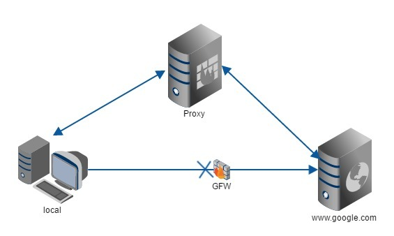
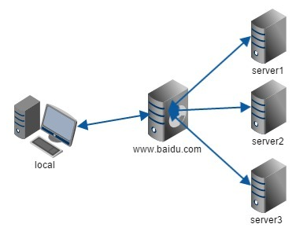

### 正向代理
我们常说的代理也就是只正向代理，正向代理的过程，它隐藏了真实的请求客户端，服务端不知道真实的客户端是谁，客户端请求的服务都被代理服务器代替来请求，某些科学上网工具扮演的就是典型的正向代理角色。用浏览器访问 [http://www.google.com](http://www.google.com) 时，被残忍的block，于是你可以在国外搭建一台代理服务器，让代理帮我去请求`google.com`，代理把请求返回的相应结构再返回给我.

### 反向代理
反向代理隐藏了真实的服务端，当我们请求 www.baidu.com 的时候，就像拨打10086一样，背后可能有成千上万台服务器为我们服务，但具体是哪一台，你不知道，也不需要知道，你只需要知道反向代理服务器是谁就好了，www.baidu.com 就是我们的反向代理服务器，反向代理服务器会帮我们把请求转发到真实的服务器那里去。Nginx就是性能非常好的反向代理服务器，用来做负载均衡.

两者的区别在于代理的对象不一样：正向代理代理的对象是客户端，反向代理代理的对象是服务端

### 参考
* [知乎](https://www.zhihu.com/question/24723688)