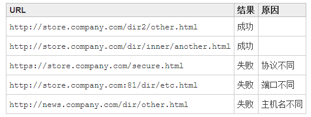

# CSRF攻击
CSRF是Cross Site Request Forgery的缩写，翻译过来就是跨站请求伪造。 也被称为 one click attack/session riding，缩写为：CSRF/XSRF。
可以这么理解CSRF攻击：从网站A中发起一个到网站B的请求，而这个请求是经过伪装的， 伪装的目的就是让请求看起来像是从网站B中发起的， 也就是说，让B网站所在的服务器端误以为该请求是从自己网站发起的，而不是从A网站发起的。当然，请求一般都是恶意的。

## 浏览器的跨域访问限制

### Cookie跨域
cookie可以跨二级域名来访问，例如在www.cmj.com所在的web应用程序创建了一个cookie， 在cs.cmj.com这样的二级域名对应的应用程序中可以访问，当然你在创建cookie的时候需要指出Domain属性为cmj.com。 其他情况下的不同域名就无法访问这个cookie了。

### JavaScript跨域
js跨域是指通过js在不同的域之间进行数据传输或通信，比如用ajax向一个不同的域请求数据， 或者通过js获取页面中不同域的框架中(iframe)的数据。只要协议、域名、端口有任何一个不同，都被当作是不同的域。

### 通过jsonp跨域
在js中，我们直接用XMLHttpRequest请求不同域上的数据时，是不可以的。 但是，在页面上引入不同域上的js脚本文件却是可以的，jsonp正是利用这个特性来实现的。

如果你的页面使用jquery，那么通过它封装的方法就能很方便的来进行jsonp操作了。 普通的jquery的ajax调用方法基本都采用这个方式，所以就可以调用不同域名实现的API了。

$.getJSON方法会自动判断是否跨域，不跨域的话，就调用普通的ajax方法； 跨域的话，则会以异步加载js文件的形式来调用jsonp的回调函数。

### 通过document.domain来跨子域
浏览器的同源策略，不能通过ajax的方法去请求不同源中的文档。

我们只要把`http://www.example.com/a.html` 和 `http://example.com/b.html`这两个页面的document.domain都设成相同的域名就可以了。

### CSRF攻击步骤
要完成一次CSRF攻击，受害者必须依次完成两个步骤：

登录受信任网站A，并在本地生成Cookie。
在不登出A的情况下，访问危险网站B。

### CSRF防御

防御效果是从服务端着手效果比较好，现在一般的CSRF防御也都在服务端进行。

#### Cookie Hashing
**所有表单**都包含**同一个伪随机值**，这可能是最简单的解决方案了， 因为攻击者不能获得第三方的Cookie(理论上)，所以表单中的数据也就构造失败了。

这个方法个人觉得已经可以杜绝99%的CSRF攻击了，那还有1%呢….由于用户的Cookie很容易由于网站的XSS漏洞而被盗取，这就另外的1%。

#### 验证码
每次的用户提交都需要用户在表单中填写一个图片上的随机字符串，这个方案可以完全解决CSRF，但个人觉得在易用性方面似乎不是太好。

# XSS攻击
XSS攻击：跨站脚本攻击(Cross-Site Scripting),XSS是一种常见的web安全漏洞，它允许攻击者将恶意代码植入到提供给其它用户使用的页面中。

## XSS分类

### 存储型XSS
主要出现在让用户输入数据，供其他浏览此页的用户进行查看的地方，包括留言、评论、博客日志和各类表单等。

应用程序从数据库中查询数据，在页面中显示出来，攻击者在相关页面输入恶意的脚本数据后，用户浏览此类页面时就可能受到攻击。

这个流程简单可以描述为:恶意用户的Html输入Web程序->进入数据库->Web程序->用户浏览器。

### 反射型XSS
将脚本代码加入URL地址的请求参数里，请求参数进入程序后在页面直接输出，用户点击类似的恶意链接就可能受到攻击。

## XSS攻击主要使用的手段和目的
- 盗用cookie，获取敏感信息。
- 利用植入Flash，通过crossdomain权限设置进一步获取更高权限；或者利用Java等得到类似的操作。
- 利用iframe、frame、XMLHttpRequest或上述Flash等方式，以（被攻击者）用户的身份执行一些管理动作， 或执行一些如:发微博、加好友、发私信等常规操作，前段时间新浪微博就遭遇过一次XSS。
- 利用可被攻击的域受到其他域信任的特点，以受信任来源的身份请求一些平时不允许的操作，如进行不当的投票活动。
- 在访问量极大的一些页面上的XSS可以攻击一些小型网站，实现DDoS攻击的效果

## XSS原理
Web应用未对用户提交请求的数据做充分的检查过滤，允许用户在提交的数据中掺入HTML代码(最主要的是“>”, “<”)， 并将未经转义的恶意代码输出到第三方用户的浏览器解释执行，是导致XSS漏洞的产生原因。

## 预防XSS
答案很简单，坚决不要相信用户的任何输入，并过滤掉输入中的所有特殊字符。这样就能消灭绝大部分的XSS攻击。

目前防御XSS主要有如下几种方式：
- 过滤特殊字符
避免XSS的方法之一主要是将用户所提供的内容进行过滤。
- 使用HTTP头指定类型
这样就可以让浏览器解析javascript代码，而不会是html输出。

总之, XSS漏洞是相当有危害的，在开发Web应用的时候，一定要记住过滤数据，特别是在输出到客户端之前，这是现在行之有效的防止XSS的手段。

# SQL注入攻击
SQL注入攻击（SQL Injection），简称注入攻击，是Web开发中最常见的一种安全漏洞。 可以用它来从数据库获取敏感信息，或者利用数据库的特性执行添加用户，导出文件等一系列恶意操作， 甚至有可能获取数据库乃至系统用户最高权限。

而造成SQL注入的原因是因为**程序没有有效过滤用户的输入**，使攻击者成功的向服务器**提交恶意的SQL查询代码**， 程序在接收后并错误的将攻击者的输入作为查询语句的一部分执行，导致原始的查询逻辑被改变， 额外的执行了攻击者精心构造的恶意代码。

## 如何预防SQL注入
永远不要信任外界输入的数据，特别是来自于用户的数据，包括选择框、表单隐藏域和 cookie。 就如上面的第一个例子那样，就算是正常的查询也有可能造成灾难。

下面这些建议或许对防治SQL注入有一定的帮助：

- 严格限制Web应用的数据库的操作权限，给此用户提供仅仅能够满足其工作的最低权限，从而最大限度的减少注入攻击对数据库的危害。
- 检查输入的数据是否具有所期望的数据格式，严格限制变量的类型，例如使用regexp包进行一些匹配处理， 或者使用strconv包对字符串转化成其他基本类型的数据进行判断。
- 对进入数据库的特殊字符（’”\尖括号&*;等）进行转义处理，或编码转换。
- 所有的查询语句建议使用数据库提供的参数化查询接口，参数化的语句使用参数而不是将用户输入变量嵌入到SQL语句中， 比如Java中的PrepareStatement。
- 在应用发布之前建议使用专业的SQL注入检测工具进行检测， 以及时修补被发现的SQL注入漏洞。网上有很多这方面的开源工具，例如sqlmap、SQLninja等。
- 避免网站打印出SQL错误信息，比如类型错误、字段不匹配等，把代码里的SQL语句暴露出来，以防止攻击者利用这些错误信息进行SQL注入。

总之, SQL注入是危害相当大的安全漏洞。所以对于我们平常编写的Web应用，应该对于每一个小细节都要非常重视。

# 防止表单重复提交
在平时开发中，如果网速比较慢的情况下，用户提交表单后，发现服务器半天都没有响应， 那么用户可能会以为是自己没有提交表单，就会再点击提交按钮重复提交表单，我们在开发中必须防止表单重复提交。

## 重复提交的几个场景
- 场景一
在网络延迟的情况下让用户有时间点击多次submit按钮导致表单重复提交
- 场景二 
表单提交后用户点击【刷新】按钮导致表单重复提交，点击浏览器的刷新按钮， 就是把浏览器上次做的事情再做一次，因为这样也会导致表单重复提交。
- 场景三
用户提交表单后，使用浏览器【后退】按钮重复之前的操作，导致重复提交表单。

## 表单重复提交解决办法

### JavaScript方案
可通过javascript来防止表单重复提交，表单提交之后， 将提交按钮设置为不可用，让用户没有机会点击第二次提交按钮

### Session方案
对于【场景二】和【场景三】导致表单重复提交的问题，既然客户端无法解决， 那么就在服务器端解决，在服务器端解决就需要用到session了。

具体的做法：在服务器端生成一个唯一的随机标识号，专业术语称为Token(令牌)，同时在当前用户的Session域中保存这个Token。 然后将Token发送到客户端的Form表单中，在Form表单中使用隐藏域来存储这个Token， 表单提交的时候连同这个Token一起提交到服务器端，然后在服务器端判断客户端提交上来的Token与服务器端生成的Token是否一致， 如果不一致，那就是重复提交了，此时服务器端就可以不处理重复提交的表单。如果相同则处理表单提交， 处理完后清除当前用户的Session域中存储的标识号。

在下列情况下，服务器程序将拒绝处理用户提交的表单请求：

1. 存储Session域中的Token(令牌)与表单提交的Token(令牌)不同。
2. 当前用户的Session中不存在Token(令牌)。
3. 用户提交的表单数据中没有Token(令牌)。

### 使用Post/Redirect/Get模式
针对【场景二】和【场景三】，除了使用Session方案，还有一种方案可以实现。 这就是所谓的 Post-Redirect-Get (PRG)模式。

简言之，当用户提交了表单后，你去执行一个客户端的重定向，转到提交成功信息页面。 这能避免用户按F5导致的重复提交，而其也不会出现浏览器表单重复提交的警告，也能消除按浏览器前进和后退按导致的同样问题。

